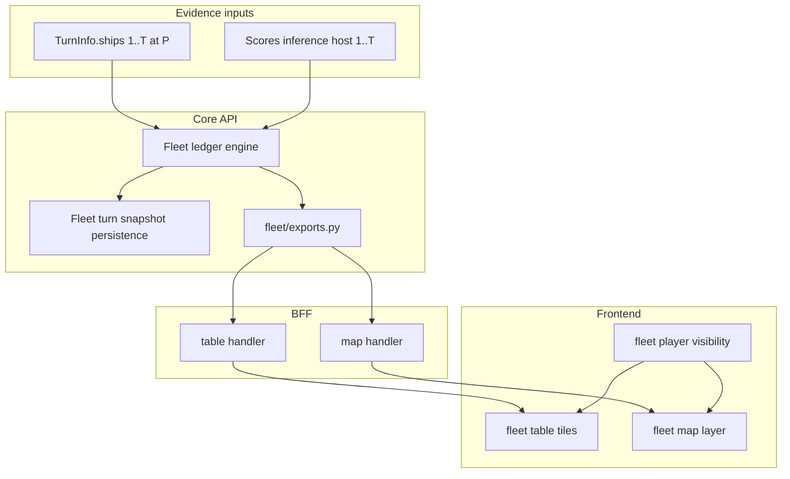

# Design: Fleet analytic

Per-player inferred fleet composition for the Planets Console **turn analytic** id `fleet`. Decisions below were resolved in design review; glossary terms live in [CONTEXT.md](../CONTEXT.md).

Related:

- [Adding a turn analytic](design-adding-a-turn-analytic.md)
- [Analytic exports](design-analytic-exports.md) -- cross-analytic queries, ensure dependencies, `fleet` / `scores` unwind chain
- [Military score build inference](design-military-score-build-inference.md) -- `shipBuilds` source for **fleet inferred acquisition**
- [Analytic persistence ADR](adr/0002-analytic-persistence.md) -- **fleet turn snapshot** paths
- [Homeworld locator](design-homeworld-locator-analytic.md) -- future starbase region constraints (follow-on)

GitHub: parent epic [#114](https://github.com/SteveDraper/Planets-Console/issues/114); child slices [#115](https://github.com/SteveDraper/Planets-Console/issues/115)--[#128](https://github.com/SteveDraper/Planets-Console/issues/128); follow-ons [#129](https://github.com/SteveDraper/Planets-Console/issues/129)--[#134](https://github.com/SteveDraper/Planets-Console/issues/134).

---

## 1. Purpose

Players need a consolidated view of each **Player**'s fleet -- not only ships visible on the current turn, but acquisitions inferred from scoreboard deltas and prior sightings. The **fleet analytic**:

1. Maintains a **fleet acquisition ledger** per **Player** as of shell turn `T`
2. Combines **fleet observed ship** evidence from `TurnInfo.ships` (turns `1..T` at shell **perspective** `P`)
3. Adds **fleet inferred acquisition** rows from **military score build inference** (`shipBuilds` on host turns in the same range)
4. Represents partial knowledge with structured **fleet field constraint** values and **fleet build option set** lists (consistent tuples, not per-field Cartesian products)
5. Exposes **map** layers (per-player ship nodes at known positions) and **tabular** tiles (one per enabled **Player**)
6. Participates in the **analytic export** graph (`fleet@N` <-> `scores@N` / `scores@N-1` ensure chain)

**Not in scope for v1:** omniscient merge across perspectives; guessed disposition changes on ship-count decreases; user-facing **fleet reconciliation correction** UI; report parsing; homeworld-derived starbase regions on map.

---

## 2. Shell scope and observation model

Computed at `(game_id, turn T, perspective P)`.

| Rule | Detail |
|------|--------|
| **Fleet observation scope** | Stored turns `1..T` at **perspective** `P` only |
| **Players tracked** | Every **Player** in **GameInfo** (not limited to viewpoint) |
| **Direct evidence** | Ships in `turn.ships` on those snapshots |
| **Build evidence** | **Scores** held solutions per `player_id` on host turns in `1..T` |
| **Turn 1 baseline** | **Fleet ensure baseline**: implicit empty fleet per **Player**; also seed from turn-1 sightings when present. On the first reliable accelerated scoreboard row, also seed **homeworld starting inventory** rows (starting freighter and any baseline warships from Starmap settings) before accelerated segment placeholders |
| **Cross-perspective** | Out of scope -- no union across stored perspective slots |

---

## 3. Fleet ship record model

### 3.1 Record grain

One **fleet ship record** = one acquired ship tracked across turns until retired. Fields (each wrapped in **fleet field constraint** where needed):

| Field | Notes |
|-------|-------|
| `recordId` | Stable uuid within ledger (not host ship id) |
| `shipId` | Host ship id when known or bounded |
| `hull`, `engine`, `beams`, `launchers` | Component ids / labels; may be unknown or option-set-driven |
| `builtTurn` | Host turn of scoreboard `+N` acquisition or first inference |
| `lastSeen` | Turn, `x/y`, optional planet id |
| `disposition` | **Fleet ship disposition**: `active`, `lost`, `traded`, `unknown` |
| `qualifiers` | **Fleet possibly lost**, **fleet alibi** (row-level; not disposition) |
| `buildOptionSets` | List of **fleet build option set** while ambiguous |
| `events` | Append-only **fleet evidence event** timeline |

### 3.2 Field constraint shapes

| Kind | Wire role | UI |
|------|-----------|-----|
| `known` | Single value | Definite cell |
| `unknown` | No constraint | `?` |
| `bounded` | e.g. `shipId <= maxId` | `<= 318` |
| `options` | Finite set on one field when others fixed | Rare alone; prefer build option sets |
| `region` | Planet ids, SB coords, or map overlay | Region label / deferred map geometry |

### 3.3 Build option sets

When top-K **scores** solutions disagree on a build, attach a list of **fleet build option set** entries -- each a consistent fitted spec (hull + engine + beams + launchers + slot fills) from one `shipBuilds` row in one held solution.

**Do not** expose independent per-field unions (e.g. `(Cruiser | Destroyer) x (W6 | Transwarp)`) that admit impossible combinations.

Display default: highest **inference solution rank weight** option set. Row expander lists alternates.

### 3.4 Disposition vs qualifiers

| Concept | When |
|---------|------|
| **`active` disposition** | Ship still in fleet accounting |
| **`lost` / `traded` / `unknown` disposition** | Only with **strong evidence** (future: destruction/trade in scores or reports) |
| **Fleet possibly lost** | Candidate for loss after count decrease; row stays `active` |
| **Fleet alibi** | Sighting after a destruction event proves this row was not the one lost |
| **Fleet count discrepancy** | Player-level: implied count < active rows; no guessed row demotion |

---

## 4. Evidence and reconciliation

### 4.1 Evidence sources (v1)

| Source | Events |
|--------|--------|
| `TurnInfo.ships` | Sighting, position update, **fleet alibi** |
| Scoreboard deltas | `+N` / `-N` warship/freighter; triggers inferred row placeholders |
| **Scores** inference | Solution updates; **fleet build option set** refresh |
| Reports | Event type + hook only in v1 (no parser) |

### 4.2 Inferred row placeholders

When scoreboard shows `+2 warship` and inference is `in_progress` with 0 solutions: create **two** inferred rows with unknown specs. Refine as solutions stream in. Fleet refinement queries **scores** at the scoreboard turn for each placeholder `builtTurn` and applies top-level **`$.solutions`** only (no reads of **`$.diagnostics`**). On the first reliable accelerated shell turn, `builtTurn < shellTurn` placeholders resolve from backfill rows (`scores@(builtTurn + 1)`); same-turn placeholders use `scores@shellTurn`. Placeholder metadata (targets, homeworld baselines, accelerated-shell gating) is consumed via `api.analytics.scores.placeholder_targets`.

### 4.3 Observation-inference merge

When a sighting arrives:

1. Match spec to a **fleet build option set** on an unmatched inferred row (exact component match on visible fields)
2. Tie-break: earliest inferred row without linked id that lists the matching set (FIFO by `builtTurn`)
3. On match: append event, collapse fields to **known**, link `shipId` if visible
4. No match: new **fleet observed ship** row
5. Never delete prior events -- support future **fleet reconciliation correction**

### 4.4 Id bounds

Sequential host ship id allocation: if turn `N-1` had `X` ships globally and turn `N` had `Y` builds, `maxId <= X + Y` (refine when sighting fixes id).

On the first reliable accelerated row (`turn == acceleratedturns`), apply **built-turn-aware** bounds when tightening inferred rows on that shell turn:

| Row kind | Id bound source |
|----------|-----------------|
| Homeworld starting inventory | Global ship count after each player receives starting ships (`players * (baseline freighters + baseline warships)`) |
| Inferred row with `builtTurn < shellTurn - 1` (accelerated window host turn) | Global ship total at end of host turn `N-2` (prior totals from row `N` before reported host-turn deltas) |
| Inferred row with `builtTurn == shellTurn - 1` (reported host turn on row `N`) | Current shell-turn bound (`total - net + builds` on row `N`) |
| Normal scoreboard-delta rows | Current shell-turn bound |

Missing or stale bounds are not re-tightened to a looser value when a row already has a tighter `lte` bound.

### 4.5 Location constraints (deferred enrichment)

Builds occur at starbases: initial location may be constrained to builder's SBs or a region. v1 may emit **unknown** location until planet/SB positions and **homeworld locator** inputs exist. Schema must accept **region** constraints when added.

### 4.6 Ship-count decreases

When scoreboard implies fewer ships than **active** rows:

- Record **fleet count discrepancy** at player level
- Mark candidate rows **fleet possibly lost** when evidence supports candidacy
- Apply **fleet alibi** when a row has post-event sighting
- **Do not** change disposition without strong evidence (no FIFO demotion in v1)
- Future: scores destruction actions and report text may resolve which row was lost

---

## 5. Persistence

**Fleet turn snapshot** at logical path:

`games/{gameId}/{perspective}/turns/{turn}/analytics/fleet`

| Rule | Detail |
|------|--------|
| **Chain** | Materialize turn `T` from snapshot `T-1` + evidence on turn `T` only |
| **Baseline** | Turn 1: empty ledger or sightings-only seed |
| **Events** | Copied forward; new events appended; corrections add events at `T` without erasing `T-1` |
| **Invalidation** | Turn document replace at `T`: drop fleet snapshots `>= T` at that **perspective**; re-chain. Scores inference invalidation: re-chain from first affected host turn (exact coupling in implementation ticket) |
| **Materialization version** | Each persisted snapshot stores `materializationVersion` (integer, current code constant `FLEET_MATERIALIZATION_VERSION`). Bump conservatively when materialization semantics change for the same RST + scores inputs (chain rules, inferred acquisition ingest, observation-inference merge). On read, missing or stale versions delete that snapshot and count as a cache miss; gap-fill re-materializes with current logic. Does not replace input-driven invalidation (turn reload, scores row changes) |
| **Invalidation generation** | Each `(gameId, perspective)` has a monotonic counter bumped on every fleet snapshot invalidation. Multi-turn gap-fill records the counter at chain start and aborts (then retries from a fresh anchor, bounded max retries) when the counter advances mid-materialization. Invalidation callbacks only bump the counter and delete stored snapshots; they do not block on an in-progress gap-fill |

---

## 6. Analytic exports

Register `analytics/fleet/exports.py`:

```python
ENSURE_DEPENDENCIES = (
    EnsureDependency(analytic_id="scores", turn_delta=0, player_id="same"),
)
```

Wire **scores** provider edge (currently empty in #93d):

```python
EnsureDependency(analytic_id="fleet", turn_delta=-1, player_id="same"),
```

Export tree mirrors ledger: per-player records, discrepancies, `meta.searchStatus` when scores materialization incomplete. See [design-analytic-exports.md](design-analytic-exports.md) for query examples.

---

## 7. BFF wire contracts

### 7.1 Table (`GET /bff/analytics/fleet/table`)

```text
players[]:
  playerId, playerName, discrepancy?, records[]
records[]:
  recordId, disposition, qualifiers, fields{...}, buildOptionSets[], displayDefaultOptionSetIndex?
```

Default consumer filter: `disposition == active`.

### 7.2 Map (`GET /bff/analytics/fleet/map`)

Per **Player** (client filters by **fleet player visibility**):

```text
players[]:
  playerId, nodes[], overlayCircles? (v1 often empty)
nodes[]:
  id: fleet:{playerId}:{recordId}
  x, y, label, hullSummary, qualifiers
```

Only **active** rows with known point position in v1. Region-only rows omitted until overlay ticket.

Types: Zod module under `packages/frontend/src/analytics/fleet/` (not central OpenAPI codegen).

---

## 8. Frontend

### 8.1 Sidebar

- Master fleet analytic enable (global localStorage, like other analytics)
- **Fleet player visibility** checklist: one toggle per **Player** for **both** map and table
- Default: all **Players** on until the user toggles an override
- Persisted globally (not per game), same pattern as **Cartography layer**

### 8.2 Map (deliverable separate from table)

- Register in `mapAnalyticRegistry.ts`
- Merge **fleet map node**s with player color
- Tooltips: spec constraints, **fleet alibi** / **fleet possibly lost** icons

### 8.3 Table (deliverable separate from map)

- One **fleet table tile** per visible **Player** in tabular **view mode**
- Columns: id, hull, engine, beams, launchers, built, last seen, status icons
- Row expander for **fleet build option set** alternates
- Tile header: **fleet count discrepancy** banner

**MVP vertical slice:** Core + BFF table for viewpoint player before map ships.

---

## 9. Architecture



### Core modules (planned)

F0.2 registration uses a single `api/analytics/fleet.py` module (same pattern as `connections.py` and `base_map.py`); split into the package layout below when phase 1 domain types and persistence land.

| Module | Responsibility |
|--------|----------------|
| `api/analytics/fleet/` | Types, ledger engine, snapshot chain, table/map compute |
| `api/analytics/fleet/exports.py` | Export catalog, ensure, materialize |
| `api/analytics/fleet/persistence.py` | Snapshot read/write, invalidation hooks |

---

## 10. Registration

| Touch point | Value |
|-------------|-------|
| `analytic_id` | `fleet` |
| `supports_table` | `true` |
| `supports_map` | `true` |
| `type` | `selectable` |

---

## 11. Testing

| Area | Tests |
|------|-------|
| Constraint serialization | known / unknown / bounded / option sets / region round-trip |
| Snapshot chain | T-1 -> T; turn-1 baseline; invalidation on turn replace |
| Observation ingest | Sighting creates/updates row; id bounds |
| Inference ingest | Placeholder rows from delta; option sets from top-K |
| Reconciliation | Option-set match + FIFO; event append immutability |
| Discrepancy | Player flag without disposition change; alibi excludes possibly-lost |
| Exports | Ensure deps; materialize shape; scores edge registration |
| BFF | Table/map wire golden fixtures |
| Frontend | Player visibility persistence; tile filter; map node merge |

---

## 12. Implementation phases

| Phase | Focus | Issue |
|-------|-------|-------|
| **0** | Design doc + registration shell | [#114](https://github.com/SteveDraper/Planets-Console/issues/114), [#115](https://github.com/SteveDraper/Planets-Console/issues/115) |
| **1** | Domain types + snapshot persistence + observation ingest | [#116](https://github.com/SteveDraper/Planets-Console/issues/116)--[#118](https://github.com/SteveDraper/Planets-Console/issues/118) |
| **2** | Scores integration + reconciliation + exports | [#119](https://github.com/SteveDraper/Planets-Console/issues/119)--[#121](https://github.com/SteveDraper/Planets-Console/issues/121) |
| **3** | Discrepancy + qualifiers + report hook stub | [#122](https://github.com/SteveDraper/Planets-Console/issues/122)--[#124](https://github.com/SteveDraper/Planets-Console/issues/124) |
| **4** | BFF table/map wire | [#125](https://github.com/SteveDraper/Planets-Console/issues/125), [#126](https://github.com/SteveDraper/Planets-Console/issues/126) |
| **5** | Frontend sidebar, map layer, table tiles | [#127](https://github.com/SteveDraper/Planets-Console/issues/127)--[#128](https://github.com/SteveDraper/Planets-Console/issues/128) |
| **6** | Follow-ons | [#129](https://github.com/SteveDraper/Planets-Console/issues/129)--[#134](https://github.com/SteveDraper/Planets-Console/issues/134) |

Critical path: `0 -> 1 -> 2 -> 3 -> 4 -> 5`.

---

## 13. Out of scope (v1)

- Omniscient multi-perspective fleet merge
- FIFO disposition demotion on `-N` warship without strong evidence
- Per-field Cartesian ambiguity display
- **Fleet reconciliation correction** UI (representation required; UI deferred)
- Report message parsing
- Starbase region overlays on map
- **Inference tier policy overlay** from fleet (#87) -- consumer of fleet exports, not producer
- Wandering Tribes fleet-at-spawn special case

---

## 14. Follow-on coupling

| Feature | Use |
|---------|-----|
| **Homeworld locator** | SB / planet positions for **region** constraints on inferred builds |
| **Scores** `#87` | Component histogram and `maxTechLevel` overlay from `$.composition` (`hullTypes`, `beamTypes`, `launcherTypes`, `maxTechLevel`; `torpedoTypesLoaded` when ledger stores loaded ammo) |
| Reports ingest | Strong evidence for loss/trade row selection |
| Export ensure orchestration (#109) | Background unwind when fleet@N requires deep scores chain |

### `$.composition` export branch (#154)

Per-player, scoped by `player_id`. Materialized from active `FleetShipRecord` rows for the scoped player(s):

| Path | Shape | Rule |
|------|-------|------|
| `$.composition.hullTypes` | `{ "<hullId>": <shipCount>, ... }` | Known `fields.hull` only |
| `$.composition.beamTypes` | `{ "<beamId>": <shipCount>, ... }` | Known `fields.beams` with positive id |
| `$.composition.launcherTypes` | `{ "<torpId>": <shipCount>, ... }` | Known `fields.launchers` (torp type id) with positive id |
| `$.composition.torpedoTypesLoaded` | same histogram shape | Empty in v1 until loaded-torp evidence is on ledger rows |
| `$.composition.maxTechLevel` | `{ "hulls"?, "engines"?, "launchers"?, "beams"? }` | Max `techlevel` from turn catalog for ids present in the histograms (engines from known `fields.engine` on rows). Axes with no catalog-resolvable ids omitted. |

Unknown, bounded, options, and region field constraints are excluded from histograms. Known zero for beams/launchers (no fitted weapons) is excluded. Turn 1 baseline: empty histograms and `{}` `maxTechLevel`.
