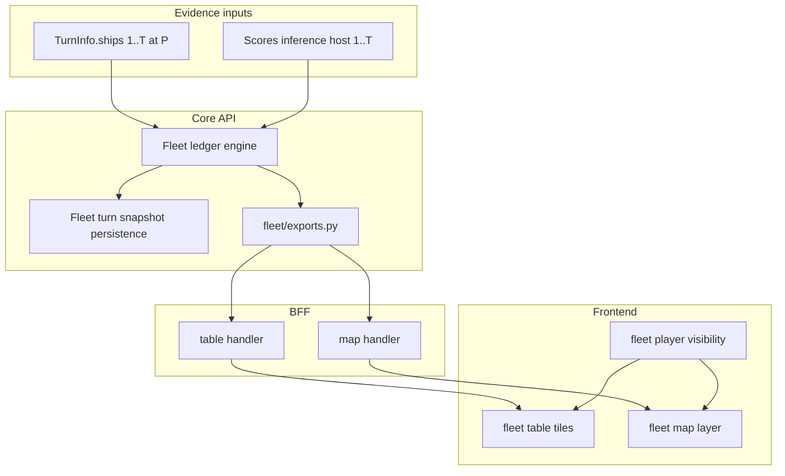

# Design: Fleet analytic

Per-player inferred fleet composition for the Planets Console **turn analytic** id `fleet`. Decisions below were resolved in design review; glossary terms live in [CONTEXT.md](../CONTEXT.md).

Related:

- [Adding a turn analytic](design-adding-a-turn-analytic.md)
- [Analytic exports](design-analytic-exports.md) -- cross-analytic queries, ensure dependencies, `fleet` / `scores` unwind chain
- [Military score build inference](design-military-score-build-inference.md) -- `shipBuilds` source for **fleet inferred acquisition**
- [Analytic persistence ADR](adr/0002-analytic-persistence.md) -- turn-scoped analytic paths
- [Fleet per-player persistence ADR](adr/0004-fleet-per-player-persistence-and-ensure-provenance.md) -- **fleet ledger persistence**, **fleet materialization provenance**, table stream
- [Homeworld locator](design-homeworld-locator-analytic.md) -- future starbase region constraints (follow-on)

GitHub: parent epic [#114](https://github.com/SteveDraper/Planets-Console/issues/114); child slices [#115](https://github.com/SteveDraper/Planets-Console/issues/115)--[#128](https://github.com/SteveDraper/Planets-Console/issues/128); follow-ons [#129](https://github.com/SteveDraper/Planets-Console/issues/129)--[#134](https://github.com/SteveDraper/Planets-Console/issues/134); **F7** per-player persistence/provenance/stream [#163](https://github.com/SteveDraper/Planets-Console/issues/163)--[#169](https://github.com/SteveDraper/Planets-Console/issues/169) ([ADR 0004](adr/0004-fleet-per-player-persistence-and-ensure-provenance.md)).

---

## 1. Purpose

Players need a consolidated view of each **Player**'s fleet -- not only ships visible on the current turn, but acquisitions inferred from scoreboard deltas and prior sightings. The **fleet analytic**:

1. Maintains a **fleet acquisition ledger** per **Player** as of shell turn `T`
2. Combines **fleet observed ship** evidence from `TurnInfo.ships` (turns `1..T` at shell **perspective** `P`)
3. Adds **fleet inferred acquisition** rows from **military score build inference** (`shipBuilds` on host turns in the same range)
4. Represents partial knowledge with structured **fleet field constraint** values and **fleet build option set** lists (consistent tuples, not per-field Cartesian products)
5. Exposes **map** layers (per-player ship nodes at known positions) and **tabular** tiles (one per enabled **Player**)
6. Participates in the **analytic export** graph (`fleet@N` <-> `scores@N` / `scores@N-1` ensure chain)

**Not in scope for v1:** omniscient merge across perspectives; guessed disposition changes on ship-count decreases; user-facing **fleet reconciliation correction** UI; report parsing; homeworld-derived starbase regions on map.

---

## 2. Shell scope and observation model

Computed at `(game_id, turn T, perspective P)`.

| Rule | Detail |
|------|--------|
| **Fleet observation scope** | Stored turns `1..T` at **perspective** `P` only |
| **Players tracked** | Every **Player** in **GameInfo** (not limited to viewpoint) |
| **Direct evidence** | Ships in `turn.ships` on those snapshots |
| **Build evidence** | **Scores** held solutions per `player_id` on host turns in `1..T` |
| **Turn 1 baseline** | **Fleet ensure baseline**: implicit empty fleet per **Player**; also seed from turn-1 sightings when present. On the first reliable accelerated scoreboard row, also seed **homeworld starting inventory** rows (starting freighter and any baseline warships from Starmap settings) before accelerated segment placeholders |
| **Cross-perspective** | Out of scope -- no union across stored perspective slots |

---

## 3. Fleet ship record model

### 3.1 Record grain

One **fleet ship record** = one acquired ship tracked across turns until retired. Fields (each wrapped in **fleet field constraint** where needed):

| Field | Notes |
|-------|-------|
| `recordId` | Stable uuid within ledger (not host ship id) |
| `shipId` | Host ship id when known or bounded |
| `hull`, `engine`, `beams`, `launchers` | Component ids / labels; may be unknown or option-set-driven |
| `builtTurn` | Host turn of scoreboard `+N` acquisition or first inference |
| `lastSeen` | Turn, `x/y`, optional planet id |
| `disposition` | **Fleet ship disposition**: `active`, `lost`, `traded`, `unknown` |
| `qualifiers` | **Fleet possibly lost**, **fleet alibi** (row-level; not disposition) |
| `buildOptionSets` | List of **fleet build option set** while ambiguous; observed rows carry a single confirmed fit for slot fills |
| `events` | Append-only **fleet evidence event** timeline |

### 3.2 Field constraint shapes

| Kind | Wire role | UI |
|------|-----------|-----|
| `known` | Single value | Definite cell |
| `unknown` | No constraint | `?` |
| `bounded` | e.g. `shipId <= maxId` | `<= 318` |
| `options` | Finite set on one field when others fixed | Rare alone; prefer build option sets |
| `region` | Planet ids, SB coords, or map overlay | Region label / deferred map geometry |

### 3.3 Build option sets

When top-K **scores** solutions disagree on a build, attach a list of **fleet build option set** entries -- each a consistent fitted spec (hull + engine + beams + launchers + slot fills) from one `shipBuilds` row in one held solution.

**Do not** expose independent per-field unions (e.g. `(Cruiser | Destroyer) x (W6 | Transwarp)`) that admit impossible combinations.

Display default: highest **inference solution rank weight** option set. Row expander lists alternates.

**Observed ships:** direct `TurnInfo.ships` sightings also attach option-set ground truth for fitted components. Full-information sightings (`ledger.player_id == perspective`) attach a **single confirmed** option set carrying fitted beam/launcher slot fills (`ship.beams` / `ship.torps`) alongside type ids, and lock all component fields (including known-zero weapons). Partial foreign sightings typically lock **hull** only; fog-of-war zeros are left unknown (`beamId`/`torpId` null and `beamCount`/`launcherCount` null on the option set -- display as `?`) and must not be treated as confirmed empty weapons. `fields.beams` / `fields.launchers` remain type-id constraints for belief-set and reconciliation; counts are not stored on those fields. A lone confirmed set is not ambiguity -- the row expander stays collapsed.

### 3.4 Disposition vs qualifiers

| Concept | When |
|---------|------|
| **`active` disposition** | Ship still in fleet accounting |
| **`lost` / `traded` / `unknown` disposition** | Only with **strong evidence** (future: destruction/trade in scores or reports) |
| **Fleet possibly lost** | Candidate for loss after count decrease; row stays `active` |
| **Fleet alibi** | Sighting after a destruction event proves this row was not the one lost |
| **Fleet count discrepancy** | Player-level: implied count < active rows; no guessed row demotion |

---

## 4. Evidence and reconciliation

### 4.1 Evidence sources (v1)

| Source | Events |
|--------|--------|
| `TurnInfo.ships` | Sighting, position update, **fleet alibi** |
| Scoreboard deltas | `+N` / `-N` warship/freighter; triggers inferred row placeholders |
| **Scores** inference | Solution updates; **fleet build option set** refresh |
| Reports | Event type + hook only in v1 (no parser) |

### 4.2 Inferred row placeholders

When scoreboard shows `+2 warship` and inference is `in_progress` with 0 solutions: create **two** inferred rows with unknown specs. Refine as solutions stream in. Fleet refinement queries **scores** at the scoreboard turn for each placeholder `builtTurn` and applies top-level **`$.solutions`** only (no reads of **`$.diagnostics`**). On the first reliable accelerated shell turn, `builtTurn < shellTurn` placeholders resolve from backfill rows (`scores@(builtTurn + 1)`); same-turn placeholders use `scores@shellTurn`. When `scores@(builtTurn + 1)` is **not stored** (common while accelerated start is still open), refine loads the matching **`hostTurnTargets`** entry from the first reliable row (`scores@N`) instead. Placeholder metadata (targets, homeworld baselines, accelerated-shell gating) is consumed via `api.analytics.scores.placeholder_targets`.

### 4.3 Observation-inference merge

When a sighting arrives:

1. Match spec to a **fleet build option set** on an unmatched inferred row (exact component match on visible fields)
2. Tie-break: earliest inferred row without linked id that lists the matching set (FIFO by `builtTurn`)
3. On match: append event, collapse **observation-reliable** fields to **known**, link `shipId` if visible
4. No match: new **fleet observed ship** row
5. Never delete prior events -- support future **fleet reconciliation correction**

**Refine must not overwrite observation-known elements.** After a sighting has linked a scoreboard placeholder:

- **Full-information** (`ledger.player_id == perspective`): confirmed option set and known component fields are locked; later scores refine is a no-op for that row's fit.
- **Partial** (foreign ship): preserve observation-known axes (typically hull; other axes only when positively observed). Refine may still attach inferred option sets for unknown axes, forcing known hull/component ids onto those sets. Fog zeros are not observation locks.

### 4.4 Id bounds

Sequential host ship id allocation: if turn `N-1` had `X` ships globally and turn `N` had `Y` builds, `maxId <= X + Y` (refine when sighting fixes id).

On the first reliable accelerated row (`turn == acceleratedturns`), apply **built-turn-aware** bounds when tightening inferred rows on that shell turn:

| Row kind | Id bound source |
|----------|-----------------|
| Homeworld starting inventory | Global ship count after each player receives starting ships (`players * (baseline freighters + baseline warships)`) |
| Inferred row with `builtTurn < shellTurn - 1` (accelerated window host turn) | Global ship total at end of host turn `N-2` (prior totals from row `N` before reported host-turn deltas) |
| Inferred row with `builtTurn == shellTurn - 1` (reported host turn on row `N`) | Current shell-turn bound (`total - net + builds` on row `N`) |
| Normal scoreboard-delta rows | Current shell-turn bound |

Missing or stale bounds are not re-tightened to a looser value when a row already has a tighter `lte` bound.

### 4.5 Location constraints (deferred enrichment)

Builds occur at starbases: initial location may be constrained to builder's SBs or a region. v1 may emit **unknown** location until planet/SB positions and **homeworld locator** inputs exist. Schema must accept **region** constraints when added.

### 4.6 Ship-count decreases

When scoreboard implies fewer ships than **active** rows:

- Record **fleet count discrepancy** at player level
- Mark candidate rows **fleet possibly lost** when evidence supports candidacy
- Apply **fleet alibi** when a row has post-event sighting
- **Do not** change disposition without strong evidence (no FIFO demotion in v1)
- Future: scores destruction actions and report text may resolve which row was lost

---

## 5. Persistence

**Fleet ledger persistence** (per **Player**) at turn scope. Logical document:

`games/{gameId}/{perspective}/turns/{turn}/analytics/fleet`

In-document keys: `ledgers/{playerId}` -- each entry is one **fleet acquisition ledger** plus **fleet materialization provenance** and `materializationVersion`. See [ADR 0004](adr/0004-fleet-per-player-persistence-and-ensure-provenance.md).

| Rule | Detail |
|------|--------|
| **Grain** | One ledger per `player_id` per turn; not one monolithic all-players blob for ensure semantics |
| **Chain** | Materialize turn `T` for player P from P's ledger at `T-1` + evidence on turn `T` for P only |
| **Baseline** | Turn 1: empty ledger or sightings-only seed per **Player** |
| **Provenance** | Per ledger: `(turnEvidenceAtN, priorLedgerAtNMinus1)`. Both `true` --> persisted ledger is **final** for ensure/probe. Either `false` --> scope needs further ensure work |
| **Events** | Copied forward per player; new events appended; corrections add events at `T` without erasing `T-1` |
| **Invalidation** | Turn document replace at `T`: drop all fleet ledgers at turns `>= T` at that **perspective**. Scores inference evidence update for player P at host *H*: drop P's ledgers at fleet turns `>= H` |
| **Materialization version** | Per ledger entry. Bump conservatively when materialization semantics change. Stale version --> treat as cache miss for that player |
| **Invalidation generation** | Per `(gameId, perspective)` counter bumped on fleet invalidation; gap-fill aborts mid-chain when generation advances (see section 5.1) |
| **Migration** | Legacy monolithic snapshot (all players at document root) upgraded on read to `ledgers/{playerId}` keys |
| **Shared turn context** | Global id-bound inputs from RST scoreboard totals are read once per turn; not stored as a cross-player mutable ledger |

### 5.1 Gap-fill scope, concurrency, and `ConflictError`

Gap-fill is **deterministic** for a given anchor, stored RST sequence, and scores inference materialization inputs per **Player**. Each `put_ledger` writes one player's ledger for that turn with honest **fleet materialization provenance** -- partial provenance is allowed on disk but must not be treated as ensure-final. The system does **not** compare competing writers byte-for-byte or pick a semantic winner when two paths materialize the same player turn.

#### 5.1.1 Player-scoped unwind (target)

A fleet materialization request is scoped to **one compute scope** `(fleet, game_id, perspective, turn, player_id)` -- see [design-compute-orchestrator.md](design-compute-orchestrator.md). Gap fill for player P from turn `M` through `N` unwinds only P's ensure subgraph, forward by turn:

```text
scores@M,P → fleet@M,P → scores@(M+1),P → fleet@(M+1),P → … → scores@N,P → fleet@N,P
```

| Entry point | Scope |
|-------------|--------|
| `ensure_fleet_export(ctx, scope)` | `scope.player_id` only |
| `get_or_materialize_fleet_ledger_for_player(P, …)` | P only |
| Fleet table stream tile job | That tile's `player_id` only |
| `get_or_materialize_fleet_snapshot` | **Fan-out helper** for callers that explicitly need every roster player at one turn (e.g. `compute_fleet` table wire). Must loop N player nodes internally -- not the implementation path for single-player ensure |

**Must not:** when any caller requests one player, materialize other roster players, require all-roster ensure-final before short-circuiting one player, or loop `iter_turn_players` inside a single-player coordinator unwind. Implementation: [#179](https://github.com/SteveDraper/Planets-Console/issues/179).

**Shared turn context** (`FleetTurnContext` id bounds from RST totals) may be computed once per turn and reused across player materializers on the same turn; it is read-only and not a cross-player dependency.

#### 5.1.2 Concurrency and epoch abort

**Mid-chain invalidation:** when invalidation generation bumps during a coherent gap-fill unwind, the leader **exits that leg** with `FleetGapFillEpochInvalidated` (after checking for a peer-written ensure-final ledger). It does **not** spin synchronous rematerializations (`GAP_FILL_MAX_RETRIES` was removed). Torn-chain prevention stays: abort mid-unwind rather than persisting later turns on a stale generation.

**Re-queue:** orchestrator fleet nodes already discard on epoch mismatch (`generation_at_submit` → re-queue). Scores evidence updates that clear fleet ledgers call `reschedule_fleet_table_player`. Export `ensure_fleet_export` catches `FleetGapFillEpochInvalidated` and returns unsatisfied so a later ensure / DAG submit can complete once evidence is stable. Ensure-final still requires `has_final_ledger` (both provenance flags); non-final ledgers must not short-circuit ensure.

**Host-turn persist gate:** `FleetPersistencePolicy.persist` re-resolves provenance after scores refine. If `turnEvidenceAtN` is still false, it raises `FleetScoresEvidenceOpenError` (HTTP 409, a `PersistDeferredError`) carrying a `PersistDependencyRecovery` that force_freshes same-turn scores `tier_solve`, instead of writing a non-final ledger and completing the fleet node. Completing with open scores evidence unlocked dependents and left the chain with a non-final ledger and no automatic rematerialization after #233 removed sync gap-fill spin. The orchestrator handles `PersistDeferredError` generically: demotes the node to `waiting_deps` (not soft `parked`) and submits the declared dependency so a durable close rematerializes fleet (stream-only reschedule cannot wake historical/background DAG nodes). Scores `is_satisfied` / skip-complete uses the same materialization probe as fleet (no ensure-ephemeral). Cheap ImmediateRowAdmission ensure admits persist fallback-complete disk rows (`no_prior_turn` / `player_not_found`) with `put_row(..., notify=False)` so that probe can close without relying on ephemeral-only state and without firing fleet invalidation mid gap-fill.

**Concurrent callers:** multiple entry points can request the same fleet node `(gameId, perspective, playerId, turn)` -- fleet table stream tile, scores export ensure (`fleet` @ *N*−1), and scores inference stream orchestrator **`background`-band** warm ([#200](https://github.com/SteveDraper/Planets-Console/issues/200)). They share storage and the per-player invalidation-generation counter.

**Phase 1 (shipped):** before failing an abort path, re-read the target player's ledger cache; return it if another path already finished ensure-final. Background warm / ensure treat a peer-written final ledger as success without rematerializing.

**Phase 2 ([#161](https://github.com/SteveDraper/Planets-Console/issues/161)):** **fleet gap-fill coordinator** (singleflight) with forward scores↔fleet unwind via export ensure; deferred per-player ledger notifications; epoch aligned with invalidation generation.

**Phase 2b ([#179](https://github.com/SteveDraper/Planets-Console/issues/179)):** narrow coordinator dedupe to `(gameId, perspective, playerId)`; per-player gap-start and cache-hit gates; ensure path uses per-player materialization only. Waiters for the same player share one in-flight unwind to `max(requested_turn)`; requests for different players do not block each other.

**Phase 3 ([#233](https://github.com/SteveDraper/Planets-Console/issues/233)):** replace sync invalidation spin with single-attempt abort + orchestrator / ensure re-queue (this section).

**Scores invalidation coupling ([#182](https://github.com/SteveDraper/Planets-Console/issues/182), [#184](https://github.com/SteveDraper/Planets-Console/issues/184)):** when a player's ensure-final `fleet@(N - 1)` ledger is persisted, scores inference for that player at host turn *N* is dropped and their open table-stream row is rescheduled. Production wiring listens on `on_ledger_persisted` per player after gap-fill deferred flush or immediate `put_ledger`. Roster-level `on_snapshot_persisted` is legacy-only for explicit `put_snapshot` / migration callers; gap-fill, ensure, and single-player materialization must not use it.

---

## 6. Analytic exports

Register `analytics/fleet/exports.py`:

```python
ENSURE_DEPENDENCIES = (
    EnsureDependency(analytic_id="scores", turn_delta=0, player_id="same"),
)
```

Wire **scores** provider edge (currently empty in #93d):

```python
EnsureDependency(analytic_id="fleet", turn_delta=-1, player_id="same"),
```

Export tree mirrors ledger: per-player records, discrepancies, `meta.searchStatus` when scores materialization incomplete for the scoped `player_id`. `is_ensure_satisfied` for `fleet@N` requires per-player provenance `(true, true)`, not merely a stored document. See [design-analytic-exports.md](design-analytic-exports.md) and [ADR 0004](adr/0004-fleet-per-player-persistence-and-ensure-provenance.md).

---

## 7. BFF wire contracts

### 7.1 Table (`GET /bff/analytics/fleet/table`)

```text
players[]:
  playerId, playerName, discrepancy?, records[]
records[]:
  recordId, disposition, qualifiers, fields{...}, buildOptionSets[], displayDefaultOptionSetIndex?
```

Default consumer filter: `disposition == active`.

### 7.2 Map (`GET /bff/analytics/fleet/map`)

Per **Player** (client filters by **fleet player visibility**):

```text
players[]:
  playerId, nodes[], overlayCircles? (v1 often empty)
nodes[]:
  id: fleet:{playerId}:{recordId}
  x, y, label, hullSummary, qualifiers
```

Only **active** rows with known point position in v1. Region-only rows omitted until overlay ticket.

Types: Zod module under `packages/frontend/src/analytics/fleet/` (not central OpenAPI codegen).

---

## 8. Frontend

### 8.1 Sidebar

- Master fleet analytic enable (global localStorage, like other analytics)
- **Fleet player visibility** checklist: one toggle per **Player** for **both** map and table
- Default: all **Players** on until the user toggles an override
- Persisted globally (not per game), same pattern as **Cartography layer**

### 8.2 Map (deliverable separate from table)

- Register in `mapAnalyticRegistry.ts`
- Merge **fleet map node**s with player color
- Tooltips: spec constraints, **fleet alibi** / **fleet possibly lost** icons

### 8.3 Table (deliverable separate from map)

- One **fleet table tile** per visible **Player** in tabular **view mode**
- Columns: id, hull, engine, beams, launchers, built, last seen, status icons
- Row expander for **fleet build option set** alternates
- Tile header: **fleet count discrepancy** banner

**MVP vertical slice:** Core + BFF table for viewpoint player before map ships.

---

## 9. Architecture



### Core modules (planned)

F0.2 registration uses a single `api/analytics/fleet.py` module (same pattern as `connections.py` and `base_map.py`); split into the package layout below when phase 1 domain types and persistence land.

| Module | Responsibility |
|--------|----------------|
| `api/analytics/fleet/` | Types, ledger engine, snapshot chain, table/map compute |
| `api/analytics/fleet/exports.py` | Export catalog, ensure, materialize |
| `api/analytics/fleet/persistence.py` | Snapshot read/write, invalidation hooks |

---

## 10. Registration

| Touch point | Value |
|-------------|-------|
| `analytic_id` | `fleet` |
| `supports_table` | `true` |
| `supports_map` | `true` |
| `type` | `selectable` |

---

## 11. Testing

| Area | Tests |
|------|-------|
| Constraint serialization | known / unknown / bounded / option sets / region round-trip |
| Snapshot chain | T-1 -> T; turn-1 baseline; invalidation on turn replace |
| Observation ingest | Sighting creates/updates row; id bounds |
| Inference ingest | Placeholder rows from delta; option sets from top-K |
| Reconciliation | Option-set match + FIFO; event append immutability |
| Discrepancy | Player flag without disposition change; alibi excludes possibly-lost |
| Exports | Ensure deps; materialize shape; scores edge registration |
| BFF | Table/map wire golden fixtures |
| Frontend | Player visibility persistence; tile filter; map node merge |

---

## 12. Implementation phases

| Phase | Focus | Issue |
|-------|-------|-------|
| **0** | Design doc + registration shell | [#114](https://github.com/SteveDraper/Planets-Console/issues/114), [#115](https://github.com/SteveDraper/Planets-Console/issues/115) |
| **1** | Domain types + snapshot persistence + observation ingest | [#116](https://github.com/SteveDraper/Planets-Console/issues/116)--[#118](https://github.com/SteveDraper/Planets-Console/issues/118) |
| **2** | Scores integration + reconciliation + exports | [#119](https://github.com/SteveDraper/Planets-Console/issues/119)--[#121](https://github.com/SteveDraper/Planets-Console/issues/121) |
| **3** | Discrepancy + qualifiers + report hook stub | [#122](https://github.com/SteveDraper/Planets-Console/issues/122)--[#124](https://github.com/SteveDraper/Planets-Console/issues/124) |
| **4** | BFF table/map wire | [#125](https://github.com/SteveDraper/Planets-Console/issues/125), [#126](https://github.com/SteveDraper/Planets-Console/issues/126) |
| **5** | Frontend sidebar, map layer, table tiles | [#127](https://github.com/SteveDraper/Planets-Console/issues/127)--[#128](https://github.com/SteveDraper/Planets-Console/issues/128) |
| **6** | Follow-ons | [#129](https://github.com/SteveDraper/Planets-Console/issues/129)--[#134](https://github.com/SteveDraper/Planets-Console/issues/134) |

Critical path: `0 -> 1 -> 2 -> 3 -> 4 -> 5`.

---

## 13. Out of scope (v1)

- Omniscient multi-perspective fleet merge
- FIFO disposition demotion on `-N` warship without strong evidence
- Per-field Cartesian ambiguity display
- **Fleet reconciliation correction** UI (representation required; UI deferred)
- Report message parsing
- Starbase region overlays on map
- Wandering Tribes fleet-at-spawn special case

---

## 14. Follow-on coupling

| Feature | Use |
|---------|-----|
| **Scores** **#133** | Production consumer for **inference fleet launcher belief set** from prior-turn `$.composition`; stream warm, invalidation reschedule, `fleetTorpInputStatus` UX -- [design-military-score-build-inference-implementation.md](design-military-score-build-inference-implementation.md) section 8.8.5 |
| **Homeworld locator** | SB / planet positions for **region** constraints on inferred builds |
| **Scores** **#87** | **Inference fleet launcher belief set** from `$.composition` (torp admission + misalignment prior); see below |
| **Scores** **#156** | Per-axis tech ceilings from same `$.composition` rows (**inference component tech-gap prior**) |
| Reports ingest | Strong evidence for loss/trade row selection |
| Export ensure orchestration (#109) | Background unwind when fleet@N requires deep scores chain; per-player provenance drives missing-step sets |
| **Fleet gap-fill coordinator** ([#161](https://github.com/SteveDraper/Planets-Console/issues/161), scope [#179](https://github.com/SteveDraper/Planets-Console/issues/179)) | Singleflight per `(gameId, perspective, playerId)`; forward unwind; see section 5.1 |
| **Fleet F7** (ADR 0004) | Per-player persistence, provenance, table stream -- [#163](https://github.com/SteveDraper/Planets-Console/issues/163) epic; section 15 |
| **#143** | Neutral scores-inference revision for fleet refetch; superseded for refinement updates once F7 stream ships |

### `$.composition` export branch (#154)

Per-player, scoped by `player_id`. Materialized from active `FleetShipRecord` rows for the scoped player(s). Feeds **#87** / **#156** via analytic export query at prior turn (see [design-analytic-exports.md](design-analytic-exports.md)); production wiring **#133**.

**Belief-set rule (scores inference):** component ids on a row come from **known** field constraints **or** from every **fleet build option set** on inferred rows (union of consistent tuples -- no per-field Cartesian product, no top-1-only slice). Scores inference is a first-class signal; sightings alone are insufficient because **known** launchers do not promote from inference on later turns.

| Path | Shape | Rule |
|------|-------|------|
| `$.composition.hullTypes` | `{ "<hullId>": <shipCount>, ... }` | Belief-set hull ids (known or any option set) |
| `$.composition.engineTypes` | `{ "<engineId>": <shipCount>, ... }` | Belief-set engine ids (known or any option set) |
| `$.composition.beamTypes` | `{ "<beamId>": <shipCount>, ... }` | Belief-set beam ids with positive id |
| `$.composition.launcherTypes` | `{ "<torpId>": <shipCount>, ... }` | Belief-set launcher/torp ids with positive id (**inference fleet launcher belief set** for #87) |
| `$.composition.torpedoTypesLoaded` | same histogram shape | Loaded-torp ids on rows when persisted (future); empty in v1 |
| `$.composition.maxTechLevel` | `{ "hulls"?, "engines"?, "launchers"?, "beams"? }` | Max `techlevel` from turn catalog over ids present in the matching type histogram for that axis |

Unknown-only, bounded-only, and region field constraints contribute no ids until resolved to known or option-set tuples. Known zero for beams/launchers (no fitted weapons) is excluded. Turn 1 baseline: empty histograms and `{}` `maxTechLevel` (scores inference treats absent overlay like empty belief set).

---

## 15. Per-player persistence, provenance, and stream (F7)

Parent epic and slices implement [ADR 0004](adr/0004-fleet-per-player-persistence-and-ensure-provenance.md). Shippable phases; each slice includes tests and doc updates.

| Slice | Issue | Deliverable |
|-------|-------|-------------|
| **F7 epic** | [#163](https://github.com/SteveDraper/Planets-Console/issues/163) | ADR 0004, design docs, slice tracking |
| **F7.1** | [#164](https://github.com/SteveDraper/Planets-Console/issues/164) | Per-player `ledgers/{playerId}` persistence, provenance wire types, legacy snapshot migration, unit tests |
| **F7.2** | [#165](https://github.com/SteveDraper/Planets-Console/issues/165) | Per-player materialization chain; honest provenance on write; shared turn-context reads for id bounds |
| **F7.3** | [#166](https://github.com/SteveDraper/Planets-Console/issues/166) | Ensure/probe `is_ensure_satisfied` and fleet export gates use provenance; fleet compute does not short-circuit on partial ledgers |
| **F7.4** | [#167](https://github.com/SteveDraper/Planets-Console/issues/167) | Per-player invalidation when scores rows change; turn-reload hooks |
| **F7.5** | [#168](https://github.com/SteveDraper/Planets-Console/issues/168) | Fleet table NDJSON stream (Core scheduler + BFF); event schema and integration tests |
| **F7.6** | [#169](https://github.com/SteveDraper/Planets-Console/issues/169) | Frontend per-player stream connect; tile-level updates; reduce dependence on [#143](https://github.com/SteveDraper/Planets-Console/issues/143) revision bump |

**Stream sketch (F7.5):** connect with `playerIds[]`; admit all requested players (cached finals may short-circuit), then multiplex per-player event queues onto one wire -- events tagged with `playerId` (`ledger_updated`, `record_refined`, `provenance`, `complete`, `error`; exact wire in implementation). Pool completions for any admitted player reach the SPA as they finish (completion-order, not admission-order serialization). Background ensure from [#109](https://github.com/SteveDraper/Planets-Console/issues/109) may share the same per-player outstanding-work queue built from provenance gaps.
