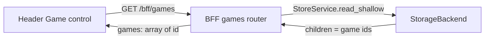

# Design: Issue #13 - Game selection

**Source:** [GitHub Issue #13 - [Feature] Select game](https://github.com/SteveDraper/Planets-Console/issues/13)

This document describes the design for game selection in the console: a clickable Game control in the header that lets the user choose from games already in storage or add a new one (by game id). It is a design and acceptance reference. The **in-scope** items are implemented in the repo; **out-of-scope** items (fetch/store for new games, persisting selection, wiring map/turn to the selected id) remain future work.

---

## 1. Goal (from the issue)

- When no game is selected, the top bar currently shows "Game: --". Restyle this so there is an **obvious clickable element** (e.g. a control that displays "None" or similar when no game is selected).
- When clicked, the user can:
  - **Select** from games already stored (enumerated from the Core layer as `/api/v1/store/games` with shallow view).
  - **Add a new one** by entering the game id (how to handle the new game after it is added is left as a TODO placeholder for this ticket).
- For this ticket: implement **enumeration of existing games** and the **UI** only. The "add new game" flow is implemented as far as collecting the game id; what happens with that id (e.g. triggering a fetch, persisting selection) is an explicit TODO.

---

## 2. Scope

| In scope | Out of scope |
|----------|--------------|
| Header Game control: clickable, shows "None" or selected game id when none/selected | Login identity, Turn, Viewpoint controls (unchanged for this issue) |
| Dropdown/popover to list stored games and "Add new" entry point | Full "add new game" flow (fetch, store, switch context) |
| BFF endpoint to return list of stored game ids (and optional names if cheap) | Core API changes (use existing store shallow read) |
| Frontend state for selected game id (or null) and UI to choose/add | Persisting selected game across reloads (can be follow-up) |
| Unit tests for BFF games list and frontend behavior | Real persistence backend; storage remains as-is |

---

## 3. Current state (as implemented)

### 3.1 Header and frontend

- `packages/frontend/src/components/Header.tsx` renders the login identity control (see [design-issue-12-login-identity.md](design-issue-12-login-identity.md)), **`GameControl`**, and Turn / Viewpoint as static "—" (still placeholders).
- **`selectedGameId`** (`string | null`) and **`onSelectGameId`** live in **`packages/frontend/src/App.tsx`** and are passed into `Header` → `GameControl`.
- **`GameControl`** (`packages/frontend/src/components/GameControl.tsx`): a button showing **Game: None** or **Game: &lt;id&gt;;** opens a popover. TanStack Query loads the list from **`GET /bff/games`** when the popover opens (query key `['bff', 'games']`). The user can select a listed game or enter a game id (adds to selection and to an in-session list only; no planets.nu fetch or store write yet).
- API helper: **`fetchGames`** in `packages/frontend/src/api/bff.ts`.
- **Tests:** `packages/frontend/src/components/GameControl.test.tsx`. **`Header.test.tsx`** wraps `Header` in **`QueryClientProvider`** because `GameControl` uses `useQuery`.

### 3.2 Storage and Core

- Game data lives under the store path `games/{game_id}/...` (e.g. `games/628580/info`, `games/628580/{perspective}/turns/111`).
- Core exposes **store CRUD** at `/api/v1/store/{path:path}` with `GET ?view=shallow` returning `{ path, node_type, children, count }` where `children` are the next-hop segment names (see [design-storage-abstraction-and-crud-api.md](design-storage-abstraction-and-crud-api.md)).
- **Listing stored games** via Core: `GET /api/v1/store/games?view=shallow` returns `children: ["628580", ...]` when the `games` node exists. If the path does not exist, Core returns **404**.

### 3.3 BFF

- **`GET /bff/games`** is implemented in **`packages/bff/bff/routers/games.py`**. The BFF uses in-process **`StoreService(get_storage()).read_shallow("games")`** (same semantics as the Core store shallow read). **`NotFoundError`** maps to **`{ "games": [] }`**; otherwise **`{ "games": [ { "id": "<child>" }, ... ] }`** from shallow **`children`**.
- The SPA talks only to the BFF for this feature; it does not call Core store URLs directly.
- **Downstream:** Base map and other analytics still use **hard-coded test game/turn** in the BFF until a later issue wires **`selectedGameId`** (and turn) end-to-end.

---

## 4. Proposed design

### 4.1 Data flow (layered)

**Implemented path:** the BFF calls **`StoreService.read_shallow("games")`** in-process (same behavior as **`GET /api/v1/store/games?view=shallow`** on the Core REST app, without an extra HTTP hop).

- Frontend holds **selected game id** (`string | null`) in **`App.tsx`** and passes it into **`Header`** for display; future features (turn list, base map) should consume the same state.
- When the user opens the game selector, the frontend fetches the list from the BFF; the BFF performs the shallow read on **`games`** as above.

### 4.2 Core API

- **No new Core routes.** Use the existing store API:
  - `GET /api/v1/store/games?view=shallow` → `{ path, node_type, children, count }` with `children` = list of game id strings (e.g. `["628580"]`).
  - If the path `games` does not exist, Core returns **404**; the BFF treats that as "no games" and returns an empty list.

### 4.3 BFF

- **Route:** `GET /bff/games`
  - **Behavior:** Shallow read for store path `games` via in-process **`StoreService.read_shallow("games")`** (equivalent to **`GET /api/v1/store/games?view=shallow`**). On missing path (**`NotFoundError`**), return **`{ "games": [] }`**.
  - **Response shape (proposed):**  
    `{ "games": [ { "id": "<game_id>" } ] }`  
    so the frontend gets a stable contract. Optionally include `name` for each game if the BFF can obtain it cheaply (e.g. one shallow read under `games/{id}/info` or a single batch); for this issue, **id-only is sufficient**; name can be added in a follow-up.
  - **Errors:** Unexpected storage or service failures propagate as appropriate HTTP errors to the frontend.

### 4.4 Frontend

- **Header**
  - **Game control** (`GameControl`): a **clickable control** that:
    - Shows **"None"** (or similar) when no game is selected.
    - Shows the **selected game id** (or a short label) when a game is selected.
    - On click, opens a **dropdown or popover** that:
      - Lists stored games (from `GET /bff/games`), e.g. by id (and name later if added).
      - Includes an **"Add new"** (or "Add game") action that asks for the **game id** (e.g. input or modal). After the user submits the id, the implementation **only** stores that id as the new selection and/or adds it to the local list for this session; **what to do with the new game id** (e.g. trigger a fetch from planets.nu, write to store, refresh list) is left as a **TODO placeholder** for this ticket, as per the issue.
  - The control must be clearly recognizable as interactive (e.g. button, combobox, or styled link).

- **State and data**
  - **Selected game id:** Lifted to the app (e.g. `App.tsx` or a shared store/context) so the Header and future consumers (turn selector, map, etc.) can use it. Type: `string | null`.
  - **Games list:** Fetched when the user opens the selector (e.g. via TanStack Query with a key like `['bff', 'games']`). No need to fetch until the selector is opened, unless a global cache is preferred.

- **Accessibility**
  - Use appropriate semantics (e.g. button or combobox) and labels so the control is usable with keyboard and screen readers.

### 4.5 "Add new" placeholder (per issue)

- The issue states: *"Adding a new one should just ask for the game id"* and *"How to deal with a new game when it is added can be left as a TODO placeholder for this ticket"*.
- Therefore:
  - **In scope:** UI to "Add new" that prompts for game id and, on submit, sets that id as the selected game (and optionally appends it to the displayed list for the session).
  - **Out of scope for this ticket:** Actually fetching game data from planets.nu, writing to the store, or refreshing the stored games list from the backend. Those behaviors are left as a **TODO** in code (and optionally a short comment in this doc or a follow-up issue).

---

## 5. Tests

### 5.1 BFF

**`packages/bff/tests/test_games.py`** covers **`GET /bff/games`**:

- No `games` path in store: **`{ "games": [] }`**.
- Store has `games` with children: response includes those ids (e.g. **`628580`**, **`999`**) in **`{ "games": [ { "id": "..." }, ... ] }`**.

### 5.2 Frontend

**`packages/frontend/src/components/GameControl.test.tsx`** (mocked **`fetch`** for **`/bff/games`**):

- Trigger shows **None** vs selected id.
- Opening loads and displays listed games.
- Selecting a game calls **`onSelectGameId`**.
- Add-by-id updates selection (session path only).

**`Header.test.tsx`** provides **`QueryClientProvider`** for header integration; game-picker behavior is asserted in **`GameControl.test.tsx`**.

---

## 6. Documentation

- **Inline:** Docstrings or short comments for the new BFF route and for the Header game selector component (what the control does, that "add new" only captures id and leaves fetch/store as TODO).
- **This doc:** Update the "Open points" or "Out of scope" section if implementation diverges (e.g. if a dedicated Core list-games endpoint is added later).

---

## 7. Acceptance criteria

- Header shows a **clickable** Game control that displays "None" (or equivalent) when no game is selected and the selected game id when one is selected.
- Clicking the control opens a dropdown/popover that lists **stored games** from the BFF (which in turn uses Core store shallow read at `games`).
- User can **add a new game** by entering a game id; selection (and optionally the in-session list) updates; behavior beyond that (fetch/store) is left as TODO.
- No new Core API routes; enumeration uses the same shallow read as **`GET /api/v1/store/games?view=shallow`** (BFF uses **`StoreService.read_shallow`** in-process).
- BFF and frontend have unit tests as in **§5**; docs/comments reflect the placeholder for the full "add new game" flow (fetch/store).

---

## 8. Open points / follow-ups

- **BFF–Core coupling:** **Resolved** -- implementation uses in-process **`StoreService.read_shallow("games")`** (see **`packages/bff/bff/routers/games.py`**).
- **Game name:** Omit in this issue or add from `games/{id}/info` (or similar) if a single cheap read is available; avoid N+1.
- **Persistence of selection:** Storing the selected game id in localStorage or sessionStorage is a follow-up; not implemented yet.
- **Wire selected game (and turn) to map and analytics:** Still open; base map continues to use hard-coded test context in the BFF until a later issue.
