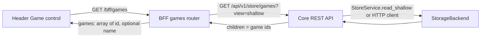

# Design: Issue #13 - Game selection

**Source:** [GitHub Issue #13 - [Feature] Select game](https://github.com/SteveDraper/Planets-Console/issues/13)

This document describes the design for adding game selection to the console: a clickable Game control in the header that lets the user choose from games already in storage or add a new one (by game id). **Implementation is out of scope** for this doc; it is a design and acceptance reference only.

---

## 1. Goal (from the issue)

- When no game is selected, the top bar currently shows "Game: --". Restyle this so there is an **obvious clickable element** (e.g. a control that displays "None" or similar when no game is selected).
- When clicked, the user can:
  - **Select** from games already stored (enumerated from the Core layer as `/api/v1/store/games` with shallow view).
  - **Add a new one** by entering the game id (how to handle the new game after it is added is left as a TODO placeholder for this ticket).
- For this ticket: implement **enumeration of existing games** and the **UI** only. The "add new game" flow is implemented as far as collecting the game id; what happens with that id (e.g. triggering a fetch, persisting selection) is an explicit TODO.

---

## 2. Scope

| In scope | Out of scope |
|----------|--------------|
| Header Game control: clickable, shows "None" or selected game id when none/selected | Login identity, Turn, Viewpoint controls (unchanged for this issue) |
| Dropdown/popover to list stored games and "Add new" entry point | Full "add new game" flow (fetch, store, switch context) |
| BFF endpoint to return list of stored game ids (and optional names if cheap) | Core API changes (use existing store shallow read) |
| Frontend state for selected game id (or null) and UI to choose/add | Persisting selected game across reloads (can be follow-up) |
| Unit tests for BFF games list and frontend behavior | Real persistence backend; storage remains as-is |

---

## 3. Current state

### 3.1 Header

- `packages/frontend/src/components/Header.tsx` renders the login identity control (refresh icon + "Login:" label; see issue #12), static "Game: —", and Turn, Viewpoint as "—".
- No game (or turn/viewpoint) state is passed into the Header; the app has no selected game context yet.

### 3.2 Storage and Core

- Game data lives under the store path `games/{game_id}/...` (e.g. `games/628580/info`, `games/628580/turns/111`).
- Core exposes **store CRUD** at `/api/v1/store/{path:path}` with `GET ?view=shallow` returning `{ path, node_type, children, count }` where `children` are the next-hop segment names (see [design-storage-abstraction-and-crud-api.md](design-storage-abstraction-and-crud-api.md)).
- So **listing stored games** is already supported: `GET /api/v1/store/games?view=shallow` returns `children: ["628580", ...]` when the `games` node exists. If the path does not exist (no games stored), Core returns **404**. The BFF will treat 404 as an empty list.

### 3.3 BFF and frontend

- BFF has no games-related endpoint today. The frontend talks only to the BFF (`packages/frontend/src/api/bff.ts`).
- App state in `App.tsx` holds view mode, map zoom, and enabled analytic ids; there is no selected game id or turn number yet (issue #10 uses hard-coded test values in the BFF for base map).

---

## 4. Proposed design

### 4.1 Data flow (layered)

- Frontend holds **selected game id** (string | null) in state (e.g. in `App.tsx` or a small context/store). It is passed into the Header and used for display and for downstream features (e.g. turn list, base map) in later tickets.
- When the user opens the game selector, the frontend fetches the list of games from the BFF; the BFF obtains it from Core (store shallow read at `games`).

### 4.2 Core API

- **No new Core routes.** Use the existing store API:
  - `GET /api/v1/store/games?view=shallow` → `{ path, node_type, children, count }` with `children` = list of game id strings (e.g. `["628580"]`).
  - If the path `games` does not exist, Core returns **404**; the BFF treats that as "no games" and returns an empty list.

### 4.3 BFF

- **New route:** `GET /bff/games`
  - **Behavior:** Call Core store shallow read for path `games` (in-process via `StoreService.read_shallow("games")` or via HTTP to `GET /api/v1/store/games?view=shallow`, per existing BFF–Core integration choice). On 404 from Core, return an empty list.
  - **Response shape (proposed):**  
    `{ "games": [ { "id": "<game_id>" } ] }`  
    so the frontend gets a stable contract. Optionally include `name` for each game if the BFF can obtain it cheaply (e.g. one shallow read under `games/{id}/info` or a single batch); for this issue, **id-only is sufficient**; name can be added in a follow-up.
  - **Errors:** If Core returns something other than 200 or 404 (e.g. 500), BFF propagates an appropriate error to the frontend (e.g. 502 or 500 with detail).

### 4.4 Frontend

- **Header**
  - Replace the static "Game: —" with a **clickable control** that:
    - Shows **"None"** (or similar) when no game is selected.
    - Shows the **selected game id** (or a short label) when a game is selected.
    - On click, opens a **dropdown or popover** that:
      - Lists stored games (from `GET /bff/games`), e.g. by id (and name later if added).
      - Includes an **"Add new"** (or "Add game") action that asks for the **game id** (e.g. input or modal). After the user submits the id, the implementation **only** stores that id as the new selection and/or adds it to the local list for this session; **what to do with the new game id** (e.g. trigger a fetch from planets.nu, write to store, refresh list) is left as a **TODO placeholder** for this ticket, as per the issue.
  - The control must be clearly recognizable as interactive (e.g. button, combobox, or styled link).

- **State and data**
  - **Selected game id:** Lifted to the app (e.g. `App.tsx` or a shared store/context) so the Header and future consumers (turn selector, map, etc.) can use it. Type: `string | null`.
  - **Games list:** Fetched when the user opens the selector (e.g. via TanStack Query with a key like `['bff', 'games']`). No need to fetch until the selector is opened, unless a global cache is preferred.

- **Accessibility**
  - Use appropriate semantics (e.g. button or combobox) and labels so the control is usable with keyboard and screen readers.

### 4.5 "Add new" placeholder (per issue)

- The issue states: *"Adding a new one should just ask for the game id"* and *"How to deal with a new game when it is added can be left as a TODO placeholder for this ticket"*.
- Therefore:
  - **In scope:** UI to "Add new" that prompts for game id and, on submit, sets that id as the selected game (and optionally appends it to the displayed list for the session).
  - **Out of scope for this ticket:** Actually fetching game data from planets.nu, writing to the store, or refreshing the stored games list from the backend. Those behaviors are left as a **TODO** in code (and optionally a short comment in this doc or a follow-up issue).

---

## 5. Tests (to implement)

### 5.1 BFF

- **GET /bff/games**
  - When store has no `games` path (or Core returns 404): response is `{ "games": [] }`.
  - When store has `games` with children (e.g. `628580`): response is `{ "games": [ { "id": "628580" } ] }` (and optionally name if implemented).
  - Use in-process store or mock Core so that no real HTTP or persistence is required.

### 5.2 Frontend

- **Header Game control**
  - Renders a clickable element that shows "None" when selected game is null and shows the selected game id when set.
  - Opening the control triggers a request for the games list (e.g. TanStack Query); list is displayed in the dropdown.
  - "Add new" flow: user can enter a game id and submit; selection updates to that id (and optionally the list updates for the session). No tests required for the TODO part (fetch/store) since it is explicitly out of scope.

- Prefer unit tests with mocked BFF responses; avoid flaky E2E unless already in use for the header.

---

## 6. Documentation

- **Inline:** Docstrings or short comments for the new BFF route and for the Header game selector component (what the control does, that "add new" only captures id and leaves fetch/store as TODO).
- **This doc:** Update the "Open points" or "Out of scope" section if implementation diverges (e.g. if a dedicated Core list-games endpoint is added later).

---

## 7. Acceptance criteria

- Header shows a **clickable** Game control that displays "None" (or equivalent) when no game is selected and the selected game id when one is selected.
- Clicking the control opens a dropdown/popover that lists **stored games** from the BFF (which in turn uses Core store shallow read at `games`).
- User can **add a new game** by entering a game id; selection (and optionally the in-session list) updates; behavior beyond that (fetch/store) is left as TODO.
- No new Core API routes; enumeration uses existing `GET /api/v1/store/games?view=shallow`.
- BFF and frontend have unit tests as above; docs/comments reflect the placeholder for the full "add new game" flow.

---

## 8. Open points for implementation

- **BFF–Core coupling:** Use in-process `StoreService.read_shallow("games")` (consistent with current BFF use of Core services) or an HTTP client to `GET /api/v1/store/games?view=shallow`. Either is acceptable; choose based on existing BFF patterns and testability.
- **Game name:** Omit in this issue or add from `games/{id}/info` (or similar) if a single cheap read is available; avoid N+1.
- **Persistence of selection:** Storing the selected game id in localStorage or sessionStorage can be done in this ticket or a follow-up; the design does not require it.
