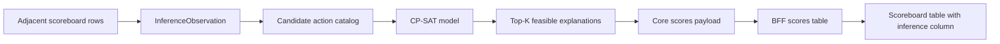

# Design: Military score inference implementation with OR-Tools

This document turns [design-military-score-build-inference.md](design-military-score-build-inference.md) into a phased implementation plan using OR-Tools CP-SAT.

The implementation should make exact feasibility the first-class contract: observed score and scoreboard deltas are hard constraints when enabled, while probability heuristics are encoded as an integer objective so the solver finds plausible explanations before low-probability noise.

**Related:** [design-military-score-build-inference.md](design-military-score-build-inference.md), [design-analytics-structure.md](design-analytics-structure.md), [design-planets-api-data-model.md](design-planets-api-data-model.md), [vga-planets-domain-context.md](vga-planets-domain-context.md).

---

## 1. Dependency choice

Use the Python package `ortools` for CP-SAT.

| Property | Decision |
|----------|----------|
| Package | `ortools` |
| Solver API | `ortools.sat.python.cp_model` |
| License | Apache-2.0 |
| Package location | `packages/api/pyproject.toml` |
| Lockfile update | via `uv` |

The dependency belongs in the Core API package because the inference model is domain logic. The BFF should only reshape Core results for the SPA, and the frontend should only render the analytic.

When adding the dependency, respect the dependency cooldown rule. At design time, the current OR-Tools release observed was older than seven days and supports the repo's Python 3.14 baseline.

---

## 2. Data flow



The first implementation solves each player independently. Cross-player coupling is deferred until ship trading, ship capture, and ownership transfers are modeled.

---

## 3. Module layout

Start with a small Core API subpackage so the solver and scoring model do not crowd the existing `scores` analytic:

```text
packages/api/api/analytics/military_score_inference/
|-- __init__.py
|-- actions.py          # action catalog and contribution helpers
|-- models.py           # dataclasses for observations, actions, problems, solutions
|-- scoring.py          # scaled military-score contribution formulas
|-- solver.py           # OR-Tools CP-SAT adapter
`-- analytic.py         # turn-level analytic assembly
```

Do not register `military_score_inference` as a separate user-facing analytic. The solver package should be called by the existing `scores` analytic when inference is requested.

BFF and frontend files should follow existing analytics structure:

```text
packages/bff/bff/analytics/scores.py
packages/bff/bff/analytics/registry.py
packages/frontend/src/analytics/scores/
```

The implementation should not put solver logic in the BFF or frontend.

---

## 4. Core dataclasses

Use plain dataclasses in the Core package.

```python
@dataclass(frozen=True)
class InferenceObservation:
    player_id: int
    turn: int
    military_delta_2x: int
    warship_delta: int
    freighter_delta: int
    priority_point_delta: int
    starbases_owned: int
    is_after_ship_limit: bool


@dataclass(frozen=True)
class CandidateAction:
    id: str
    label: str
    score_delta_2x: int
    warship_delta: int = 0
    freighter_delta: int = 0
    priority_point_delta: int = 0
    build_slot_usage: int = 0
    lower_bound: int = 0
    upper_bound: int = 0
    probability_weight: int = 0
```

The important modeling rule is that action variables are non-negative integers, but action contribution vectors may contain positive or negative values. `probability_weight` is enough for simple actions, but repeated actions also need count-dependent probability terms.

```python
@dataclass(frozen=True)
class ProbabilityBucket:
    label: str
    lower_count: int
    upper_count: int
    marginal_weight: int
```

Use buckets when the probability of `n` repeated actions is not `n` independent repetitions of the same event. For example, building 10 defense posts is plausible, building 100 is much less plausible, but 100 defense posts should not be penalized as 100 independent rare choices.

```python
@dataclass(frozen=True)
class InferenceProblem:
    observation: InferenceObservation
    actions: tuple[CandidateAction, ...]
    probability_buckets_by_action_id: dict[str, tuple[ProbabilityBucket, ...]]
    max_solutions: int = 20
    time_limit_seconds: float = 1.0


@dataclass(frozen=True)
class InferenceSolutionAction:
    action_id: str
    label: str
    count: int


@dataclass(frozen=True)
class InferenceSolution:
    objective_value: int
    actions: tuple[InferenceSolutionAction, ...]


@dataclass(frozen=True)
class InferenceResult:
    status: str
    solutions: tuple[InferenceSolution, ...]
    diagnostics: dict[str, object]
```

These contracts can be refined during implementation, but the boundary should stay explicit: observations and candidate actions go into the solver; ranked feasible explanations come out.

---

## 5. CP-SAT formulation

For each `CandidateAction`, create one integer variable:

```text
count[action] in [lower_bound, upper_bound]
```

Add hard constraints:

```text
sum(score_delta_2x[action] * count[action]) == observation.military_delta_2x
sum(warship_delta[action] * count[action]) == observation.warship_delta
sum(freighter_delta[action] * count[action]) == observation.freighter_delta
sum(priority_point_delta[action] * count[action]) == observation.priority_point_delta
sum(build_slot_usage[action] * count[action]) <= observation.starbases_owned
```

Priority points should be configurable at first. If queue behavior is not yet confirmed for a scenario, run the solve with priority points as a diagnostic or optional constraint rather than silently accepting a wrong queue model.

Add an integer objective:

```text
maximize action_weights + bucketed_count_weights + interaction_weights
```

Weights should be scaled integer log-probabilities or penalties. For example, a common race-appropriate hull receives a better weight than an unusual one, and generic defense-post explanations receive a penalty so they do not crowd out more informative ship-build explanations.

### 5.1 Count-dependent probability terms

Some actions need probability as a function of count, not as a constant per unit. Use bucket variables for these cases.

Example for planetary defense posts:

| Bucket | Count range | Marginal meaning |
|--------|-------------|------------------|
| modest build-up | 0-10 | plausible local development |
| heavy build-up | 11-50 | less likely but common in border areas |
| extreme build-up | 51-100 | possible but strongly penalized |

The model can represent this with separate integer variables per bucket:

```text
defense_posts_total == defense_posts_bucket_1 + defense_posts_bucket_2 + defense_posts_bucket_3
0 <= defense_posts_bucket_1 <= 10
0 <= defense_posts_bucket_2 <= 40
0 <= defense_posts_bucket_3 <= 50
```

Then the objective uses different marginal weights for each bucket. This keeps the CP-SAT objective linear while avoiding the wrong assumption that 100 defense posts are as unlikely as 100 fully independent one-post actions.

This bucket pattern also applies to:

- starbase defense posts,
- starbase fighter increases,
- loaded fighter increases,
- loaded torpedoes by type,
- future mine-laying quantities.

---

## 6. Top-K solving

Do not enumerate all feasible solutions. Low-value actions can produce many exact but unhelpful combinations.

Use repeated optimization:

1. Build the model and solve for the best objective value.
2. Extract the non-zero action counts.
3. Add a no-good cut excluding that exact action vector.
4. Re-solve for the next best solution.
5. Stop when `max_solutions`, solver status, or time budget is reached.

A no-good cut can be encoded with indicator variables that detect whether each action count differs from its previous value, then require at least one difference. Keep this inside `solver.py` so the rest of the analytic only sees top-K results.

The solver should return:

- `exact` when at least one feasible solution is found,
- `no_exact_solution` when the model is infeasible under enabled constraints,
- `time_limited` when the solver reaches the time budget before proving optimality,
- `invalid_problem` when generated action bounds or observations are inconsistent before solving.

---

## 7. Scoreboard integration

The user-facing feature belongs to the existing **Scores** analytic. It should not appear as a separate analytic in the analytics list.

### 7.1 Analytics pane

Add an option inside the existing Scores tile:

- label: `Include build inference`,
- control: checkbox,
- default: off,
- disabled state: disabled only when Scores itself is unavailable,
- behavior: when checked, the scoreboard table requests or computes inference details in addition to normal score rows.

The checkbox should preserve the normal Scores analytic behavior. Turning it off should return the current scoreboard table shape with no inference column.

### 7.2 Scoreboard table

When inference is enabled, add one extra column to the existing scoreboard table.

| Icon | Meaning | Hover text | Click behavior |
|------|---------|------------|----------------|
| Green tick | At least one feasible solution found | summarize top solution and alternative count | open modal with detailed ranked solutions |
| Hourglass | solving is in progress for this player row | show that inference is still running | no modal until a result is available |
| Red cross | no solution, timeout, invalid problem, or solver failure | summarize failure status and key diagnostics | optionally open diagnostic modal if details exist |

The row-level hourglass means the frontend should track inference status per player, not block the whole scoreboard table until all rows are solved. The table should remain useful while slower rows are still pending.

### 7.3 Modal details

The modal for a green tick should show:

- player and turn transition,
- observed deltas used as constraints,
- solver status and runtime,
- ranked solutions in descending objective/probability order,
- action breakdown for each solution,
- score arithmetic for the selected solution,
- warnings when priority points were diagnostic-only or when deferred effects may explain missing solutions.

### 7.4 API shape

Keep the Core solver as an internal component. The Core `scores` analytic should accept an option such as `include_military_score_inference`. When false, it returns the current score rows. When true, each row may include an `inference` object:

```json
{
  "status": "exact",
  "summary": "Best: built one Rush with 18 fighters; 3 alternatives",
  "solutionCount": 4,
  "isComplete": true,
  "solutions": []
}
```

The BFF can decide whether to include detailed solutions in the initial table response or fetch them lazily when the modal opens. The initial implementation should prefer a simple table response unless row-level solve time requires lazy per-player requests.

---

## 8. Action catalog

Generate the initial catalog from the observation and static game data.

### 8.1 Ship build actions

Create build actions for hulls the player can build. Each concrete action should include hull, engines, beams, tubes, and optional initial ammo load if the loadout catalog is known.

Initial implementation can deliberately start with a reduced loadout catalog:

- canonical empty or low-ammo build,
- common full-fighter carrier build,
- common torpedo-ship loadouts by torpedo tech,
- race-specific preferred hull priors.

Avoid generating every theoretical component combination until the performance envelope is measured.

### 8.2 Low-value repeated actions

Aggregate noisy actions where location detail is not yet known:

- `planet_defense_posts_added_total`,
- `starbase_defense_posts_added_total`,
- `starbase_fighters_added_total`,
- `ship_fighters_added_total`,
- `ship_torps_loaded_by_type`.

These variables still have exact score contributions, but they avoid one variable per planet or starbase in the initial version.

### 8.3 Negative actions

Support signed contribution vectors from the start:

- fighter transfer from ship to starbase: negative score delta,
- fighter transfer from starbase to ship: positive score delta,
- future ship loss or transfer actions: negative or cross-player deltas.

Negative actions need explicit upper bounds. Without bounds, positive and negative actions can create cancellation loops and a huge number of equivalent solutions.

---

## 9. Bounds and performance

The solver should receive a bounded, pruned action catalog.

Use these bounds before building the CP-SAT model:

- **Residual score bound:** `abs(action.score_delta_2x) * count` cannot exceed a conservative residual cap unless the action is explicitly allowed to offset another signed action.
- **Build slot bound:** total ship builds cannot exceed starbases owned in the initial no-loss model.
- **Count-delta bound:** warship and freighter build actions are bounded by the observed count deltas when losses and trades are out of scope.
- **Capacity bound:** ship fighters and torpedoes should be capped by plausible loadout capacity where known.
- **Noisy-action cap:** defense posts, starbase fighters, and generic ammo adjustments should have conservative caps and lower probability weights.
- **Top-K cap:** default to a small solution count, such as 10 or 20 per player.
- **Time cap:** use a per-player solver budget so a pathological player does not block the whole analytic.

The target scale for early implementation is hundreds to low thousands of variables per player, not every possible per-location action. If the catalog grows beyond that, add staged solving or column generation before broadening the action families.

---

## 10. Implementation phases

These phases are intentionally small enough to hand to junior engineers. Each phase should be a reviewable PR unless the team explicitly batches adjacent phases.

### Phase 1A: Add the solver dependency

Goal: make OR-Tools available to Core API tests without changing product behavior.

Files:

- `packages/api/pyproject.toml`,
- `uv.lock`.

Steps:

1. Add `ortools` to the API package dependencies with `uv`.
2. Confirm the selected release satisfies the dependency cooldown rule.
3. Add a tiny import smoke test in `packages/api/tests/test_military_score_inference_solver.py`.
4. Do not create inference model code yet.

Done when:

- `PYTHONPATH=packages/api uv run python -m pytest packages/api/tests/test_military_score_inference_solver.py` passes,
- `make lint` passes.

### Phase 1B: Add Core contracts and score helpers

Goal: define the data shapes and deterministic score arithmetic before using CP-SAT.

Files:

- `packages/api/api/analytics/military_score_inference/models.py`,
- `packages/api/api/analytics/military_score_inference/scoring.py`,
- `packages/api/api/analytics/military_score_inference/__init__.py`,
- `packages/api/tests/test_military_score_inference_scoring.py`.

Steps:

1. Add dataclasses for observations, candidate actions, probability buckets, problems, solutions, and diagnostics.
2. Add scaled score helpers for fighters, torpedoes, starbase fighters, starbase defense posts, and planet defense posts.
3. Keep ship construction score as a helper that accepts already-known hull/component costs if full catalog data is not ready.
4. Add tests for exact scaled values, including half-point components multiplied by two.

Done when:

- score helper tests pass,
- dataclasses are frozen or otherwise safe to share between catalog and solver code,
- no OR-Tools model code exists outside the solver adapter planned for Phase 1C.

### Phase 1C: Add minimal CP-SAT exact solver

Goal: solve small synthetic inference problems exactly.

Files:

- `packages/api/api/analytics/military_score_inference/solver.py`,
- `packages/api/tests/test_military_score_inference_solver.py`.

Steps:

1. Convert each `CandidateAction` into a bounded integer variable.
2. Add hard equality constraints for scaled military score, warship count, freighter count, and priority points.
3. Add the build-slot upper-bound constraint.
4. Add support for signed action contribution vectors.
5. Return structured statuses instead of raising for infeasible models.

Tests:

- one exact positive-action solution,
- one solution using a negative action contribution,
- one infeasible problem,
- one invalid problem with bad action bounds.

Done when:

- solver tests pass with small synthetic catalogs,
- all solver-specific OR-Tools imports are isolated to `solver.py`.

### Phase 1D: Add ranked top-K solving

Goal: return the best few feasible solutions without enumerating the whole feasible space.

Files:

- `packages/api/api/analytics/military_score_inference/solver.py`,
- `packages/api/tests/test_military_score_inference_solver.py`.

Steps:

1. Add the integer objective for constant action weights.
2. Solve for the best feasible solution.
3. Add no-good cuts to exclude each returned action vector.
4. Re-solve until `max_solutions`, infeasibility, or time budget stops the loop.
5. Include objective value and non-zero action counts in each solution.

Tests:

- higher-weight solution sorts first,
- no-good cuts prevent duplicate solutions,
- top-K stops at the configured limit,
- time-limited or non-optimal status is surfaced in diagnostics.

Done when:

- top-K tests demonstrate descending objective order,
- the solver never enumerates all feasible solutions by default.

### Phase 1E: Add bucketed probability terms

Goal: support count-dependent probability for repeated low-value actions.

Files:

- `packages/api/api/analytics/military_score_inference/models.py`,
- `packages/api/api/analytics/military_score_inference/solver.py`,
- `packages/api/tests/test_military_score_inference_solver.py`.

Steps:

1. Add `ProbabilityBucket` support to `InferenceProblem`.
2. For each bucketed action, add bucket variables whose sum equals the action count.
3. Apply bucket marginal weights in the objective.
4. Prefer bucketed penalties for defense posts, starbase fighters, loaded fighters, and loaded torpedoes.

Tests:

- 10 defense posts has a different marginal penalty from 100 defense posts,
- a bucketed action still satisfies the exact score constraint,
- bucket variables cannot exceed their configured count ranges.

Done when:

- count-dependent priors are covered by tests,
- constant-weight actions still work unchanged.

### Phase 1F: Add initial action catalog

Goal: generate a bounded catalog for the first useful scoreboard-inference cases.

Files:

- `packages/api/api/analytics/military_score_inference/actions.py`,
- `packages/api/tests/test_military_score_inference_actions.py`.

Steps:

1. Add aggregate variables for low-value repeated actions.
2. Add simple ship-build actions from a small, documented loadout catalog.
3. Bound ship-build actions by observed warship/freighter deltas and starbase count.
4. Bound noisy actions by residual score and configured caps.
5. Add negative fighter-transfer actions with explicit caps.

Tests:

- generated actions have finite bounds,
- noisy actions are aggregate actions rather than per-location actions,
- ship-build actions respect observed count deltas,
- negative actions cannot create unbounded cancellation loops.

Done when:

- action catalog tests pass,
- generated catalog size is logged or exposed in diagnostics for performance checks.

### Phase 2: Integrate with the existing Core scores analytic

Goal: enrich `scores` rows with optional inference data while preserving current behavior when disabled.

Files:

- `packages/api/api/analytics/scores.py`,
- `packages/api/api/analytics/options.py`,
- `packages/api/api/analytics/military_score_inference/analytic.py`,
- `packages/api/tests/test_analytics_registry.py`,
- `packages/api/tests/test_military_score_inference_analytic.py`.

Steps:

1. Add a scores option such as `include_military_score_inference`.
2. Keep `get_scores_table(turn)` behavior unchanged when the option is false.
3. When enabled, build one `InferenceObservation` per score row with enough adjacent-turn data available.
4. Call the internal solver package per player.
5. Attach an `inference` object to each Core scores row.
6. Do not add a new Core analytic ID for the user-facing feature.

Tests:

- current scores output remains unchanged when disabled,
- enabled output includes per-row inference status,
- missing prior score data produces a row-level diagnostic status,
- one player's solver failure does not remove other players' score rows.

Done when:

- Core scores tests cover both disabled and enabled behavior,
- the analytics registry still exposes `scores` as the user-facing analytic.

### Phase 3: Add BFF request and table shaping

Goal: expose the optional inference column through the existing BFF scores table.

Files:

- `packages/bff/bff/analytics/scores.py`,
- `packages/bff/bff/analytics/models.py` if query options need to expand,
- `packages/bff/bff/routers/analytics.py` if table query parsing needs a new option,
- `packages/bff/tests/test_analytics.py`.

Steps:

1. Add a BFF query option for `includeBuildInference`.
2. Forward the option to the Core scores analytic.
3. Keep existing scores table columns unchanged when the option is false.
4. Add an inference column when the option is true.
5. Shape each inference cell with status, summary text, and detail payload or detail lookup key.

Tests:

- disabled BFF response exactly matches the current table contract,
- enabled response adds the inference column,
- exact, in-progress, and failure statuses format predictably,
- diagnostics from Core are preserved enough for hover text.

Done when:

- BFF tests prove backward-compatible default behavior,
- no solver logic exists in BFF code.

### Phase 4: Add frontend scoreboard controls and status cells

Goal: let users enable inference from the Scores tile and see row-level status in the scoreboard.

Files:

- `packages/frontend/src/analytics/scores/` or the existing scores-related frontend module,
- `packages/frontend/src/AnalyticsBar.tsx` or the generic tile component that owns per-analytic controls,
- `packages/frontend/src/MainArea.tsx` if query keys or table rendering need option wiring,
- frontend tests near the touched components.

Steps:

1. Add a checkbox labeled `Include build inference` to the Scores analytic controls.
2. Include the checkbox state in the scores query key.
3. Render the inference column only when enabled.
4. Render green tick, hourglass, or red cross based on row status.
5. Add hover text with the row summary.
6. Keep the normal scoreboard table fast and unchanged when the checkbox is off.

Tests:

- checkbox toggles the query option,
- disabled state shows the current scoreboard columns,
- enabled state renders the inference column,
- each status renders the expected icon and accessible label.

Done when:

- frontend tests pass,
- the scoreboard remains usable while inference is disabled.

### Phase 5: Add solution-detail modal

Goal: let users inspect ranked solutions for rows with feasible explanations.

Files:

- `packages/frontend/src/analytics/scores/` modal component,
- any shared dialog component if one already exists,
- frontend tests for modal behavior.

Steps:

1. Open the modal when the user clicks a green tick.
2. Show solutions in descending objective/probability order.
3. Show observed deltas, action breakdown, score arithmetic, and warnings.
4. Do not open a solution modal for hourglass rows.
5. For red cross rows, either show hover-only diagnostics or a separate diagnostic modal if details are already available.

Tests:

- clicking a green tick opens the modal,
- solutions are displayed in order,
- hourglass rows are non-clickable or explain that solving is pending,
- modal closes cleanly and does not reset the Scores checkbox.

Done when:

- modal behavior is covered by frontend tests,
- detailed solution rendering does not require BFF or frontend to understand OR-Tools internals.

### Phase 6: richer constraints and deferred effects

Add action families and constraints only after the initial pipeline is measurable.

Candidates:

- mine laying and scooping,
- ship trades and captures,
- planet and starbase losses,
- prior inventory and resource bounds,
- per-location defense post and fighter attribution,
- calibrated race/player probability priors.

Each addition should include tests showing both new feasible explanations and cases where the new action removes a previous false unsat.

---

## 11. Testing strategy

Keep most tests below HTTP boundaries until the model stabilizes.

| Layer | Tests |
|-------|-------|
| Scoring helpers | exact scaled contribution values for ships, fighters, torpedoes, defenses |
| Action catalog | bounds, signed actions, noisy-action aggregation, bucket assignments |
| Solver | exact fit, top-K, no-good cuts, negative coefficients, bucketed objective terms, infeasible status |
| Core scores analytic | disabled behavior, enabled row enrichment, per-player results, diagnostics |
| BFF scores table | default table contract, optional inference column, hover summaries |
| Frontend scores UI | checkbox control, row status icons, modal behavior |

Prefer synthetic fixtures with small action catalogs. Large real-turn fixtures can be added later as performance regression tests.

---

## 12. Risks and mitigations

| Risk | Mitigation |
|------|------------|
| Too many low-probability exact solutions | optimize by probability first, top-K only, aggregate noisy actions |
| Solver runtime spikes | per-player time limits, action bounds, catalog pruning |
| Incorrect priority-point model | make priority constraint configurable until queue semantics are confirmed |
| False confidence | return multiple explanations and expose ambiguity |
| Scoreboard regression | keep inference disabled by default and test the existing table contract |
| Row-level solving blocks the table | track per-row status and consider lazy or asynchronous detail loading |
| Dependency/platform issue | keep solver isolated behind an adapter so a fallback can be added |
| Hard-to-debug CP-SAT models | emit diagnostics with action counts, bounds, constraint targets, and solver status |

---

## 13. Acceptance criteria

Phase 1 should be considered complete when:

- OR-Tools is isolated to the Core API solver adapter,
- synthetic CP-SAT tests pass for positive and negative action vectors,
- bucketed probability terms pass count-dependent objective tests,
- top-K ranked solving returns distinct feasible explanations,
- infeasible cases return diagnostics rather than exceptions,
- `make lint` and the relevant package tests pass.

The user-facing scoreboard integration should be considered complete when:

- inference remains disabled by default,
- the existing Scores table contract is unchanged when inference is disabled,
- the Scores tile includes an `Include build inference` checkbox,
- enabling inference adds an inference column with row-level status,
- green tick rows open a modal with ranked solution details,
- BFF and frontend code never import OR-Tools or encode solver rules directly,
- `make lint` and the relevant API, BFF, and frontend tests pass.
