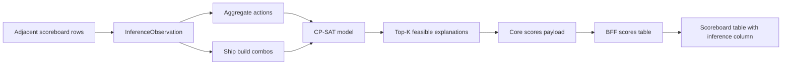

# Design: Military score inference implementation with OR-Tools

This document turns [design-military-score-build-inference.md](design-military-score-build-inference.md) into a phased implementation plan using OR-Tools CP-SAT.

The implementation should make exact feasibility the first-class contract: observed score and scoreboard deltas are hard constraints when enabled, while probability heuristics are encoded as an integer objective so the solver finds plausible explanations before low-probability noise.

**Related:** [design-military-score-build-inference.md](design-military-score-build-inference.md), [design-analytics-structure.md](design-analytics-structure.md), [design-planets-api-data-model.md](design-planets-api-data-model.md), [vga-planets-domain-context.md](vga-planets-domain-context.md).

---

## 1. Dependency choice

Use the Python package `ortools` for CP-SAT.

| Property | Decision |
|----------|----------|
| Package | `ortools` |
| Solver API | `ortools.sat.python.cp_model` |
| License | Apache-2.0 |
| Package location | `packages/api/pyproject.toml` |
| Lockfile update | via `uv` |

The dependency belongs in the Core API package because the inference model is domain logic. The BFF should only reshape Core results for the SPA, and the frontend should only render the analytic.

When adding the dependency, respect the dependency cooldown rule. At design time, the current OR-Tools release observed was older than seven days and supports the repo's Python 3.14 baseline.

---

## 2. Data flow



The first implementation solves each player independently. Cross-player coupling is deferred until ship trading, ship capture, and ownership transfers are modeled.

---

## 3. Module layout

Start with a small Core API subpackage so the solver and scoring model do not crowd the existing `scores` analytic:

```text
packages/api/api/analytics/military_score_inference/
|-- __init__.py
|-- accelerated_start.py    # accelerated scoreboard baselines, segment split, observation deltas
|-- actions.py              # aggregate noisy actions (defense, ammo load, transfers)
|-- ship_build_combos.py    # eligible hull/engine/beam/torp combos (Phase 1G+)
|-- component_eligibility.py # hull/component id resolution for policy filters and catalog build
|-- tier_policy.py          # YAML policy load, resolve, optional overlay hook (#77, #78)
|-- policy_ladder.py        # walk YAML policy steps, seed carry-forward, merge top-K
|-- inference_path.py       # prior-turn gate and InferencePath resolve-then-dispatch
|-- inference_target.py     # observation/catalog context; accelerated backfill source loading
|-- constraints.py          # hard equality targets and band-retry slack for observations
|-- models.py               # dataclasses for observations, actions, problems, solutions
|-- scoring.py              # scaled military-score contribution formulas
|-- score_arithmetic.py     # solution score breakdown for API diagnostics
|-- solver.py               # OR-Tools CP-SAT adapter
|-- inference_api_payload.py # inference result and solution API payload serialization
`-- analytic.py             # run_inference_with_artifacts entry; path dispatch to solver paths
```

Phase 1F shipped an interim flat `build_{hull}_{preset}` catalog in `actions.py`. Phase 1G moves ship builds into `ship_build_combos.py` and leaves aggregate actions in `actions.py`.

### 3.1 Accelerated start scoreboard (`accelerated_start.py`)

**Domain rules:** [design-military-score-build-inference.md](design-military-score-build-inference.md) section 3.3.

When `settings.acceleratedturns = N` with `N > 0`:

- **Unreliable rows** (`1 <= turn < N`): scoreboard deltas are not trustworthy for a single-host-turn solve. `prior_turn_score_data_available(turn)` in `inference_path.py` returns false for these rows (and for turn 1).
- **First reliable row** (`turn == N`): `accelerated_inference_segments(score, turn)` splits activity into an optional `accel_window` segment (host turn `N-2`) and a `reported_host_turn` segment (host turn `N-1`). Each segment gets its own observation and a full YAML **policy ladder** solve via `policy_ladder.py` (`ACCELERATED_SPLIT` path).
- **Later rows** (`turn > N`): use normal scoreboard deltas through `observation_deltas_from_score(score, turn)` and the single-row policy ladder (`POLICY_LADDER` path).

**Resolve-then-dispatch:** `run_inference_with_artifacts` in `analytic.py` calls `resolve_inference_path` in `inference_path.py` before any solver work. The `InferencePath` enum selects orchestration:

| Path | When | Solver behavior |
|------|------|-----------------|
| `NO_PRIOR_TURN` | Turn 1, or unreliable accelerated row with no backfill | Return `no_prior_turn` without CP-SAT |
| `ACCELERATED_BACKFILL` | Unreliable accelerated row; first reliable turn stored | Re-run split inference from stored turn `N`; return the segment matching this row's host turn |
| `ACCELERATED_SPLIT` | First reliable row (`turn == N`) | Per-segment policy ladders; primary API payload from `reported_host_turn` |
| `POLICY_LADDER` | Normal rows with a prior scoreboard row | Single `solve_with_policy_ladder` call |
| `CORPUS_PREBUILT` | Corpus harness passes a prebuilt catalog | Single solve on supplied catalog |

**Accelerated backfill:** Unreliable accelerated rows (`turn < N`) can still produce inference when the game store holds turn `N`. `inference_target.py` loads the first reliable scoreboard turn via `load_scoreboard_turn`, recomputes `accelerated_inference_segments` from that stored row, and `analytic.py` runs the same split solve once. The row's host turn (`turn - 1`) selects which segment's solutions and catalog are returned. Diagnostics include `accelerated_backfill`, `accelerated_backfill_source_turn`, and `accelerated_backfill_host_turn`. The scores analytic supplies `load_scoreboard_turn` when storage is available; callers without it (e.g. bare `infer_military_score_build`) cannot backfill.

**When `no_prior_turn` still applies:**

- **Turn 1** -- no prior host turn (`diagnostics.reason`: `first_turn`).
- **Unreliable accelerated row** (`turn < N`) when backfill cannot run: no `load_scoreboard_turn`, first reliable turn not stored, player missing on source turn, or no segment for the target host turn (`diagnostics.reason`: `accelerated_backfill_unavailable`).

**Homeworld baseline:** `starting_scoreboard_snapshot(settings)` derives turn-1 military totals from Starmap flags (e.g. `homeworldhasstarbase`, standard homeworld starbase fighters and defense posts, one starting freighter). Shared homeworld constants used by the action catalog (e.g. Evil Empire free starbase fighter caps) also live in this module.

**Diagnostics (not solver inputs):**

- `synthetic_scoreboard_before_reported_deltas(score)` -- totals at host turn `N-1` inferred by subtracting row deltas from turn `N` totals.
- `infer_accelerated_window_ship_builds(score, turn)` -- splits freighter/warship build counts across the accelerated window vs the reported host turn `N-1` delta fields; used in tests and future UI copy, not in CP-SAT constraints today.

**Tests:** `packages/api/tests/test_accelerated_start_scoreboard.py` (store-backed cases when `.data` is present; fixture-backed cases that need committed corpus JSON live alongside the inference corpus harness tests).

Do not register `military_score_inference` as a separate user-facing analytic. The solver package should be called by the existing `scores` analytic when inference is requested.

BFF and frontend files should follow existing analytics structure:

```text
packages/bff/bff/analytics/scores.py
packages/bff/bff/analytics/registry.py
packages/frontend/src/analytics/scores/
```

The implementation should not put solver logic in the BFF or frontend.

---

## 4. Core dataclasses

Use plain dataclasses in the Core package.

```python
@dataclass(frozen=True)
class InferenceObservation:
    player_id: int
    turn: int
    military_delta_2x: int
    warship_delta: int
    freighter_delta: int
    priority_point_delta: int
    starbases_owned: int
    is_after_ship_limit: bool


@dataclass(frozen=True)
class CandidateAction:
    id: str
    label: str
    score_delta_2x: int
    warship_delta: int = 0
    freighter_delta: int = 0
    priority_point_delta: int = 0
    build_slot_usage: int = 0
    lower_bound: int = 0
    upper_bound: int = 0
    probability_weight: int = 0
```

The important modeling rule is that action variables are non-negative integers, but action contribution vectors may contain positive or negative values. `probability_weight` is enough for simple actions, but repeated actions also need count-dependent probability terms.

```python
@dataclass(frozen=True)
class ProbabilityBucket:
    label: str
    lower_count: int
    upper_count: int
    marginal_weight: int
```

Use buckets when the probability of `n` repeated actions is not `n` independent repetitions of the same event. For example, building 10 defense posts is plausible, building 100 is much less plausible, but 100 defense posts should not be penalized as 100 independent rare choices.

```python
@dataclass(frozen=True)
class InferenceProblem:
    observation: InferenceObservation
    actions: tuple[CandidateAction, ...]
    probability_buckets_by_action_id: dict[str, tuple[ProbabilityBucket, ...]]
    max_solutions: int = 20
    time_limit_seconds: float = 20.0
```

**Target extension (Phase 1G+):** ship builds become structured combos; aggregate noisy actions stay flat.

```python
@dataclass(frozen=True)
class ShipBuildCombo:
    combo_id: str
    hull_id: int
    engine_id: int
    beam_id: int | None       # None = no beams fitted
    torp_id: int | None       # None = no torp tubes fitted
    beam_count: int           # 0 .. hull.beams
    launcher_count: int       # 0 .. hull.launchers
    labels: tuple[str, ...]   # display labels; multiple when score-equivalent
    score_delta_2x: int
    warship_delta: int
    freighter_delta: int
    probability_weight: int


@dataclass(frozen=True)
class InferenceProblem:
    observation: InferenceObservation
    aggregate_actions: tuple[CandidateAction, ...]
    ship_build_combos: tuple[ShipBuildCombo, ...]
    ship_build_tier: int
    probability_buckets_by_action_id: dict[str, tuple[ProbabilityBucket, ...]]
    max_solutions: int = 20
    time_limit_seconds: float = 20.0
```

The solver sums contributions from **both** aggregate action counts and ship-build combo counts into the same hard constraints.


@dataclass(frozen=True)
class InferenceSolutionAction:
    action_id: str
    label: str
    count: int


@dataclass(frozen=True)
class InferenceSolution:
    objective_value: int
    actions: tuple[InferenceSolutionAction, ...]


@dataclass(frozen=True)
class InferenceResult:
    status: str
    solutions: tuple[InferenceSolution, ...]
    diagnostics: dict[str, object]
```

These contracts can be refined during implementation, but the boundary should stay explicit: observations and candidate actions go into the solver; ranked feasible explanations come out.

---

## 5. CP-SAT formulation

For each `CandidateAction`, create one integer variable:

```text
count[action] in [lower_bound, upper_bound]
```

Add hard constraints:

```text
sum(score_delta_2x[action] * count[action]) == observation.military_delta_2x
sum(warship_delta[action] * count[action]) == observation.warship_delta
sum(freighter_delta[action] * count[action]) == observation.freighter_delta
sum(priority_point_delta[action] * count[action]) == observation.priority_point_delta
sum(build_slot_usage[action] * count[action]) <= observation.starbases_owned
```

Priority points should be configurable at first. If queue behavior is not yet confirmed for a scenario, run the solve with priority points as a diagnostic or optional constraint rather than silently accepting a wrong queue model.

Add an integer objective:

```text
maximize action_weights + bucketed_count_weights + interaction_weights
```

Weights should be scaled integer log-probabilities or penalties. For example, a common race-appropriate hull receives a better weight than an unusual one, and generic defense-post explanations receive a penalty so they do not crowd out more informative ship-build explanations.

### 5.1 Count-dependent probability terms

Some actions need probability as a function of count, not as a constant per unit. Use bucket variables for these cases.

Example for planetary defense posts:

| Bucket | Count range | Marginal meaning |
|--------|-------------|------------------|
| modest build-up | 0-10 | plausible local development |
| heavy build-up | 11-50 | less likely but common in border areas |
| extreme build-up | 51-100 | possible but strongly penalized |

The model can represent this with separate integer variables per bucket:

```text
defense_posts_total == defense_posts_bucket_1 + defense_posts_bucket_2 + defense_posts_bucket_3
0 <= defense_posts_bucket_1 <= 10
0 <= defense_posts_bucket_2 <= 40
0 <= defense_posts_bucket_3 <= 50
```

Then the objective uses different marginal weights for each bucket. This keeps the CP-SAT objective linear while avoiding the wrong assumption that 100 defense posts are as unlikely as 100 fully independent one-post actions.

This bucket pattern also applies to:

- starbase defense posts,
- starbase fighter increases,
- loaded fighter increases,
- loaded torpedoes by type,
- future mine-laying quantities.

---

## 6. Top-K solving

Do not enumerate all feasible solutions. Low-value actions can produce many exact but unhelpful combinations.

Use repeated optimization:

1. Build the model and solve for the best objective value.
2. Extract the non-zero action counts.
3. Add a no-good cut excluding that exact action vector.
4. Re-solve for the next best solution.
5. Stop when `max_solutions`, solver status, stream cancel (#71 SPA), or **batch** time budget is reached.

A no-good cut can be encoded with indicator variables that detect whether each action count differs from its previous value, then require at least one difference. Keep this inside `solver.py` so the rest of the analytic only sees top-K results.

**Phase 1H (#71):** the policy ladder and per-tier top-K loop emit the **full held top-K** on the NDJSON wire whenever a new **inference explanation signature** is admitted (incremental-only via solver `on_solution` -- no post-solve re-merge), before the row is complete, so the UI can show an **inference solution count indicator** (and open a partial modal) while later alternatives are still enumerating. Cross-row **inference row scheduler** interleaves tier jobs. SPA uses one multiplexed **inference table stream** plus **inference global pause**; implicit stream cancellation on scope change remains. Batch JSON still returns only after top-K or per-case time budget.

The solver should return:

- `exact` when at least one feasible solution is found,
- `no_exact_solution` when the model is infeasible under enabled constraints,
- `time_limited` when the **batch** time budget is reached before proving optimality (not used as the primary SPA stop mechanism after #71),
- `stopped` when the stream is cancelled (#71 SPA implicit cancel),
- `invalid_problem` when generated action bounds or observations are inconsistent before solving.

---

## 7. Scoreboard integration

The user-facing feature belongs to the existing **Scores** analytic. It should not appear as a separate analytic in the analytics list.

### 7.1 Analytics pane

Add an option inside the existing Scores tile:

- label: `Include build inference`,
- control: checkbox,
- default: off,
- disabled state: disabled only when Scores itself is unavailable,
- behavior: when checked, the scoreboard table requests or computes inference details in addition to normal score rows.

The checkbox should preserve the normal Scores analytic behavior. Turning it off should return the current scoreboard table shape with no inference column.

### 7.2 Scoreboard table

When inference is enabled, add one extra column to the existing scoreboard table.

| Icon | Meaning | Hover text | Click behavior |
|------|---------|------------|----------------|
| **Inference solution count indicator** | Green outlined badge with **N** = rows currently held in **inference merged top-K** (`N > 0`). Search may continue until `isComplete`. | summarize top solution; note when search is still running | open modal with ranked held solutions (grows while streaming until plateau at K) |
| Hourglass | No exact explanation held yet for this player row (`N = 0`) | show that inference is still running | no modal until the first held exact arrives |
| Paused | row frozen by **inference global pause** | paused summary; held count when **N > 0** | modal when **N > 0**; resume all via column header |
| Red cross | natural completion with no exact explanation, invalid problem, or solver failure | summarize failure status and key diagnostics | optionally open diagnostic modal if details exist |
| Global pause (column header) | freeze or resume all rows on this scope | pause/resume all build inference | `POST/DELETE .../inference/global-pause` |

The row-level hourglass means the frontend should track inference status per player, not block the whole scoreboard table until all rows are solved. The table should remain useful while slower rows are still pending. With Phase 1H streaming (#71), the hourglass clears when the first `solution` event arrives with a non-empty held top-K (`N` becomes 1), not when top-K enumeration or the full policy ladder finishes.

### 7.3 Modal details

The modal for a row with **N > 0** should show:

- player and turn transition,
- observed deltas used as constraints,
- solver status and runtime,
- ranked solutions in descending objective/probability order,
- action breakdown for each solution,
- score arithmetic for the selected solution,
- warnings when priority points were diagnostic-only or when deferred effects may explain missing solutions.

### 7.4 API shape

Keep the Core solver as an internal component. The Core `scores` analytic should accept an option such as `include_military_score_inference`. When false, it returns the current score rows. When true, each row may include an `inference` object:

```json
{
  "status": "exact",
  "summary": "Best: built one Rush with 18 fighters; 3 alternatives",
  "solutionCount": 4,
  "isComplete": true,
  "solutions": []
}
```

Inference is fetched **per scoreboard row** at the solver layer. Three wire paths:

| Path | Consumer | Completion |
|------|----------|------------|
| **Batch JSON** | Inference corpus harness, CI | Returns after top-K enumeration or per-case `time_limit_seconds` (default 20s) |
| **NDJSON table stream** | SPA (#71) primary | One connection per shell scope; multiplexed row events |

**Batch (current):** `GET .../scores/inference?playerId=...` returns one JSON payload when the row solve completes or hits the time budget.

**Table stream (Phase 1H, #71, SPA primary):** `GET .../scores/inference/table-stream?playerIds=...` returns one NDJSON connection for all requested rows. Events: `solution`, optional `progress`, `globalPause`, terminal `complete` / `error`. Row-scoped events include `playerId`. Follow the load-all progress pattern (`readNdjsonStream`, Zod-owned event shapes). Each `solution` event carries the **full held top-K** for that row (ranked explanations plus **inference solution rank weight**); the consumer replaces local held state from the payload (server owns merge and K-best eviction). The hourglass clears when the first `solution` arrives with `solutions.length >= 1`; the count badge and modal track `solutions.length` while search continues.

**Stream disconnect:** when the table stream ends (client `AbortSignal`, refresh, network loss, disable build inference, or natural completion after all rows finish), the server cancels all row runs for that connection and clears **inference global pause**. Reopening the table stream on the same scope **recalculates from scratch** (no server-side ladder or pause state preserved across disconnect).

**Global pause:** `POST/DELETE .../scores/inference/global-pause` freezes or resumes all scheduler work for the current scope **while the table stream is connected**. Open streams receive `globalPause` events; held top-K remains visible with paused chrome. The frontend syncs pause-control state from stream `globalPause` events.

**SPA time budget:** none. A row runs until the ladder completes, **inference global pause** freezes it (on an open stream), or the stream is cancelled (game / turn / **perspective** change, disable build inference, client disconnect). Implicit cancel may emit `complete` with `status: stopped`, `isComplete: true`, and the last held top-K on the wire when applicable; reconnect still recalculates.

**#77 batch path (before #71 stream UI):** same merge semantics (section 8.5.4) without wire events; `solutionCount` in the batch payload reflects final held top-K size.

### 7.5 Inference row scheduler (#71)

Process-wide backend facility (glossary: `CONTEXT.md` **Inference row scheduler**). Fair-schedules **inference search tier** work for rows on the active inference table stream.

1. When the table stream schedules a row, construct a tier-1 **inference tier job** (deltas, player id, ladder entry state).
2. Enqueue tier-1 on a shared **FIFO** queue.
3. Drain with a worker pool (default **4** workers, configurable). Distinct from corpus `--workers` (batch case parallelism).
4. When a tier job completes, enqueue that row's tier-(n+1) job (seeds, held solutions, signatures). Per-row tier chains are strictly sequential.
5. Emit `solution` events (full held top-K) from merge-admit hooks inside the tier job.

One schedulable job = one full **inference search tier** step (catalog build, exact/band passes, within-tier top-K, merge, seed output).

**Table stream multiplexing:** per-row event queues are round-robin drained into one NDJSON generator; `playerId` tags identify the row on the wire.

**Global pause:** pause drains the worker queue into a held buffer and broadcasts `globalPause`; resume requeues held tier jobs and continuations. Applies only while the table stream stays connected. **Stream disconnect** cancels all row runs and clears server-side global pause; reconnect recalculates from scratch.

**Accelerated-start rows:** same scheduler path as normal rows in v1; internal accel segments stay inside the row path (no per-segment SPA time split).

**Cancellation:** each row run has a cancel token. Scope change, disable build inference, and client disconnect call `cancel_run`, which purges queued tier jobs for that `run_id` and cooperatively stops in-flight work. There is no per-row halt API in the SPA.

**Accelerated-start lifecycle:** segment chaining and terminal row-complete assembly live in `InferenceStreamOrchestration`; the scheduler delegates after each segment's ladder finishes. Batch JSON uses `run_accelerated_split_inference` with per-segment time budgets (see module docstring in `inference_accelerated.py`).

**Inference solve interrupt boundary (v1):** cooperative cancel at sub-step boundaries inside a tier job (top-K iterations, seed attempts, exact vs band passes) plus `StopSearch()` when cancel fires mid-`Solve()`. OR-Tools CP-SAT cannot resume internal search state across `Solve()` calls. **Known gap:** a long first-feasible `Solve()` on a huge catalog may block cancel until that call returns. **Follow-on:** retry `UNKNOWN` sub-steps until feasible or cancelled (see `CONTEXT.md` **Inference solve interrupt boundary**).

---

## 8. Action catalog

The catalog has **two layers** that feed the same CP-SAT hard constraints:

1. **Aggregate actions** -- flat `CandidateAction` rows for repeated or location-agnostic effects.
2. **Ship build combos** -- sparse `(hull, engine, beam?, torp?, counts)` tuples with integer count variables (Phase 1G+).

Do **not** fold build-time fighter or torpedo **ammo** into ship combos. Loaded fighters and loaded torpedoes are separate aggregate actions that can take non-zero counts alongside ship builds.

### 8.1 Ship build combos (target model)

Each combo describes **one ship construction configuration** built at a starbase:

- one hull type;
- `hull.engines` copies of **one** engine type;
- `beam_count` copies of **one** beam type, or zero beams fitted;
- `launcher_count` copies of **one** torp tube type (via a torp's `launchercost`), or zero tubes fitted.

**Independence of beams and tubes:** omitting beams, omitting launchers, or omitting both is always allowed when the hull has the corresponding slots. Beams and tubes are not required to be fitted together.

**Same-type rule:** when `beam_count > 0`, all fitted beams share one beam type. When `launcher_count > 0`, all fitted tubes share one torp type (`launchercost`).

**Construction score** (scaled `score_delta_2x`):

```text
hull.cost
+ hull.engines * engine.cost
+ beam_count * beam.cost            (if beam_count > 0)
+ launcher_count * torp.launchercost (if launcher_count > 0)
plus minerals via megacredits + 5 * minerals
times 2 for military score scaling
```

Ammo (fighters loaded on ships, torpedoes loaded into tubes) is **not** part of this formula.

**Warship vs freighter:** a hull is a warship when it has `beams > 0`, `launchers > 0`, or `fighterbays > 0`; otherwise it counts as a freighter for `shipchange` / `freighterchange` constraints.

**Buildable hulls:** intersection of `player.activehulls`, race hull lists, `turn.racehulls`, and hulls present in `turn.hulls`. Do not filter hull catalog rows on `Hull.isbase`; Planets.nu marks normal starships with `isbase: true`.

**Eligible components** (widened by search tier -- see 8.5):

- engines from `player.activeengines` intersect `turn.engines`;
- beams from `player.activebeams` intersect `turn.beams`;
- torps from `player.activetorps` intersect `turn.torpedos` (tube cost only).

**Combo families by tier:**

| Tier focus | Beam / launcher counts | Typical use |
|------------|------------------------|-------------|
| Early tiers | `0` or maximum slot count only (`beam_count in {0, hull.beams}`, `launcher_count in {0, hull.launchers}`) | Default search; covers almost all practical builds |
| Later tiers | Intermediate counts `1 .. hull.beams - 1` and `1 .. hull.launchers - 1` | Niche partial-fit builds; lower priority |

Early tiers still include **minimal** builds `(beam_count=0, launcher_count=0)` for hulls with slots, including unarmed warships and torp hulls with empty tubes and/or empty beams.

**Global linking** (same hard constraints as today, summed over both layers):

```text
sum_agg(score_delta_2x * count)
  + sum_combo(score_delta_2x * build) == military_delta_2x

sum_agg(warship_delta * count)
  + sum_combo(warship_delta * build) == warship_delta

sum_agg(freighter_delta * count)
  + sum_combo(freighter_delta * build) == freighter_delta

sum(build_slot_usage) <= starbases_owned
```

Ship combos use `build_slot_usage = 1` per ship. Priority-point deltas on ship builds remain **zero** until production-queue semantics are modeled; treat `prioritypointchange` as diagnostic-only until then.

**Solution shape:** emit structured rows `{ hull, engine, beam?, torp?, beam_count, launcher_count, count }` rather than opaque `build_*` preset IDs.

### 8.2 Interim flat ship builds (Phase 1F -- to be replaced)

Phase 1F shipped a reduced flat catalog (`build_{hull}_{preset}`) with known gaps:

- single default engine (lowest ID in `turn.engines`);
- single default beam and torp type for armed presets;
- no beam-type or engine-type enumeration;
- preset names `empty` / `torpedoes` only.

This was enough to prove the pipeline but produces frequent INFEASIBLE results when the true build used other components. Phase 1G replaces this block with section 8.1.

### 8.3 Aggregate noisy actions

Aggregate actions where location detail is not yet known:

- `planet_defense_posts_added_total`,
- `starbase_defense_posts_added_total`,
- `starbase_fighters_added_total`,
- `ship_fighters_added_total`,
- `ship_torps_loaded_{torpedo_id}` for each torp type in `turn.torpedos`.

These variables still have exact score contributions, but they avoid one variable per planet or starbase in the initial version.

**#77 deferral:** aggregate noisy actions from section 8.3 enter only via cumulative **tier aggregate allowlist** on higher policy steps (section 8.5.2). `evil_empire_free_starbase_fighters` remains outside the allowlist.

### 8.4 Negative actions

Support signed contribution vectors from the start:

- fighter transfer from ship to starbase: negative score delta,
- fighter transfer from starbase to ship: positive score delta,
- future ship loss or transfer actions: negative or cross-player deltas.

Negative actions need explicit upper bounds. Without bounds, positive and negative actions can create cancellation loops and a huge number of equivalent solutions.

### 8.5 Inference search tier ladder (#77)

**GitHub:** #77 (static YAML policy), #78 (overlay injection follow-on). **Supersedes** interim hardcoded tiers 0--4 (#52, #72) and partial-slot step #54 (absorbed into policy). Glossary: `CONTEXT.md` (**Inference search tier**, **Inference tier policy**, **Fine-grained slack action**, etc.).

A full cross product of buildable hulls times eligible engines, beams, and launcher torpedo types can reach **low thousands to ~10k** combo variables in worst cases. Prefer a **variable-length unified ladder** loaded from static YAML over a fixed four-step ship-build loop with always-on aggregate actions.

#### 8.5.1 Interim implementation (pre-#77)

Phase 1G shipped `_solve_with_tier_retry` with hardcoded tiers 0--4 in code (`START_SHIP_BUILD_TIER`, `MAX_SHIP_BUILD_TIER`). Component defaults use **lowest engine/beam id** and **lowest torpedo tech level** -- not explicit early-game tech bands. **All** aggregate noisy actions from section 8.3 are included at every tier. That combination produces false positives: **fine-grained slack actions** pad military score before the true ship build appears at a higher tier.

#### 8.5.2 Policy asset

- **Path:** `assets/analytics/military_score_build_inference/tier_policy.yaml` at repo root (`assets/analytics/<analytic_id>/` pattern for analytic static config; distinct from `packages/api/api/storage/assets/` test/seed JSON).
- **Loader:** `resolve_tier_policies(base_path, overlay: TierPolicyOverlay | None = None)` in `tier_policy.py`. Overlay types and merge contract documented in #77; merge implementation in #78.
- **Steps:** ordered list of **inference tier policy** records. Each step is a strict superset of the prior step on every dimension it controls.

Per-step fields (informal schema; exact YAML shape is implementation-owned):

| Field | Meaning |
|-------|---------|
| `id` | Stable step id for diagnostics |
| `filters` | Catalog constraints for all four ship-build axes (see below) |
| `beamSlotCounts` / `launcherSlotCounts` | `none` (0 or max only) vs `partial` (niche intermediate counts); dedicated policy step before `partial` |
| `aggregateAllowlist` | Cumulative **tier aggregate allowlist**: action id -> max count |
| `alpha` | Military-score band tolerance in **2x** units; **final step must be `0`** |
| `maxSeeds` | Band near-solutions to carry to next step (default **5**) |

**`filters` object:** required keys `hulls`, `engines`, `beams`, `launchers`. Each value uses the same shape:

| Subfield | Meaning |
|----------|---------|
| `all: true` | **Widened** eligibility on that axis (not "every turn-catalog id"). **hulls:** all buildable hull ids for the player, no tech band. **engines / beams / launchers:** player `active*` intersect turn catalog; **empty active list jumps to full turn catalog** for that axis. Mutually exclusive with `techLevels`. |
| `techLevels: [...]` | Non-empty tech-level allowlist; component ids derived at runtime. **hulls:** intersect buildable hull set. **Other axes:** filter turn catalog by `techlevel`. Required when `all` is false or absent. |
| `componentIds: [...]` | Optional future refinement: further restrict resolved ids (e.g. when multiple ids share a tech level). Parsed but unused in v1 eligibility unless non-empty. |

Static YAML steps widen by **strict superset on `techLevels` lists** or by switching an axis from `techLevels` to `all: true` (one-way; cannot narrow back).

**Fine-grained slack deferral:** v1 **tier aggregate allowlist** admits only:

- `planet_defense_posts_added_total`
- `starbase_defense_posts_added_total`
- `starbase_fighters_added_total`
- `ship_fighters_added_total`
- `ship_torps_loaded_{torpedo_id}` (per type, with per-type caps)
- `fighters_starbase_to_ship` / `fighters_ship_to_starbase` (via `fighter_transfers_per_direction`)

**Not** deferred: `evil_empire_free_starbase_fighters` (race-specific, high-probability informational action when EE resources allow).

#### 8.5.3 v1 ladder (sketch A)

Tunable constants in YAML; illustrative starting point from design review:

| Step | Ship-build scope | Aggregate allowlist (cumulative caps) | `alpha` |
|------|------------------|---------------------------------------|---------|
| 0 | Early game: hulls tech 1--6, engines all, beams/launchers tech 1--5 | none | 50 |
| 1 | Widen launchers to tech 1--8 | none | 50 |
| 2 | Widen hulls (`filters.hulls.all`) | none | 50 |
| 3 | All component axes; partial beam/launcher **slot** counts | planet defense max 16; starbase/ship fighters max 50/20; fighter transfers max 50/dir | 50 |
| 4 | + starbase defense posts | + starbase defense max 5 | 30 |
| 5 | + ship torpedoes per type | + ship torps max 10 each | 30 |
| 6 | Full ship-build catalog; slack at full policy caps | full (fighters 200/500, transfers 100/dir) | 0 |

#### 8.5.4 Per-player solve loop

Replace `_solve_with_tier_retry` hardcoded 0--4 with policy-driven loop:

1. Walk policy steps until a step adds **no new distinct exact solution signatures** to the merged top-K, the stream is cancelled (#71 SPA), or the **batch** per-case time budget is exhausted (corpus / batch JSON path only).
2. Build catalog: policy constraints intersect turn catalog intersect player actives; apply **tier aggregate allowlist** and caps.
3. **Exact solve first** (military, warship, freighter equalities -- section constraints module).
4. If INFEASIBLE and `alpha > 0`, **band retry** on military score only: `explained_2x >= observed_2x - alpha`; warship and freighter stay exact.
5. **Exact solutions** from any step merge into **inference merged top-K** immediately (user-facing). **Do not** carry exact solutions forward as seeds -- no remainder to refine. Merge rules:
   - **Accumulate across the full ladder.** Catalog widen at a step (new ship-build combo ids and/or newly admitted aggregate action ids) does **not** discard previously merged exact solutions. Later tiers are strict supersets on every dimension they control; an explanation exact at step *N* remains valid for the observation when re-checked against the final catalog reached.
   - **Dedup:** identity is **inference explanation signature** (sorted multiset of aggregate action ids with counts plus ship-build combo ids with counts). Re-discovery at a later step is suppressed; first discovery wins. The same rule applies to batch merge and to stream emission in #71.
   - **K-best retention:** default top-K is 20. When *K* distinct signatures are held, the ladder **continues** climbing tiers (do not stop solely because the buffer is full). A new signature is admitted only if its **inference solution rank weight** exceeds the current worst held row, which is then evicted.
   - **Batch terminal status:** `exact` when **any** held row satisfies hard equalities (military, warship, freighter) against the **final** catalog at ladder end. Do not emit `exact` when rank-1 alone fails hard equalities but another held row would pass.
6. **Band near-solutions** (up to `maxSeeds` distinct per step) seed the **next** step only:
   - **Fix** ship-build combo counts from the seed.
   - Admit newly unlocked aggregate actions to close residual military score.
   - If infeasible, **widen** to a neighborhood around fixed counts.
   - If still infeasible, **free search** on the step catalog.
7. Band-feasible results are **internal**; they do not appear in the UI unless the full ladder produces zero exact solutions (see section 8.5.5).

Record in diagnostics: policy step `id`, index, `tiersAttempted`, resolved constraint snapshot, `alpha`, `comboCount`, seed count, band residual when used.

#### 8.5.5 User-facing outcomes

| Outcome | UI |
|---------|-----|
| At least one **exact** solution from any policy step | **Inference solution count indicator** with **N** = held top-K size; merged top-K across steps |
| Full ladder, zero exact | Red cross / `no_exact_solution`; diagnostics include best band residual from internal retries |
| Stream cancelled (#71 implicit cancel) | `status: stopped` when applicable; count badge when **N > 0** on the terminal wire event (not preserved server-side across reconnect) |
| Band near-solution | Never shown directly; seeds next step only |

While search is in flight (#71), **N** rises from 1 toward K as new signatures are admitted, then plateaus at K when the buffer is full (eviction swaps membership without changing **N**). Hourglass until **N > 0**; red cross only after natural terminal `complete` / batch response with zero held exact. Halt is not failure.

Do not emit `exact-with-deferred-risk` for band-feasible multisets in #77; that status remains for future deferred-effect modeling (#49).

#### 8.5.6 Runtime overlay (#78, follow-on)

**Fleet-informed tier promotion** and other external signals merge via **inference tier policy overlay** at resolve time (append tech levels, bump aggregate caps, etc.). #77 defines the hook (`overlay=None`); #78 implements merge semantics. Overlay producers (fleet histogram, prior builds, UI) are out of scope for both tickets.

### 8.6 Score-equivalent combos (solver-side merge)

Multiple combos may share the same `(score_delta_2x, warship_delta, freighter_delta)` but differ in labels or probability weights (different hull names with identical construction cost, or different components that collide after scaling).

For **feasibility**, the solver may merge such combos into one integer variable carrying multiple `labels`.

For **top-K enumeration**, equal score does **not** imply equal probability. Distinct labels with the same score should still produce **distinct ranked solutions** when their probability weights differ. Implementation options:

- keep separate objective terms until after solve, or
- expand merged variables back into label-specific solution rows during extraction.

Do not treat score-equivalent combos as interchangeable in the UI ranking solely because the military score constraint cannot distinguish them.

### 8.7 Inference tier policy overlay (#78)

Solver-side merge of `TierPolicyOverlay` into the resolved policy list before catalog build. Deterministic precedence per constraint type (document augment vs replace). No production caller required in #78. See `CONTEXT.md` **Inference tier policy overlay**.

---

## 9. Bounds and performance

The solver should receive a bounded catalog. Ship builds use **tiered combo generation** (section 8.5) rather than materializing the full cross product on the first attempt.

Use these bounds before building the CP-SAT model:

- **Residual score bound:** `abs(action.score_delta_2x) * count` cannot exceed a conservative residual cap unless the action is explicitly allowed to offset another signed action.
- **Build slot bound:** total ship builds cannot exceed starbases owned in the initial no-loss model.
- **Count-delta bound:** warship and freighter build actions are bounded by the observed count deltas when losses and trades are out of scope.
- **Capacity bound:** ship fighters and torpedoes should be capped by plausible loadout capacity where known.
- **Noisy-action cap:** defense posts, starbase fighters, and generic ammo adjustments should have conservative caps and lower probability weights.
- **Policy step cap:** stop climbing the inference search tier ladder when a step adds no new exact signatures, the stream is cancelled (#71 SPA), or the **batch** per-case time budget is exhausted (section 8.5.4).
- **Top-K cap:** default to 20 per player; when combo cardinality exceeds **5000**, interim policy forces `max_solutions=1` on the batch path so enumeration finishes within the time budget (revisit after #71 streaming + global pause ship; may no longer be needed).
- **Time cap (batch / corpus only):** default **20 seconds** per case (`DEFAULT_INFERENCE_TIME_LIMIT_SECONDS` in `actions.py`) on the batch JSON path. **SPA NDJSON streams have no row time budget** -- global pause freezes rows; implicit scope cancel ends them. Corpus orchestration may additionally cap whole probe runs (`--probe-time-limit-seconds`).

Expect **hundreds to low thousands** of variables per player at mid tiers; worst-case full catalogs may approach **~10k** combo variables before partial-count expansion. Staged solving (#77 YAML ladder), inference table streaming (#71), and the **inference row scheduler** (cross-row tier-1 interleaving) are the primary SPA mitigations. Column generation remains a later option if tier search is still too slow.

---

## 10. Implementation phases

These phases are intentionally small enough to hand to junior engineers. Each phase should be a reviewable PR unless the team explicitly batches adjacent phases.

### Phase 1A: Add the solver dependency

Goal: make OR-Tools available to Core API tests without changing product behavior.

Files:

- `packages/api/pyproject.toml`,
- `uv.lock`.

Steps:

1. Add `ortools` to the API package dependencies with `uv`.
2. Confirm the selected release satisfies the dependency cooldown rule.
3. Add a tiny import smoke test in `packages/api/tests/test_military_score_inference_solver.py`.
4. Do not create inference model code yet.

Done when:

- `PYTHONPATH=packages/api uv run python -m pytest packages/api/tests/test_military_score_inference_solver.py` passes,
- `make lint` passes.

### Phase 1B: Add Core contracts and score helpers

Goal: define the data shapes and deterministic score arithmetic before using CP-SAT.

Files:

- `packages/api/api/analytics/military_score_inference/models.py`,
- `packages/api/api/analytics/military_score_inference/scoring.py`,
- `packages/api/api/analytics/military_score_inference/__init__.py`,
- `packages/api/tests/test_military_score_inference_scoring.py`.

Steps:

1. Add dataclasses for observations, candidate actions, probability buckets, problems, solutions, and diagnostics.
2. Add scaled score helpers for fighters, torpedoes, starbase fighters, starbase defense posts, and planet defense posts.
3. Keep ship construction score as a helper that accepts already-known hull/component costs if full catalog data is not ready.
4. Add tests for exact scaled values, including half-point components multiplied by two.

Done when:

- score helper tests pass,
- dataclasses are frozen or otherwise safe to share between catalog and solver code,
- no OR-Tools model code exists outside the solver adapter planned for Phase 1C.

### Phase 1C: Add minimal CP-SAT exact solver

Goal: solve small synthetic inference problems exactly.

Files:

- `packages/api/api/analytics/military_score_inference/solver.py`,
- `packages/api/tests/test_military_score_inference_solver.py`.

Steps:

1. Convert each `CandidateAction` into a bounded integer variable.
2. Add hard equality constraints for scaled military score, warship count, freighter count, and priority points.
3. Add the build-slot upper-bound constraint.
4. Add support for signed action contribution vectors.
5. Return structured statuses instead of raising for infeasible models.

Tests:

- one exact positive-action solution,
- one solution using a negative action contribution,
- one infeasible problem,
- one invalid problem with bad action bounds.

Done when:

- solver tests pass with small synthetic catalogs,
- all solver-specific OR-Tools imports are isolated to `solver.py`.

### Phase 1D: Add ranked top-K solving

Goal: return the best few feasible solutions without enumerating the whole feasible space.

Files:

- `packages/api/api/analytics/military_score_inference/solver.py`,
- `packages/api/tests/test_military_score_inference_solver.py`.

Steps:

1. Add the integer objective for constant action weights.
2. Solve for the best feasible solution.
3. Add no-good cuts to exclude each returned action vector.
4. Re-solve until `max_solutions`, infeasibility, or time budget stops the loop.
5. Include objective value and non-zero action counts in each solution.

Tests:

- higher-weight solution sorts first,
- no-good cuts prevent duplicate solutions,
- top-K stops at the configured limit,
- time-limited or non-optimal status is surfaced in diagnostics.

Done when:

- top-K tests demonstrate descending objective order,
- the solver never enumerates all feasible solutions by default.

### Phase 1E: Add bucketed probability terms

Goal: support count-dependent probability for repeated low-value actions.

Files:

- `packages/api/api/analytics/military_score_inference/models.py`,
- `packages/api/api/analytics/military_score_inference/solver.py`,
- `packages/api/tests/test_military_score_inference_solver.py`.

Steps:

1. Add `ProbabilityBucket` support to `InferenceProblem`.
2. For each bucketed action, add bucket variables whose sum equals the action count.
3. Apply bucket marginal weights in the objective.
4. Prefer bucketed penalties for defense posts, starbase fighters, loaded fighters, and loaded torpedoes.

Tests:

- 10 defense posts has a different marginal penalty from 100 defense posts,
- a bucketed action still satisfies the exact score constraint,
- bucket variables cannot exceed their configured count ranges.

Done when:

- count-dependent priors are covered by tests,
- constant-weight actions still work unchanged.

### Phase 1F: Add initial action catalog

Goal: generate a bounded catalog for the first useful scoreboard-inference cases.

Status: **delivered** with interim flat ship-build presets (section 8.2). Replace in Phase 1G.

Files:

- `packages/api/api/analytics/military_score_inference/actions.py`,
- `packages/api/tests/test_military_score_inference_actions.py`.

Steps:

1. Add aggregate variables for low-value repeated actions.
2. Add interim flat ship-build actions from a small preset catalog.
3. Bound ship-build actions by observed warship/freighter deltas and starbase count.
4. Bound noisy actions by residual score and configured caps.
5. Add negative fighter-transfer actions with explicit caps.

Done when:

- action catalog tests pass,
- generated catalog size is logged or exposed in diagnostics for performance checks.

### Phase 1G: Factored ship build combos and tiered search

Goal: replace flat ship-build presets with structured combos (section 8.1) and staged tier widening (section 8.5).

Files:

- `packages/api/api/analytics/military_score_inference/ship_build_combos.py` (new),
- `packages/api/api/analytics/military_score_inference/actions.py` (aggregate actions only),
- `packages/api/api/analytics/military_score_inference/models.py`,
- `packages/api/api/analytics/military_score_inference/solver.py`,
- `packages/api/api/analytics/military_score_inference/analytic.py`,
- `packages/api/tests/test_military_score_inference_ship_build_combos.py` (new),
- updates to existing inference tests.

Steps:

1. Add `ShipBuildCombo` generation with validity rules (independent beam/tube omission, same-type rule, `hull.engines` engine count in score).
2. Early tiers: combo counts limited to `{0, max slots}` per axis; later tier adds partial beam/launcher counts.
3. Implement tier policy with **jump** when `activeengines` / `activebeams` / `activetorps` are empty.
4. Extend `InferenceProblem` and CP-SAT model to sum aggregate actions and combo counts into shared constraints.
5. Extend no-good cuts and solution extraction for combo variables; emit structured build rows.
6. Optional solver-side merge of score-equivalent combos; preserve distinct top-K rows when probability weights differ (section 8.6).
7. Expose `ship_build_tier`, `tiers_attempted`, and combo counts in diagnostics.
8. Remove interim flat `build_{hull}_{preset}` actions once parity tests pass.

Tests:

- combo validity and construction score for minimal, beam-only, tube-only, and fully armed builds;
- multi-engine hulls multiply engine cost by `hull.engines`;
- tier widening finds a feasible solution when tier 0 is too narrow;
- empty `active*` lists jump tiers without false INFEASIBLE from single-default components;
- score-equivalent merge does not collapse distinct probability-ranked solutions.

Done when:

- real-turn cases that failed under Phase 1F (wrong engine/torp/beam type) become feasible at an documented tier,
- diagnostics report tier and combo cardinality,
- `make lint` and inference package tests pass.

### Phase 1I: YAML inference search tier policy (#77)

Goal: replace hardcoded ship-build tiers 0--4 and always-on aggregate slack with the unified policy ladder (section 8.5).

GitHub: **#77** (supersedes #52, #72, absorbs #54). Follow-on: **#78** (overlay merge).

Files:

- `assets/analytics/military_score_build_inference/tier_policy.yaml` (new),
- `packages/api/api/analytics/military_score_inference/tier_policy.py` (new),
- `packages/api/api/analytics/military_score_inference/policy_ladder.py` (ladder walk and top-K merge),
- refactors to `actions.py`, `ship_build_combos.py`, `component_eligibility.py`, `analytic.py`, `constraints.py` (band retry only; warship/freighter stay exact).

Done when:

- acceptance criteria in #77 are met,
- section 8.5 is authoritative over interim Phase 1G tier code paths.

#### Branch composition and merge planning

The **Issue_77** branch may bundle tier policy, accelerated-start inference, corpus probe tooling, and frontend diagnostics in one PR. The slices below are **logical review units** for attribution and merge discussion -- not a mandate to split git history unless explicitly requested.

| Slice | Role | Primary ownership |
|-------|------|-------------------|
| **A** (merge gate) | Tier policy core per section 8.5; satisfies **#77** acceptance criteria | `tier_policy.yaml`, `tier_policy.py`, `policy_ladder.py`, `component_eligibility.py`; refactors to `actions.py`, `constraints.py` (band retry), `ship_build_combos.py`, `solver.py`, `analytic.py`; `test_military_score_inference_tier_policy.py` and related inference tests |
| **B** (companion) | Accelerated-start inference dispatch | `accelerated_start.py`, `inference_target.py`, `inference_path.py`; scoreboard wiring in `scores.py`, `turn_analytic_service.py`; `test_accelerated_start_scoreboard.py` |
| **C** (companion, optional split) | Corpus probe harness; inventory-only ground truth | `Makefile` targets (`inference_corpus`, `inference_corpus_discover`, `inference_corpus_probe`), `scripts/run_inference_corpus.py`, `packages/api/tests/inference_corpus/` (`worker.py`, `ground_truth.py`, `run.py`, `verify.py`, discovery/coverage/report), `test_inference_corpus_*.py`; spec touch-ups in `docs/design-inference-corpus.md` |
| **D** (companion, optional split) | Frontend accelerated segments and wire parsing | `acceleratedInferenceSegments.ts`, `scoresWireParsers.ts`, `diagnosticsFromTable.ts`, `inferenceConstraints.ts`, `InferenceDetailModal.tsx`; matching `*.test.ts(x)` |

**Merge gate:** slice **A** closes **#77**. Slices **B--D** are companion changes on the same branch that depend on or exercise the ladder but are not required to meet **#77** acceptance criteria.

**Review recommendation:** approve **A + B** as one unit (backend tier policy plus accelerated-start solve dispatch). **C** and **D** can ship with the branch or split into follow-on PRs under epic **#39** (corpus harness **#62--#66**, frontend diagnostic polish) without blocking **#77** merge once **A** (and typically **B**) pass.

### Phase 1H: Solution streaming, scheduler, and global pause (NDJSON)

Goal: expose exact explanations **within each scoreboard row** as they are admitted to **inference merged top-K**, interleave tier work fairly across rows, and let the user pause open-ended searches globally.

GitHub: **#71**. Depends on **#77** ladder merge semantics (section 8.5.4): cross-tier accumulation, signature dedup, K-best eviction.

Files:

- `packages/api/api/analytics/military_score_inference/inference_scheduler.py` (or equivalent: FIFO tier jobs, worker pool, per-row cancel),
- `packages/api/api/analytics/military_score_inference/policy_ladder.py` (emit hook on merge admit),
- `packages/api/api/analytics/military_score_inference/solver.py` (callback per within-tier solution; sub-step cancel checks),
- Core + BFF inference routes (NDJSON stream alongside existing batch JSON),
- `packages/frontend/src/api/` (Zod schemas + parser for stream events, including `stopped`),
- `packages/frontend/src/analytics/scores/useScoresInferenceByRow.ts` (consume stream, count badge, global pause sync, partial modal),
- tests at API, BFF, and frontend layers.

Steps:

1. Define NDJSON event types: `solution`, optional `progress`, `globalPause`, terminal `complete` / `error`. `complete.status` includes `exact`, `no_exact_solution`, `stopped`, etc. Table-stream row events include `playerId`.
2. Implement **inference row scheduler** (section 7.5): tier-1 enqueued per row at schedule time; tier-(n+1) chained per row; shared FIFO; default 4 workers (configurable). Add **inference global pause** (held jobs, broadcast).
3. Emit `solution` when the ladder admits a **new** **inference explanation signature** to held top-K. Payload is the **full held top-K** for that row (ranked explanation rows plus **inference solution rank weight**). Do not emit on suppressed re-discoveries. Consumer replaces local held state; no client-side merge.
4. Refactor the within-tier top-K loop to flush each feasible solution to the emit hook before the next no-good cut.
5. Add stream endpoint on Core and BFF; document in BFF OpenAPI for visibility; treat Zod as authoritative for frontend parsing.
6. **SPA:** no row time budget. **Inference global pause** in column header (while table stream connected); implicit cancel on game / turn / **perspective** change, disable build inference, disconnect (`AbortSignal`). Disconnect clears server-side global pause and recalculates on reconnect. No per-row halt API.
7. **Batch JSON:** retain for corpus harness with per-case `time_limit_seconds`. Do not remove batch time limits when SPA drops them.
8. Cooperative cancel at **inference solve interrupt boundaries** (section 7.5); `cancel_run` purges queued tier jobs. Document follow-on: sub-step retry on `UNKNOWN` if cancel responsiveness is insufficient.
9. Revisit combo-count `max_solutions=1` batch fallback after streaming + global pause proven.

**Corpus probe follow-ons** (companion PR or epic follow-on acceptable):

- Per-case time override CLI or manifest field
- Report/filter mode for `time_limited` outcomes (interrupt-boundary diagnosis)
- Single-case deep rerun with rich diagnostics when a case times out under a short cap

Done when:

- first admitted solution appears before top-K enumeration and policy-ladder completion on large catalogs,
- tier-1 jobs for all active rows start without waiting behind another row's deep ladder climb,
- count badge **N** always matches modal row count (held top-K, not cumulative discoveries above K),
- global pause and implicit stream cancel work; partial rows are not misclassified as failure,
- batch JSON + corpus time limits still work,
- `make lint` and relevant package tests pass.

### Phase 2: Integrate with the existing Core scores analytic

Goal: enrich `scores` rows with optional inference data while preserving current behavior when disabled.

Files:

- `packages/api/api/analytics/scores.py`,
- `packages/api/api/analytics/options.py`,
- `packages/api/api/analytics/military_score_inference/analytic.py`,
- `packages/api/tests/test_analytics_registry.py`,
- `packages/api/tests/test_military_score_inference_analytic.py`.

Steps:

1. Add a scores option such as `include_military_score_inference`.
2. Keep `get_scores_table(turn)` behavior unchanged when the option is false.
3. When enabled, build one `InferenceObservation` per score row with enough adjacent-turn data available.
4. Call the internal solver package per player.
5. Attach an `inference` object to each Core scores row.
6. Do not add a new Core analytic ID for the user-facing feature.

Tests:

- current scores output remains unchanged when disabled,
- enabled output includes per-row inference status,
- missing prior score data produces a row-level diagnostic status,
- one player's solver failure does not remove other players' score rows.

Done when:

- Core scores tests cover both disabled and enabled behavior,
- the analytics registry still exposes `scores` as the user-facing analytic.

### Phase 3: Add BFF request and table shaping

Goal: expose the optional inference column through the existing BFF scores table.

Files:

- `packages/bff/bff/analytics/scores.py`,
- `packages/bff/bff/analytics/models.py` if query options need to expand,
- `packages/bff/bff/routers/analytics.py` if table query parsing needs a new option,
- `packages/bff/tests/test_analytics.py`.

Steps:

1. Add a BFF query option for `includeBuildInference`.
2. Forward the option to the Core scores analytic.
3. Keep existing scores table columns unchanged when the option is false.
4. Add an inference column when the option is true.
5. Shape each inference cell with status, summary text, and detail payload or detail lookup key.

Tests:

- disabled BFF response exactly matches the current table contract,
- enabled response adds the inference column,
- exact, in-progress, and failure statuses format predictably,
- diagnostics from Core are preserved enough for hover text.

Done when:

- BFF tests prove backward-compatible default behavior,
- no solver logic exists in BFF code.

### Phase 4: Add frontend scoreboard controls and status cells

Goal: let users enable inference from the Scores tile and see row-level status in the scoreboard.

Files:

- `packages/frontend/src/analytics/scores/` or the existing scores-related frontend module,
- `packages/frontend/src/AnalyticsBar.tsx` or the generic tile component that owns per-analytic controls,
- `packages/frontend/src/MainArea.tsx` if query keys or table rendering need option wiring,
- frontend tests near the touched components.

Steps:

1. Add a checkbox labeled `Include build inference` to the Scores analytic controls.
2. Include the checkbox state in the scores query key.
3. Render the inference column only when enabled.
4. Render inference solution count indicator, hourglass, or red cross based on row status.
5. Add hover text with the row summary.
6. Keep the normal scoreboard table fast and unchanged when the checkbox is off.

Tests:

- checkbox toggles the query option,
- disabled state shows the current scoreboard columns,
- enabled state renders the inference column,
- each status renders the expected icon and accessible label.

Done when:

- frontend tests pass,
- the scoreboard remains usable while inference is disabled.

### Phase 5: Add solution-detail modal

Goal: let users inspect ranked solutions for rows with feasible explanations.

Files:

- `packages/frontend/src/analytics/scores/` modal component,
- any shared dialog component if one already exists,
- frontend tests for modal behavior.

Steps:

1. Open the modal when the user clicks a row with **N > 0**.
2. Show solutions in descending objective/probability order.
3. Show observed deltas, action breakdown, score arithmetic, and warnings.
4. Do not open a solution modal for hourglass rows.
5. For red cross rows, either show hover-only diagnostics or a separate diagnostic modal if details are already available.

Tests:

- clicking a count badge opens the modal,
- solutions are displayed in order,
- hourglass rows are non-clickable or explain that solving is pending,
- modal closes cleanly and does not reset the Scores checkbox.

Done when:

- modal behavior is covered by frontend tests,
- detailed solution rendering does not require BFF or frontend to understand OR-Tools internals.

### Phase 6: richer constraints and deferred effects

Add action families and constraints only after Phase 1G ship-build combos are measurable.

Candidates:

- mine laying and scooping,
- ship trades and captures,
- planet and starbase losses,
- prior inventory and resource bounds,
- per-location defense post and fighter attribution,
- production-queue priority-point effects on ship builds,
- fleet-histogram priors for tier ordering and combo weights.

Each addition should include tests showing both new feasible explanations and cases where the new action removes a previous false unsat.

---

## 11. Testing strategy

Keep most unit tests below HTTP boundaries until the model stabilizes. See also **inference corpus** integration tests below (real finished-game turns).

### 11.1 Unit and integration layers (existing)

| Layer | Tests |
|-------|-------|
| Scoring helpers | exact scaled contribution values for ships, fighters, torpedoes, defenses |
| Aggregate action catalog | bounds, signed actions, noisy-action aggregation, bucket assignments |
| Ship build combos | validity rules, tier widening, construction score, partial counts (later tier) |
| Solver | exact fit, top-K, no-good cuts over aggregate + combo vars, tier diagnostics, infeasible status |
| Core scores analytic | disabled behavior, enabled row enrichment, per-player results, diagnostics |
| BFF scores table | default table contract, optional inference column, hover summaries |
| Frontend scores UI | checkbox control, row status icons, modal behavior |

Prefer synthetic fixtures with small combo catalogs. Large real-turn fixtures should include tier and combo-count regression checks.

### 11.2 Inference corpus (real-turn regression)

**Authoritative contract:** [design-inference-corpus.md](design-inference-corpus.md) (manifest schema, complexity rubric, ground truth v1, coverage reasons, Tier 1 re-check, discovery, issue map #62–#66). This subsection is a summary only.

The **inference corpus** exercises production inference APIs against stored **TurnInfo** from finished games. Harness code lives under the API **test hierarchy** (`packages/api/tests/inference_corpus/`), not under `api/` business modules. A thin Typer entrypoint lives at `scripts/run_inference_corpus.py`. Import as `tests.inference_corpus` with API package `pythonpath` `.` (see spec section 1).

Glossary terms: repo root `CONTEXT.md` (**Inference corpus case**, **Inference host turn**, **Catalog coverage**, **Out of search space**, etc.).

#### Two runner modes

| Mode | Purpose | Data source |
|------|---------|-------------|
| **Fixed corpus** | CI (`make test_api`) | `packages/api/tests/fixtures/inference_corpus/manifest.json` plus trimmed RST slices |
| **Local corpus** | Dev / nightly against downloaded games | `scripts/run_inference_corpus.py --game-id <id>` reading the **file backend** store (default storage root from config, typically `.data`) |

Both modes call the same harness library (`tests.inference_corpus`). Both use the **batch JSON** inference path only (not the SPA NDJSON stream). Per-case `time_limit_seconds` remains on the batch path after #71; orchestration may cap whole probe runs (`--probe-time-limit-seconds`). See [design-inference-corpus.md](design-inference-corpus.md) section 13.

#### Case discovery (local mode)

Enumerate stored paths under `games/{gameId}/`. For each **perspective** `P` and each host turn `N` where **both** `games/{id}/P/turns/N` and `.../N+1` exist, emit one **inference corpus case**:

- **Inference host turn:** `N` (activity being explained).
- **Scoreboard input:** `TurnInfo` at turn **N+1** from perspective `P` (deltas on that document describe host turn `N`).
- **Default player scope:** the **Player** at perspective slot `P` (what that slot built on host turn `N`).

Sparse storage is valid: only perspectives and turn pairs that exist are discovered.

#### Complexity grading and culling

Before running the solver, classify each case into `minimal`, `routine`, `heavy`, or `adjunct` from **ground-truth inventory change** between turns `N` and `N+1` for the case player. Signals include ship build count, defense/fighter load-ups, and adjunct effects (losses, trades, captures).

- **Multi-perspective ground truth:** adjunct detection (e.g. trades) may merge ship visibility from every perspective that has both turns stored. If a required other perspective is missing, do not infer a trade; mark `incomplete_multi_view` when relevant.
- **`--max-complexity`:** skip cases above the cap (recorded reason, not a failure).
- **Level 3 (`adjunct`):** skipped by default unless a future `--include-adjunct` flag is added.

#### Per-case pipeline

1. Skip if complexity > `--max-complexity`.
2. Classify complexity (optional multi-perspective merge for adjunct signals).
3. Extract **ground truth explanation** when the extractor supports this case; if unavailable, run **Tier 1 only** (observation closure).
4. **Catalog coverage** (v1: action-level mapping of ground truth to the catalog built from turn `N+1` `TurnInfo`; later: optional CP-SAT feasibility probe when mapping says covered but solver is INFEASIBLE). If not covered, emit **out of search space** with `coverageReason` (e.g. `deferred_trade`, `combo_not_in_catalog`) and **do not** run the solver.
5. **Tier 1:** `infer_military_score_build` for the case player on turn `N+1`. For `minimal` / `routine`: require `exact`, at least one solution, and programmatic verification of hard equalities on the top solution. For `heavy`: same, or allow `time_limited` with at least one feasible solution. CI fixed rows are `minimal` / `routine` with implicit `exact` expectation; manifest may add `expectedStatus` for known regressions.
6. **Tier 2** (when enabled, e.g. `--tier 2`): assert ground truth is **compatible** with inventory (hard fail on mismatch).
7. **Top-K ranking check** (default `K=3`, `--top-k`): when ground truth is available and catalog coverage passed, require the ground-truth action multiset to appear among the top `K` ranked solutions. A miss is an **investigation signal** (soft by default; manifest may set `requireTopK: true` for hard fail on selected CI rows). Levels 0-1: soft everywhere until priors stabilize.

#### Outcome buckets (reporting)

| Bucket | Meaning |
|--------|---------|
| `passed` | Tier 1 (and Tier 2 if enabled) satisfied |
| `failed` | Hard Tier 1/2 failure |
| `skipped_complexity` | Above `--max-complexity` |
| `skipped_incomplete_multi_view` | Adjunct hypothesis needs missing perspectives |
| `out_of_search_space` | Ground truth not expressible in current catalog (distinct from solver `no_exact_solution`) |
| `ranking_miss` | `exact` but ground truth not in top-K (investigation, optionally hard) |

Script exit code `0` when no hard failures; stdout supports human summary and optional `--json`.

#### CI fixed corpus content

- Small trimmed finished-game slice under `tests/fixtures/inference_corpus/`.
- Manifest lists explicit cases with `hostTurn`, `perspective`, `complexity`, optional `requiredPerspectives`, optional `requireTopK`.
- Most rows: `minimal` / `routine`, Tier 1 `exact` only.
- Optional second snippet with multiple perspectives for future adjunct / coverage regressions.

#### Ordering relative to solver work (GitHub epic #39)

| When | Corpus milestone |
|------|------------------|
| Parallel with #50 | Harness + Tier 1 + CI fixed corpus on current flat catalog |
| After #50 | Fewer false `no_exact_solution` from priority-point gaps; corpus Tier 1 more meaningful |
| After #51, #52 | Revisit catalog coverage mapping for **ship build combos**; expand fixed corpus with combo-tier regressions |
| After #53 | Optional manifest rows tied to combo diagnostics shapes |
| With #49 (deferred effects) | Expand ground truth + coverage for trades/losses; adjunct fixtures |

Epic #39 Phase 1G tracker: #50, #51, #52, #53, #54, #55. Per-row solution streaming: **#71** (Phase 1H). Corpus harness: #62, #63, #64, #65, #66 (spec: [design-inference-corpus.md](design-inference-corpus.md)).

---

## 12. Risks and mitigations

| Risk | Mitigation |
|------|------------|
| Too many low-probability exact solutions | optimize by probability first, top-K only, aggregate noisy actions |
| Ship-build catalog too narrow (INFEASIBLE) | factored combos with tiered widening; jump tiers when `active*` empty |
| Ship-build catalog too wide (slow solve) | tier caps, inference row scheduler, streaming + global pause (#71), batch/corpus time limits, combo-count diagnostics |
| Score-equivalent combos hide UI diversity | merge for feasibility only; split labels for top-K when weights differ |
| Incorrect priority-point model | priority-point equality soft/diagnostic until queue semantics are modeled |
| False confidence | return multiple explanations and expose ambiguity |
| Scoreboard regression | keep inference disabled by default and test the existing table contract |
| Row-level solving blocks the table | per-row NDJSON streams (#71); inference row scheduler for cross-row fairness; hourglass clears on first admitted solution |
| Open-ended SPA search consumes CPU | global pause; scope cancel; worker pool cap; batch/corpus stay time-bounded |
| Cancel blocked by long CP-SAT call | sub-step interrupt boundaries; follow-on UNKNOWN retry if needed |
| Dependency/platform issue | keep solver isolated behind an adapter so a fallback can be added |
| Hard-to-debug CP-SAT models | emit diagnostics with tier, combo counts, bounds, constraint targets, solver status |

---

## 13. Acceptance criteria

Phase 1 should be considered complete when:

- OR-Tools is isolated to the Core API solver adapter,
- synthetic CP-SAT tests pass for positive and negative action vectors,
- bucketed probability terms pass count-dependent objective tests,
- top-K ranked solving returns distinct feasible explanations,
- infeasible cases return diagnostics rather than exceptions,
- `make lint` and the relevant package tests pass.

The user-facing scoreboard integration should be considered complete when:

- inference remains disabled by default,
- the existing Scores table contract is unchanged when inference is disabled,
- the Scores tile includes an `Include build inference` checkbox,
- enabling inference adds an inference column with row-level status,
- rows with **N > 0** open a modal with ranked held solution details,
- global pause freezes in-flight inference without losing partial held top-K while the table stream stays open; stream disconnect clears pause and recalculates; implicit cancel may emit `status: stopped` with the last held top-K on the wire,
- BFF and frontend code never import OR-Tools or encode solver rules directly,
- `make lint` and the relevant API, BFF, and frontend tests pass.
