# Design: Military score inference implementation with OR-Tools

This document turns [design-military-score-build-inference.md](design-military-score-build-inference.md) into a phased implementation plan using OR-Tools CP-SAT.

The implementation should make exact feasibility the first-class contract: observed score and scoreboard deltas are hard constraints when enabled, while probability heuristics are encoded as an integer objective so the solver finds plausible explanations before low-probability noise.

**Related:** [design-military-score-build-inference.md](design-military-score-build-inference.md), [design-analytics-structure.md](design-analytics-structure.md), [design-planets-api-data-model.md](design-planets-api-data-model.md), [vga-planets-domain-context.md](vga-planets-domain-context.md).

---

## 1. Dependency choice

Use the Python package `ortools` for CP-SAT.

| Property | Decision |
|----------|----------|
| Package | `ortools` |
| Solver API | `ortools.sat.python.cp_model` |
| License | Apache-2.0 |
| Package location | `packages/api/pyproject.toml` |
| Lockfile update | via `uv` |

The dependency belongs in the Core API package because the inference model is domain logic. The BFF should only reshape Core results for the SPA, and the frontend should only render the analytic.

When adding the dependency, respect the dependency cooldown rule. At design time, the current OR-Tools release observed was older than seven days and supports the repo's Python 3.14 baseline.

---

## 2. Data flow

```mermaid
flowchart LR
    Scores["Adjacent scoreboard rows"] --> Observations["InferenceObservation"]
    Observations --> Catalog["Candidate action catalog"]
    Catalog --> Model["CP-SAT model"]
    Model --> Solutions["Top-K feasible explanations"]
    Solutions --> CoreAnalytic["Core analytic payload"]
    CoreAnalytic --> BffTable["BFF table response"]
    BffTable --> Frontend["Frontend analytic tile"]
```



The first implementation solves each player independently. Cross-player coupling is deferred until ship trading, ship capture, and ownership transfers are modeled.

---

## 3. Module layout

Start with a small Core API subpackage so the solver and scoring model do not crowd the existing `scores` analytic:

```text
packages/api/api/analytics/military_score_inference/
|-- __init__.py
|-- actions.py          # action catalog and contribution helpers
|-- models.py           # dataclasses for observations, actions, problems, solutions
|-- scoring.py          # scaled military-score contribution formulas
|-- solver.py           # OR-Tools CP-SAT adapter
`-- analytic.py         # turn-level analytic assembly
```

Register the analytic from `packages/api/api/analytics/registry.py` after the Core payload is stable.

BFF and frontend files should follow existing analytics structure:

```text
packages/bff/bff/analytics/military_score_inference.py
packages/bff/bff/analytics/registry.py
packages/frontend/src/analytics/militaryScoreInference/
```

The implementation should not put solver logic in the BFF or frontend.

---

## 4. Core dataclasses

Use plain dataclasses in the Core package.

```python
@dataclass(frozen=True)
class InferenceObservation:
    player_id: int
    turn: int
    military_delta_2x: int
    warship_delta: int
    freighter_delta: int
    priority_point_delta: int
    starbases_owned: int
    is_after_ship_limit: bool


@dataclass(frozen=True)
class CandidateAction:
    id: str
    label: str
    score_delta_2x: int
    warship_delta: int = 0
    freighter_delta: int = 0
    priority_point_delta: int = 0
    build_slot_usage: int = 0
    lower_bound: int = 0
    upper_bound: int = 0
    probability_weight: int = 0
```

The important modeling rule is that action variables are non-negative integers, but action contribution vectors may contain positive or negative values.

```python
@dataclass(frozen=True)
class InferenceProblem:
    observation: InferenceObservation
    actions: tuple[CandidateAction, ...]
    max_solutions: int = 20
    time_limit_seconds: float = 1.0


@dataclass(frozen=True)
class InferenceSolutionAction:
    action_id: str
    label: str
    count: int


@dataclass(frozen=True)
class InferenceSolution:
    objective_value: int
    actions: tuple[InferenceSolutionAction, ...]


@dataclass(frozen=True)
class InferenceResult:
    status: str
    solutions: tuple[InferenceSolution, ...]
    diagnostics: dict[str, object]
```

These contracts can be refined during implementation, but the boundary should stay explicit: observations and candidate actions go into the solver; ranked feasible explanations come out.

---

## 5. CP-SAT formulation

For each `CandidateAction`, create one integer variable:

```text
count[action] in [lower_bound, upper_bound]
```

Add hard constraints:

```text
sum(score_delta_2x[action] * count[action]) == observation.military_delta_2x
sum(warship_delta[action] * count[action]) == observation.warship_delta
sum(freighter_delta[action] * count[action]) == observation.freighter_delta
sum(priority_point_delta[action] * count[action]) == observation.priority_point_delta
sum(build_slot_usage[action] * count[action]) <= observation.starbases_owned
```

Priority points should be configurable at first. If queue behavior is not yet confirmed for a scenario, run the solve with priority points as a diagnostic or optional constraint rather than silently accepting a wrong queue model.

Add an integer objective:

```text
maximize sum(probability_weight[action] * count[action])
```

Weights should be scaled integer log-probabilities or penalties. For example, a common race-appropriate hull receives a better weight than an unusual one, and generic defense-post explanations receive a penalty so they do not crowd out more informative ship-build explanations.

---

## 6. Top-K solving

Do not enumerate all feasible solutions. Low-value actions can produce many exact but unhelpful combinations.

Use repeated optimization:

1. Build the model and solve for the best objective value.
2. Extract the non-zero action counts.
3. Add a no-good cut excluding that exact action vector.
4. Re-solve for the next best solution.
5. Stop when `max_solutions`, solver status, or time budget is reached.

A no-good cut can be encoded with indicator variables that detect whether each action count differs from its previous value, then require at least one difference. Keep this inside `solver.py` so the rest of the analytic only sees top-K results.

The solver should return:

- `exact` when at least one feasible solution is found,
- `no_exact_solution` when the model is infeasible under enabled constraints,
- `time_limited` when the solver reaches the time budget before proving optimality,
- `invalid_problem` when generated action bounds or observations are inconsistent before solving.

---

## 7. Action catalog

Generate the initial catalog from the observation and static game data.

### 7.1 Ship build actions

Create build actions for hulls the player can build. Each concrete action should include hull, engines, beams, tubes, and optional initial ammo load if the loadout catalog is known.

Initial implementation can deliberately start with a reduced loadout catalog:

- canonical empty or low-ammo build,
- common full-fighter carrier build,
- common torpedo-ship loadouts by torpedo tech,
- race-specific preferred hull priors.

Avoid generating every theoretical component combination until the performance envelope is measured.

### 7.2 Low-value repeated actions

Aggregate noisy actions where location detail is not yet known:

- `planet_defense_posts_added_total`,
- `starbase_defense_posts_added_total`,
- `starbase_fighters_added_total`,
- `ship_fighters_added_total`,
- `ship_torps_loaded_by_type`.

These variables still have exact score contributions, but they avoid one variable per planet or starbase in the initial version.

### 7.3 Negative actions

Support signed contribution vectors from the start:

- fighter transfer from ship to starbase: negative score delta,
- fighter transfer from starbase to ship: positive score delta,
- future ship loss or transfer actions: negative or cross-player deltas.

Negative actions need explicit upper bounds. Without bounds, positive and negative actions can create cancellation loops and a huge number of equivalent solutions.

---

## 8. Bounds and performance

The solver should receive a bounded, pruned action catalog.

Use these bounds before building the CP-SAT model:

- **Residual score bound:** `abs(action.score_delta_2x) * count` cannot exceed a conservative residual cap unless the action is explicitly allowed to offset another signed action.
- **Build slot bound:** total ship builds cannot exceed starbases owned in the initial no-loss model.
- **Count-delta bound:** warship and freighter build actions are bounded by the observed count deltas when losses and trades are out of scope.
- **Capacity bound:** ship fighters and torpedoes should be capped by plausible loadout capacity where known.
- **Noisy-action cap:** defense posts, starbase fighters, and generic ammo adjustments should have conservative caps and lower probability weights.
- **Top-K cap:** default to a small solution count, such as 10 or 20 per player.
- **Time cap:** use a per-player solver budget so a pathological player does not block the whole analytic.

The target scale for early implementation is hundreds to low thousands of variables per player, not every possible per-location action. If the catalog grows beyond that, add staged solving or column generation before broadening the action families.

---

## 9. Implementation phases

### Phase 1: Core solver library

Deliver a solver package with synthetic test problems and no analytic registration.

Scope:

- add `ortools` to `packages/api/pyproject.toml` and update `uv.lock`,
- add Core dataclasses,
- add scaled military-score contribution helpers,
- add a CP-SAT solver adapter,
- support signed action coefficients,
- support integer objective ranking,
- support top-K repeated optimization,
- return diagnostics for infeasible or time-limited solves.

Tests:

- score contribution unit tests,
- exact one-solution fit,
- multiple-solution top-K ranking,
- negative contribution fit,
- infeasible problem status,
- no-good cut excludes duplicate solutions.

Run:

```bash
make lint
make test_api
```

### Phase 2: Core analytic integration

Register a Core analytic that builds observations from adjacent score rows and calls the solver.

Scope:

- add `analytic.py`,
- add `ANALYTIC_ID = "military-score-inference"`,
- derive observations from `TurnInfo.scores`,
- build an initial action catalog from available hull and score data,
- expose structured per-player inference results from Core.

Tests:

- analytics registry test,
- synthetic turn analytic test,
- missing prior-turn or missing score diagnostics,
- per-player independence test.

Run:

```bash
make lint
make test_api
```

### Phase 3: BFF and frontend table

Expose the analytic as a selectable table in the SPA.

Scope:

- add BFF metadata and table shaping,
- add frontend analytic module if generic table rendering is insufficient,
- show observed deltas, status, top explanation, and alternative count,
- include details in the payload for later expansion.

Tests:

- BFF table shaping tests,
- frontend render tests for exact, ambiguous, and no-solution rows,
- generated OpenAPI TypeScript update if response contracts change.

Run:

```bash
make lint
make test_bff
make test_frontend
```

### Phase 4: richer constraints and deferred effects

Add action families and constraints only after the initial pipeline is measurable.

Candidates:

- mine laying and scooping,
- ship trades and captures,
- planet and starbase losses,
- prior inventory and resource bounds,
- per-location defense post and fighter attribution,
- calibrated race/player probability priors.

Each addition should include tests showing both new feasible explanations and cases where the new action removes a previous false unsat.

---

## 10. Testing strategy

Keep most tests below HTTP boundaries until the model stabilizes.

| Layer | Tests |
|-------|-------|
| Scoring helpers | exact scaled contribution values for ships, fighters, torpedoes, defenses |
| Action catalog | bounds, signed actions, noisy-action aggregation |
| Solver | exact fit, top-K, no-good cuts, negative coefficients, infeasible status |
| Core analytic | observation construction, per-player results, diagnostics |
| BFF | table columns and row formatting |
| Frontend | rendering states and interaction with analytics selection |

Prefer synthetic fixtures with small action catalogs. Large real-turn fixtures can be added later as performance regression tests.

---

## 11. Risks and mitigations

| Risk | Mitigation |
|------|------------|
| Too many low-probability exact solutions | optimize by probability first, top-K only, aggregate noisy actions |
| Solver runtime spikes | per-player time limits, action bounds, catalog pruning |
| Incorrect priority-point model | make priority constraint configurable until queue semantics are confirmed |
| False confidence | return multiple explanations and expose ambiguity |
| Dependency/platform issue | keep solver isolated behind an adapter so a fallback can be added |
| Hard-to-debug CP-SAT models | emit diagnostics with action counts, bounds, constraint targets, and solver status |

---

## 12. Acceptance criteria

The first implementation PR should be considered complete when:

- OR-Tools is isolated to the Core API solver adapter,
- synthetic CP-SAT tests pass for positive and negative action vectors,
- top-K ranked solving returns distinct feasible explanations,
- infeasible cases return diagnostics rather than exceptions,
- no BFF or frontend code depends on OR-Tools directly,
- `make lint` and the relevant package tests pass.

Later PRs can expose the analytic to the UI once the Core solver behavior is stable.
