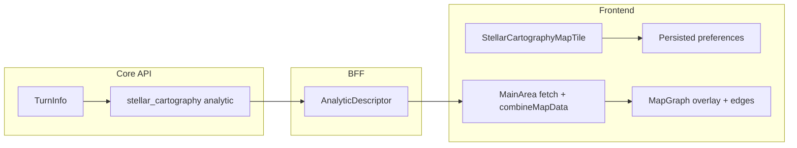

# Stellar Cartography map analytic

Implementation plan for a map-only **turn analytic** that overlays NuHost **Stellar Cartography** (and related hazards) on the React Flow starmap. Decisions below were resolved in a design review; glossary terms live in [CONTEXT.md](../CONTEXT.md).

Related docs:

- [Adding a turn analytic](design-adding-a-turn-analytic.md)
- [Analytics structure](design-analytics-structure.md)
- **[Map rendering spec](design-stellar-cartography-map-rendering.md)** -- Phase 4 appearance, colors, hover, wormholes
- [Warp wells on the map](design-warp-wells-map.md) (overlay-pane precedent)
- [VGA Planets domain context](vga-planets-domain-context.md) (NuHost add-ons)

Fixture game for development and classification research: **game `673864`**, turn **49** (rich SC payload under `.data/games/673864/0/turns/49.json`).

---

## 1. Product summary

| Requirement | Decision |
|-------------|----------|
| Registration | One selectable **turn analytic**, id `stellar-cartography`, **map only** (`supports_table: false`) |
| Sidebar | Master enable checkbox (like other analytics); **never grey the tile** in map mode |
| Sub-controls | Checkboxes per **cartography layer**; hide a checkbox when **game settings** do not enable that feature |
| Ion storms | Checkbox shown only when settings enable ion storms; **greyed + hint** when enabled but `ionstorms[]` is empty |
| Persistence | **Global** localStorage: (1) enabled analytic ids for **all** analytics, (2) cartography layer toggles |
| Defaults (no saved state) | Enabled analytics: **none**; visible layer checkboxes: **all on** |
| Star vs neutron clusters | **v1:** single **Star clusters** layer (all of `stars[]`); see [§6 Deferred work](#6-deferred-work) |
| Map rendering | Per [map rendering spec](design-stellar-cartography-map-rendering.md) (hybrid overlay + wormhole edges; debris disk **borders** only) |

---

## 2. Cartography layers (v1)

Wire ids are stable for persistence and filtering. BFF map payload tags each primitive with `layer`.

| Layer id | UI label | Settings gate (show checkbox) | Turn data | Empty-state UI |
|----------|----------|-------------------------------|-----------|----------------|
| `debris-disks` | Debris disk borders | `settings.ndebrisdiscs > 0` | Planets with `debrisdisk > 1` (seed center; value is radius ly) | Hide if gate false; planetoids (`debrisdisk == 1`) always on base map |
| `star-clusters` | Star clusters | `settings.stars > 0` | `stars[]` (group bodies by shared `name`) | Hide checkbox if gate false |
| `nebulae` | Nebulae | `settings.nebulas > 0` | `nebulas[]` | Hide if gate false |
| `ion-storms` | Ion storms | `settings.maxions > 0` | `ionstorms[]` | Grey + hint if gate true and array empty |
| `wormholes` | Wormholes | `settings.maxwormholes > 0` | `wormholes[]` | Hide if gate false |
| `black-holes` | Black holes | `settings.blackholes > 0` | `blackholes[]` | Hide if gate false |

**Settings source for gates:** `GameSettings` from **GameInfo** after refresh (same fields as turn `settings`). Recompute when shell game info changes; do not wait for turn load to show/hide checkboxes.

**Client filter:** BFF returns **all** layers' geometry for the turn; the SPA filters by persisted layer toggles before draw (no per-layer query params on map GET in v1).

---

## 3. Architecture



### 3.1 Core (`packages/api`)

1. **Extend spatial models** in `api/models/space.py` and codecs so deserialization matches live API (validated on game `673864` turn 49):
   - `Nebula`: `name`, `radius`, `intensity`, `gas`, ...
   - `Blackhole`: `name`, `coreradius`, `bandradius`, ...
   - `Wormhole`: `name`, `targetx`, `targety`, `stability`, `turn`, ...
   - `Star`: already sufficient for v1
2. Add `api/analytics/stellar_cartography.py`:
   - Input: `TurnInfo` + `TurnAnalyticsOptions` (ignore options in v1).
   - Output domain dict, then BFF shapes for SPA. Suggested Core shape:
     - `overlayCircles[]`: `{ layer, id, x, y, radius, ... }` for debris disk borders, nebulae, ion storms (incl. `parentid` for grouping), star cluster bodies, black hole core/band
     - `wormholes[]`: `{ layer, id, x, y, targetX, targetY, stability, ... }`
     - Optional `meta`: counts per layer for diagnostics
   - **Debris disk borders:** derive one circle per seed planet (`debrisdisk > 1`) from `planets[]`; radius equals `debrisdisk` in ly. Planetoids (`debrisdisk == 1`) are **not** overlay geometry -- they stay on the base map unconditionally. The layer toggle controls **outline only** (towing / minefield context).
3. Register `stellar-cartography` in `api/analytics/registry.py`.
4. Tests: handler against extended fixture (add minimal SC snippet to `turn_sample.json` or dedicated `turn_stellar_cartography_sample.json`).

### 3.2 BFF (`packages/bff`)

1. Add `bff/analytics/stellar_cartography.py` with `DESCRIPTOR`:
   - `name`: `Stellar Cartography`
   - `supports_map: true`, `supports_table: false`, `type: selectable`
   - `get_map`: load Core analytic, shape to BFF map contract (camelCase wire fields).
2. Append to `REGISTERED_ANALYTICS`.
3. Map wire contract (extend OpenAPI / `schema.ts` after implementation):

```ts
// Illustrative -- finalize in code + codegen
type StellarCartographyMapResponse = {
  analyticId: 'stellar-cartography'
  overlayCircles: Array<{
    layer: CartographyLayerId
    id: string
    x: number
    y: number
    radius: number
    // layer-specific optional fields (voltage, coreradius, bandradius, intensity, ...)
  }>
  nodes: Array<{ id: string; x: number; y: number; layer: 'wormholes' }>  // endpoint nodes
  edges: Array<{ source: string; target: string; layer: 'wormholes'; stability?: number }>
}
```

4. Tests: `GET /bff/analytics/stellar-cartography/map` returns expected layers for seeded or fixture scope.

### 3.3 Frontend (`packages/frontend`)

#### Persistence (new work, cross-cutting)

| Store | Key | Shape | Notes |
|-------|-----|-------|-------|
| `useEnabledAnalyticsStore` | `planets-console-enabled-analytics` | `{ enabledIds: string[] }` | Replace `useState<Set<string>>` in `App.tsx`; default `[]` (**A**) |
| `useStellarCartographyLayersStore` | `planets-console-stellar-cartography-layers` | `Record<CartographyLayerId, boolean>` | Default each known layer to `true` (**D**); only keys for layers the UI can show |

Use existing `createLocalStorageOrMemoryStateStorage()` + zustand `persist` (same pattern as `displayPreferences.ts`).

**Tests:** RTL tests that toggles write localStorage; reload hydration enables map fetch; password not involved.

#### Sidebar tile

- Add `src/analytics/stellar-cartography/StellarCartographyMapTile.tsx` (mirror `ConnectionsMapTile`):
  - Master checkbox + expandable body with per-layer checkboxes
  - Hide checkbox when settings gate is false (props from shell `GameInfo` / settings)
  - Ion storm row: `disabled` + `title`/hint when the turn summary reports `ionStormCount === 0`
- Wire in `AnalyticsBar.tsx` for `id === 'stellar-cartography' && viewMode === 'map'`.
- `App.tsx`: use the lightweight Stellar Cartography turn-summary endpoint for `ionStormCount`; do not fetch the full map analytic only to disable the sidebar row.

#### Fetch and merge

- `MainArea`: generic `fetchAnalyticMap('stellar-cartography', scope)` (no new query-param branch unless payload size forces later split).
- `combineMapData` / new `appendStellarCartographyMapLayer`:
  - Prefix wormhole node ids: `stellar-cartography:wh-{id}`
  - Add edges `stellar-cartography:wh-{id}` -> `stellar-cartography:wh-{id}` or paired endpoint ids as designed in Core
  - Pass `overlayCircles` through `CombinedMapData` (extend type in `bff.ts`)
- TanStack Query key: include `'stellar-cartography'` and scope; optional suffix when wire shape version bumps.

#### Map rendering

Follow [design-stellar-cartography-map-rendering.md](design-stellar-cartography-map-rendering.md). Summary: `stellarCartographyOverlay.ts` + `stellarCartographyTheme.ts`, `MapGraph` pane, wormhole edges and interaction in `mapLayers.ts` / `MapGraph`.

#### Enabled analytics migration

- On first persist write, user starts with zero analytics enabled (unchanged UX until they opt in).
- No migration of old sessions (there was no persistence).

---

## 4. Implementation phases

Each phase should be a reviewable PR. Run `make test` before merge.

### Phase 1 -- Models + Core analytic

**Deliverable:** Core computes `stellar-cartography` from `TurnInfo`; registry parity test passes.

- Extend `space.py` + serialization tests (use turn 49 fields as reference).
- Implement `stellar_cartography.py` handler.
- Unit tests for circle counts, wormhole edge pairs, empty turn.

**Docs:** This file + row in [design-analytics-structure.md § Quick reference](design-analytics-structure.md#quick-reference-existing-analytics).

### Phase 2 -- BFF + OpenAPI codegen

**Deliverable:** `GET /bff/analytics/stellar-cartography/map` stable contract; `schema.ts` regenerated.

- BFF module + registry entry.
- BFF integration tests.

### Phase 3 -- Persistence + sidebar

**Deliverable:** User can enable analytics and SC layers; choices survive reload.

- `useEnabledAnalyticsStore` wired through `App.tsx` / `AnalyticsBar`.
- `useStellarCartographyLayersStore` + `StellarCartographyMapTile`.
- Settings gates from shell game info.
- Vitest for stores and tile visibility/disabled states.

**Docs:** Short note in [design-frontend-and-backend-state.md](design-frontend-and-backend-state.md) that enabled analytics are persisted.

### Phase 4 -- Map fetch, merge, draw

**Spec:** [design-stellar-cartography-map-rendering.md](design-stellar-cartography-map-rendering.md) (appearance, interaction, wire shapes, checklist).

**Deliverable:** Enabling the analytic in map mode shows cartography overlays and wormhole edges per that spec.

**4a -- Geometry and wormholes**

- Extend `CombinedMapData` and `combineMapData`.
- `stellarCartographyOverlay.ts`, `stellarCartographyTheme.ts`, `MapGraph` pane.
- Interactive wormhole edges (dedupe bidirectional pairs; click recenter; wormhole hover strings).
- Tests: `mapLayers.test.ts`, overlay projection, wormhole dedupe.

**4b -- Stacked hover sampling**

- Core concept `sample_at(turn, x, y)` + batched BFF/Core routes.
- Tooltip UI listing all features at the hovered cell.
- Concept unit tests.

**Docs:** [user guide](user-guide.md) map subsection when 4a/4b are stable.

---

## 5. Testing strategy

| Area | Tests |
|------|--------|
| Core deserialization | Extended nebula/blackhole/wormhole round-trip |
| Core analytic | Layer counts, wormhole edge list, empty arrays |
| BFF | Map route 200 + wire shape |
| Registry parity | `test_analytics_registry.py` / BFF descriptor test |
| Frontend stores | localStorage hydrate, defaults A+D |
| Frontend map | `combineMapData` prefixes; overlay builder snapshots; sample route (4b) |
| Rendering spec | [design-stellar-cartography-map-rendering.md](design-stellar-cartography-map-rendering.md) |
| Manual | Game `673864` turn 49: toggle each layer, reload page, confirm persistence |

---

## 6. Deferred work

### Neutron vs radiation star clusters

Classification is implemented in Core (`star_clusters.py`) at map-build time. Each logical cluster (shared `stars[].name`) is assigned **`star-clusters`** or **`neutron-clusters`** from constituent body **lethal core radius**:

| Condition | Layer |
|-----------|--------|
| Every body has `5 <= radius <= 10` | **Neutron clusters** |
| No body has `5 <= radius <= 10` | **Star clusters** |
| Some bodies in range, some not | **Ambiguous** — host docs do not say which halo rules apply; console treats as **neutron** for now |

This replaces the earlier incorrect heuristic (multiple bodies with the same name). A solo body with neutron-radius core is a neutron cluster. Multiple bodies with radiation-radius cores stay on the star cluster layer regardless of count.

**Open validation:** compare against games with both kinds enabled (e.g. **673864** turn 49) and record findings in the vault wiki concept pages.

**Previously deferred (now done):** split layers gated on `settings.neutrinostars > 0`.

### Other future enhancements

- Persist **Connections** map params (out of scope here).
- Descriptor-driven map fetch in `MainArea` (trigger per [design-analytics-structure.md](design-analytics-structure.md) when a second parametric map analytic appears).
- Nebula interior raster if `maps[]` gains usable tiles.
- Spectator / `allwormholesvisible` styling for unknown wormhole ends.

---

## 7. Design decisions log

| # | Topic | Choice |
|---|--------|--------|
| 1 | Structure | One analytic **A** |
| 2 | Star/neutron split | Core radius **5–10 ly** per body; ambiguous mixed → neutron; see §6 |
| 3 | Ion storms UI | **C** (visible when settings enable; grey when empty) |
| 4 | Persistence | Global localStorage for layers + **all** enabled analytics |
| 5 | Tile greying | **A**; hide layer checkboxes when settings disable feature |
| 6--15 | Rendering / interaction | See [rendering spec](design-stellar-cartography-map-rendering.md) §8 |
| 7 | Defaults | Analytics **A** + layers **D** |

---

## 8. Checklist (copy for PRs)

- [ ] Core `stellar-cartography` registered; models match turn 49 wire
- [ ] BFF descriptor + `REGISTERED_ANALYTICS`; registry parity tests
- [ ] `schema.ts` regenerated from BFF OpenAPI
- [ ] `useEnabledAnalyticsStore` replaces in-memory `enabledIds`
- [ ] `useStellarCartographyLayersStore` + map tile wired in `AnalyticsBar`
- [ ] `MainArea` fetches map; `combineMapData` merges wormhole edges
- [ ] Phase **4a**: overlay + wormholes per [rendering spec](design-stellar-cartography-map-rendering.md)
- [ ] Phase **4b**: batched hover sample + stacked tooltip
- [ ] `make test` / frontend tests green
- [ ] Quick reference table updated in `design-analytics-structure.md`
- [ ] Neutron cluster follow-up tracked in §6 (no split in v1)
