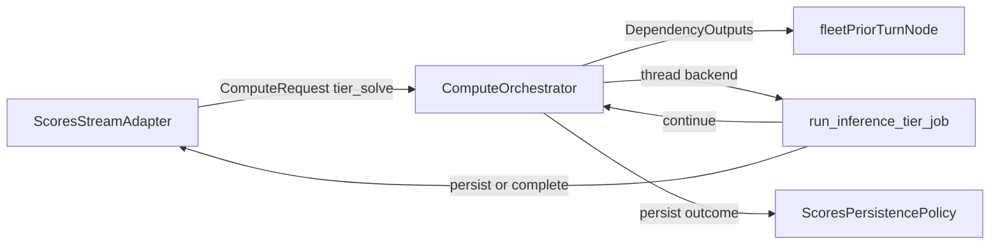

# Issue 200 Scores Orchestrator Migration

## Scope And Sources

This plan is for [GitHub issue #200](https://github.com/SteveDraper/Planets-Console/issues/200), under the compute orchestrator epic. It follows the locked shape in [docs/design-compute-orchestrator.md](design-compute-orchestrator.md), [docs/adr/0005-compute-orchestrator.md](adr/0005-compute-orchestrator.md), [CONTEXT.md](../CONTEXT.md), and the fleet reference implementation in [packages/api/api/analytics/fleet/fleet_table_stream_scheduler.py](../packages/api/api/analytics/fleet/fleet_table_stream_scheduler.py).

The implementation should preserve the existing military score inference model from [packages/api/api/analytics/military_score_inference/](../packages/api/api/analytics/military_score_inference/) and move only orchestration ownership: tier scheduling, continuation dispatch, terminal persistence, prior-turn fleet dependency wiring, and pause semantics.

## Phase 1 - Orchestrator Step Outcomes And Entry Steps

Make the compute orchestrator support the primitives issue #200 needs before changing scores callers.

- Add an explicit result envelope in [packages/api/api/compute/wire.py](../packages/api/api/compute/wire.py), for example an outcome of `continue`, `persist`, or `complete` with a serializable payload. Keep the shape small and typed enough that existing dict result wires can be adapted deliberately rather than inferred by string keys.
- Update [packages/api/api/compute/orchestrator.py](../packages/api/api/compute/orchestrator.py) so `ComputeRequest.step_kind` selects the node's entry step instead of being ignored. Default to the first registered step to preserve existing callers.
- Replace fixed profile-index completion with outcome-driven behavior: `continue` requeues the same step kind and increments `step_index` for fairness, `persist` calls the analytic persistence policy then completes the node, and `complete` completes without persistence.
- Add a node-level dispatch gate for stream-attached pool work so the scores adapter can pause `tier_solve` dispatch without cancelling in-flight work. The gate should skip gated nodes without starving unrelated ready nodes such as background fleet warm work.
- Align fleet's `materialization_leg` result in [packages/api/api/analytics/fleet/compute_orchestration.py](../packages/api/api/analytics/fleet/compute_orchestration.py) to return a `persist` outcome so fleet remains the reference path.

Tests:

- Add or update [packages/api/tests/test_compute_orchestrator.py](../packages/api/tests/test_compute_orchestrator.py) for `continue`, `persist`, `complete`, `ComputeRequest.step_kind`, and dispatch-gated ready nodes.
- Add or update [packages/api/tests/test_compute_pools.py](../packages/api/tests/test_compute_pools.py) to confirm `step_index` still enforces tier-1-before-continuations fairness.
- Run `make test_api` for this phase.

Docs:

- Update [docs/design-compute-orchestrator.md](design-compute-orchestrator.md) only if the implementation needs a narrower concrete result-wire name than the design currently states.

Review stop:

- This phase should be mergeable on its own because it extends the shared orchestrator and adapts fleet without routing scores through it yet.

## Phase 2 - Scores Compute Registration And Tier Leaf Step

Teach the scores analytic how to build and run a `tier_solve` compute step while leaving the public stream path on the existing scheduler until the adapter is ready.

- Extend [packages/api/api/analytics/scores/compute_orchestration.py](../packages/api/api/analytics/scores/compute_orchestration.py), which is currently a materialize-only stub, with `SCORES_TIER_SOLVE`, a `thread` backend `ComputeStepSpec`, a tier job-wire builder, and a `run_scores_tier_solve` wrapper around [packages/api/api/analytics/military_score_inference/inference_row_runner.py](../packages/api/api/analytics/military_score_inference/inference_row_runner.py).
- Reuse [packages/api/api/analytics/military_score_inference/row_run.py](../packages/api/api/analytics/military_score_inference/row_run.py) for per-row ladder state. Do not create a parallel representation of policy ladder state.
- Build tier job wires from concrete `scores@turn,player` scope, current row/session state, hull mask, inference path, and prior-turn fleet dependency output when available. The fleet dependency should be the prior-turn `fleet@(host_turn - 1, same player)` node already declared through scores export dependencies in [packages/api/api/analytics/scores/exports.py](../packages/api/api/analytics/scores/exports.py).
- Convert `TierJobOutcome` to orchestrator outcomes: non-terminal tier work returns `continue`, `exact` and `no_exact_solution` row completions return `persist`, and `stopped` returns `complete` without persistence.
- Implement real `ScoresPersistencePolicy.persist` in [packages/api/api/analytics/scores/compute_orchestration.py](../packages/api/api/analytics/scores/compute_orchestration.py) by delegating to [packages/api/api/services/inference_row_persistence_service.py](../packages/api/api/services/inference_row_persistence_service.py). Keep durable writes out of stream adapter callbacks.
- Align `ScoresPersistencePolicy.invalidation_generation` with the per-player fleet epoch exposed by [packages/api/api/analytics/fleet/persistence.py](../packages/api/api/analytics/fleet/persistence.py), so stale tier results are discarded when the prior fleet ledger lands.
- Update [packages/api/api/analytics/scores/__init__.py](../packages/api/api/analytics/scores/__init__.py) to register both `materialize` and `tier_solve` builders/runners.

Tests:

- Add focused unit tests for scores registration in [packages/api/tests/test_compute_turn_cache.py](../packages/api/tests/test_compute_turn_cache.py) or a new scores orchestration test file.
- Extend [packages/api/tests/test_inference_row_persistence.py](../packages/api/tests/test_inference_row_persistence.py) for orchestrator-owned terminal persistence, including no persist for `stopped`.
- Add dependency-output coverage around prior-turn fleet overlay in [packages/api/tests/test_prior_turn_fleet_torp_overlay.py](../packages/api/tests/test_prior_turn_fleet_torp_overlay.py).
- Run `make test_api` for this phase.

Docs:

- Add a short implementation note to [docs/design-compute-orchestrator.md](design-compute-orchestrator.md) if the scores tier wire has important payload fields future maintainers need to understand.

Review stop:

- This phase is mergeable when the scores registration is valid and directly testable through orchestrator unit/integration tests, even before the table stream uses it.

## Phase 3 - Replace Scores Stream Worker Pool With A Thin Orchestrator Adapter

Refactor the stream path so `InferenceRowScheduler` becomes an adapter around the orchestrator pattern used by fleet, then remove the private worker queue.

- Refactor [packages/api/api/analytics/military_score_inference/inference_scheduler.py](../packages/api/api/analytics/military_score_inference/inference_scheduler.py) or replace it with a new adapter module while preserving the public methods used by controllers and BFF pause routes.
- Mirror the fleet pattern from [packages/api/api/analytics/fleet/fleet_table_stream_scheduler.py](../packages/api/api/analytics/fleet/fleet_table_stream_scheduler.py): one orchestrator binding per stream token, listener unregister on stream teardown, `TableStreamScopeGuard`, and a `RowRun` registry owned by the stream adapter.
- Change row scheduling in [packages/api/api/analytics/military_score_inference/inference_stream_rows.py](../packages/api/api/analytics/military_score_inference/inference_stream_rows.py) to submit `ComputeRequest(scope=scores@t,P, step_kind="tier_solve", priority_band="stream_attached")` instead of enqueueing `TierJob` objects on a private deque.
- Move mid-step events (`TierProgress`, held solution updates) into callbacks owned by the adapter and emitted through each row session's event queue. Terminal row-complete events should come from the orchestrator node-complete listener rather than `on_row_complete` persistence callbacks.
- Implement global pause as a dispatch gate: paused streams hold initial submissions and continuations in adapter state; in-flight tier steps finish; resume resubmits held `tier_solve` requests.
- Preserve in-place reschedule APIs in [packages/api/api/analytics/military_score_inference/inference_table_stream_registry.py](../packages/api/api/analytics/military_score_inference/inference_table_stream_registry.py) and controller methods in [packages/api/api/analytics/military_score_inference/inference_table_stream_controller.py](../packages/api/api/analytics/military_score_inference/inference_table_stream_controller.py).
- Remove `_worker_loop`, `_work_queue`, `_dequeue_next_job_locked`, `_enqueue_continuation`, private worker startup, and `MILITARY_SCORE_INFERENCE_SCHEDULER_WORKERS` handling from the scores stream path once the orchestrator path is live.
- Rewire [packages/api/api/services/stack.py](../packages/api/api/services/stack.py) so `on_row_complete=inference_persistence.persist_row_complete` is no longer passed into the scheduler. Keep held-solution invalidation wiring for scores-to-fleet coupling.

Tests:

- Port [packages/api/tests/test_inference_scheduler_fairness.py](../packages/api/tests/test_inference_scheduler_fairness.py) to assert global pool ordering rather than private queue ordering.
- Port [packages/api/tests/test_inference_scheduler_global_pause.py](../packages/api/tests/test_inference_scheduler_global_pause.py) to assert dispatch-gated `tier_solve` behavior, held continuation counts, and in-flight tier completion.
- Keep [packages/api/tests/test_inference_table_stream.py](../packages/api/tests/test_inference_table_stream.py), [packages/api/tests/test_inference_stream_lifecycle_gaps.py](../packages/api/tests/test_inference_stream_lifecycle_gaps.py), and [packages/api/tests/test_inference_stream_accelerated_admission.py](../packages/api/tests/test_inference_stream_accelerated_admission.py) passing with the same wire contract.
- Run `make test_api` for this phase.

Docs:

- Update [CONTEXT.md](../CONTEXT.md) only if names like "Inference row scheduler" need to be clarified as an adapter rather than a worker pool.

Review stop:

- This phase is mergeable when no scores inference stream path runs `run_inference_tier_job` outside orchestrator dispatch and the old worker-pool code is deleted rather than bypassed.

## Phase 4 - Fleet Overlay Warm, Terminal Quality, And Invalidation Coupling

Finish the cross-analytic behavior explicitly called out in issue #200.

- In [packages/api/api/analytics/military_score_inference/prior_turn_fleet_torp_overlay.py](../packages/api/api/analytics/military_score_inference/prior_turn_fleet_torp_overlay.py), change the per-player persisted fleet gate from `has_ledger` to `has_final_ledger` wherever terminal fleet quality is required.
- Replace `schedule_background_prior_turn_fleet_warm` ad-hoc `threading.Thread` work with background-band orchestrator submits for `fleet@(host_turn - 1, player)` on stream open. Background warm must not be blocked by the inference global pause gate.
- Keep pending-first behavior: if the prior-turn final fleet ledger is missing at row admission, the row emits `fleetTorpInputStatus: pending`; when fleet persist fires, scores invalidation deletes the row and reschedules it so the overlay becomes `applied`.
- Retarget [packages/api/api/services/inference_invalidation_service.py](../packages/api/api/services/inference_invalidation_service.py) to the orchestrator-backed adapter while preserving current public invalidation triggers: turn stored, hull mask changed, inference evidence updated, fleet ledger persisted, and recompute host turn.
- Ensure fleet persistence notifications in [packages/api/api/analytics/fleet/persistence.py](../packages/api/api/analytics/fleet/persistence.py) still drive per-player scores row invalidation without requiring adapter-owned persistence.

Tests:

- Update [packages/api/tests/test_prior_turn_fleet_torp_overlay.py](../packages/api/tests/test_prior_turn_fleet_torp_overlay.py) for `has_final_ledger` vs partial ledger behavior.
- Update [packages/api/tests/test_prior_turn_fleet_stream_warm.py](../packages/api/tests/test_prior_turn_fleet_stream_warm.py) for orchestrator background requests instead of ad-hoc threads.
- Update [packages/api/tests/test_fleet_scores_invalidation.py](../packages/api/tests/test_fleet_scores_invalidation.py) and [packages/api/tests/test_inference_stream_invalidation.py](../packages/api/tests/test_inference_stream_invalidation.py) for pending-then-applied reschedule.
- Run `make test_api` for this phase.

Docs:

- Update [docs/design-compute-orchestrator.md](design-compute-orchestrator.md) if the final fleet warm call site differs from the broad design wording.

Review stop:

- This phase is mergeable when fleet overlay status semantics are terminal-quality based and reschedule behavior is covered end-to-end.

## Phase 5 - Final Cleanup, Acceptance Criteria, And Full Verification

Close the migration by removing legacy names and validating the complete API/frontend surface.

- Search for `MILITARY_SCORE_INFERENCE_SCHEDULER_WORKERS`, `_worker_loop`, `_work_queue`, `_dequeue_next_job_locked`, `_enqueue_continuation`, and any direct dedicated-thread calls to `run_inference_tier_job`; delete or rename anything that implies a private scores worker pool.
- Remove stale imports from [packages/api/api/services/turn_analytic_service.py](../packages/api/api/services/turn_analytic_service.py), [packages/api/api/services/stack.py](../packages/api/api/services/stack.py), and scores stream modules.
- Keep frontend stream wire contracts unchanged. Only update frontend tests if the timing/order of equivalent NDJSON events changes; do not move turn analytic table/map payloads into central OpenAPI codegen.
- Run targeted backend tests first, then `make test`. If frontend stream tests are affected, run `make test_frontend` as well.
- Add a final issue checklist note to the PR description covering each acceptance criterion from issue #200.

Tests:

- Required final backend set: `make test_api` plus the scores/fleet stream and compute tests touched in earlier phases.
- Required final repo set before PR: `make test`.

Docs:

- Update [CONTEXT.md](../CONTEXT.md) or [docs/design-compute-orchestrator.md](design-compute-orchestrator.md) only for terminology that changed in code. Avoid documenting historical migration details in code comments.

Review stop:

- This phase should be the final PR or final commit in the issue branch, depending on whether earlier phases are split into separate PRs.

## Reuse And Ownership Notes

- Reuse `RowRun`, `PolicyLadderState`, `run_inference_tier_job`, and existing stream event conversion under [packages/api/api/analytics/military_score_inference/](../packages/api/api/analytics/military_score_inference/); do not duplicate inference solving or wire-shape code.
- Use [packages/api/api/compute/](../packages/api/api/compute/) for analytic-neutral scheduling primitives only. Scores-specific pause state, row sessions, and held continuations stay in the scores stream adapter.
- Use [packages/api/api/analytics/scores/compute_orchestration.py](../packages/api/api/analytics/scores/compute_orchestration.py) as the canonical scores compute registration surface.
- Use [packages/api/api/analytics/fleet/compute_orchestration.py](../packages/api/api/analytics/fleet/compute_orchestration.py) and [packages/api/api/analytics/fleet/fleet_table_stream_scheduler.py](../packages/api/api/analytics/fleet/fleet_table_stream_scheduler.py) as the migration template, not as cross-analytic imports.
- Keep durable inference row writes in `ScoresPersistencePolicy.persist`; stream adapters emit events and own session state only.
- Keep game-domain inference semantics unchanged: military score deltas, ship/planet/starbase count deltas, priority points, score-history turn framing, and prior-turn fleet torp overlays remain existing domain logic.
