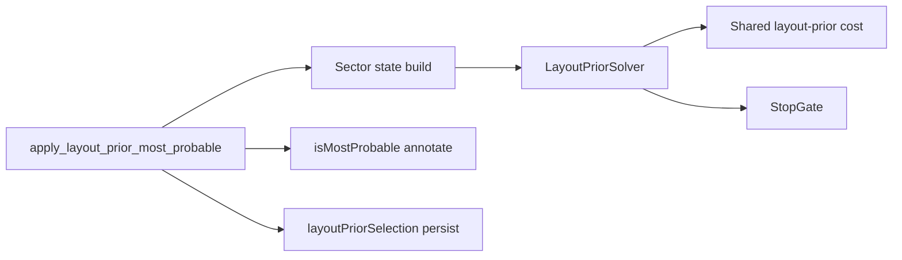

# Issue 270 — Budgeted homeworld layout-prior solver

## Scope And Sources

This plan implements [GitHub issue #270](https://github.com/SteveDraper/Planets-Console/issues/270). Stand-in launch consistency is **out of scope** ([#273](https://github.com/SteveDraper/Planets-Console/issues/273)).

Locked design:

- [docs/design-homeworld-locator-analytic.md](design-homeworld-locator-analytic.md) §4.3.3
- [docs/adr/0009-homeworld-layout-prior-budgeted-solver.md](adr/0009-homeworld-layout-prior-budgeted-solver.md)
- [CONTEXT.md](../CONTEXT.md) — **homeworld layout prior selection**, **homeworld layout stand-in**

Current code:

- [packages/api/api/analytics/homeworld_locator/layout_prior.py](../packages/api/api/analytics/homeworld_locator/layout_prior.py) — monolith (sector build + capped product + fixed mid stand-in + annotate)
- Call site: [packages/api/api/analytics/homeworld_locator/baseline_ensure.py](../packages/api/api/analytics/homeworld_locator/baseline_ensure.py) (`apply_layout_prior_most_probable`)
- Tests: [packages/api/tests/test_homeworld_layout_prior.py](../packages/api/tests/test_homeworld_layout_prior.py)
- Config: [packages/api/api/config.py](../packages/api/api/config.py) `HomeworldLocatorConfig`; docs [docs/configuration.md](configuration.md)
- Unobserved samples: [packages/api/api/analytics/homeworld_locator/sector_overlays.py](../packages/api/api/analytics/homeworld_locator/sector_overlays.py) `unobserved_band_sample_points`

## Reuse Discovery (both phases)

| Need | Action |
|------|--------|
| Sector participation / mid stand-in / choice ranking | **Extract** from `layout_prior.py` into shared builders used by all solvers; do not duplicate in SA |
| `_layout_prior_cost` / Normal density tables | **Keep outside** solvers as the single cost owner (ADR 0009) |
| `unobserved_band_sample_points` | **Reuse** for sample-grid refine (#273 hook scores samples, does not replace the grid) |
| `layout_prior_input_fingerprint` + shell persist | **Reuse** unchanged in `baseline_ensure` |
| `MAX_LAYOUT_PRIOR_CHOICES_PER_SECTOR` | **Keep** on enumerator only; SA must not hard-cap the legal set |
| Test fixtures in `test_homeworld_layout_prior.py` | **Extend**; add solver-unit tests rather than re-asserting evidence refine |

Canonical layer: all new types stay under `api/analytics/homeworld_locator/` (feature-owned). No new `concepts/` unless a game rule is extracted for #273 later.

---

## Phase 1 — Encapsulate enumerator behind `LayoutPriorSolver`

**Goal:** Pure refactor. Same selections, same `LAYOUT_PRIOR_ALGORITHM_VERSION`. Proves the abstraction before algorithm work.

### Work

1. **Split modules** (names illustrative; match repo style when coding):
   - `layout_prior_cost.py` — public cost + tie-key helpers (moved from `_layout_prior_cost`).
   - `layout_prior_problem.py` — frozen problem/sector-state dataclasses (today’s `_SectorLayoutState`, made solver-facing).
   - `layout_prior_solver.py` — `LayoutPriorSolver` protocol + `LayoutPriorSolution` (chosen planet ids by sector, stand-in positions, cost, tie metadata).
   - `layout_prior_stop_gate.py` — `StopGate` protocol (`should_stop()` / equivalent). Phase 1 may ship `NeverStopGate` or unused parameter on enumerator.
   - `layout_prior_enumerate.py` — `EnumeratingLayoutPriorSolver`: current ≤4 nearest-mid product + fixed mid stand-ins.
   - `layout_prior.py` — thin facade: eligibility → build problem → `solver.solve(...)` → annotate candidates. Preserve `apply_layout_prior_most_probable` signature for call sites (optional `solver=` for tests).

2. **Config (minimal):**
   - Add `HomeworldLocatorConfig.layout_prior_solver: str = "enumerate"` (or enum-like string).
   - Wire factory: `"enumerate"` → `EnumeratingLayoutPriorSolver`.
   - Do **not** bump `LAYOUT_PRIOR_ALGORITHM_VERSION`.
   - Do **not** require `layout_prior_budget_ms` yet (optional stub field unused by enumerator is fine if it reduces Phase 2 churn; prefer adding budget only in Phase 2 if unused config is discouraged).

3. **Hygiene in touched paths:** named constants, docblocks on protocol/solution, remove dead private helpers left after the split.

### Tests

- **Parity first:** capture `mostProbablePlanetIds` (and/or annotated rows) from current fixtures before refactor; assert identical after encapsulation (same inputs → same set). Prefer golden tuples on existing unit cases in `test_homeworld_layout_prior.py`.
- **Protocol smoke:** inject a fake `LayoutPriorSolver` that returns a fixed choice set; assert annotate + persist paths honor it (proves replaceability).
- Keep existing cap / stand-in / persistence reuse tests green (imports may move).
- Run `make test_api` (or at least homeworld layout-prior + ensure tests).

### Docs

- Point design §4.3.3 / ADR 0009 at the new module names once stable.
- `configuration.md`: document `layout_prior_solver` if added in this phase.
- No CONTEXT change required if behavior is unchanged (CONTEXT already describes budgeted anytime as the target; Phase 1 still ships enumerator-only default).

### Review stop

- Independently mergeable PR.
- Confirm: ready to PR? Fixture parity green? Start Phase 2 only after this merges (or explicit approval to stack).

---

## Phase 2 — SA solver + sample-grid stand-in refine + default switch

**Goal:** Production default becomes greedy frontier init + seeded size-aware SA under a pluggable stop-gate, then alternating sample-grid stand-in refine. Bump algorithm version.

### Work

1. **Stop-gate implementations**
   - `DeadlineStopGate(budget_ms)` — monotonic clock; production.
   - `MaxStepsStopGate(max_steps)` — tests / deterministic budgets.
   - Poll **once per discrete SA step** only. Refine is outside the gate.

2. **Sample-grid stand-in refine**
   - Given fixed discrete choices + stand-in sectors’ sample lists, alternating coordinate descent in **sector-index order** until stable or hard iter safety cap.
   - Score = shared layout-prior cost (single owner).
   - **Scored-sample hook** interface (callable / small protocol) defaulting to layout-cost-only — reserved for #273; do not implement launch consistency here.
   - During SA, stand-ins remain **cheap fixed mid samples** (current placeholder positions).

3. **`AnnealingLayoutPriorSolver` (or equivalent name)**
   - **Greedy init (A′):** start from pinned/fixed sectors; grow assigned set; among frontier choice sectors (adjacent on the circular sector ring to the assigned set), pick fewest possibles; within sector pick planet minimizing full-ring cost with fixed mid stand-ins. Deterministic tie-breaks (planet id / sector index).
   - **SA:** seeded RNG from `game_id`, turn, perspective, input fingerprint, `LAYOUT_PRIOR_ALGORITHM_VERSION`. Legal moves = replace one choice sector with any possible in that sector; **proposal bias** toward nearer sector mid and/or better local delta. Keep best-so-far; lex planet-id tie-break on equal cost.
   - **Cooling:** in-code, **problem-size adaptive** (choice-sector count / possibles / planet count / category); coefficients from fixtures — not YAML.
   - **After SA:** run sample-grid refine; return solution.
   - Accept `StopGate`; ignore refine under the gate.

4. **Config**
   - `layout_prior_budget_ms: int` — production deadline; **default measured** on 680224-class materialize (interactive constraint). Document the chosen default and how it was measured in the PR.
   - `layout_prior_solver: str` — `"anneal"` (default) | `"enumerate"` (emergency / regression).
   - Update `configuration.md` + any example YAML.

5. **Version**
   - Bump `LAYOUT_PRIOR_ALGORITHM_VERSION` when anneal becomes the default path that can change selections.
   - Enumerate-only path may keep producing old selections when selected explicitly; persistence still keys off the global algorithm version constant used at write time — document that switching solver via config is an ops concern and typically pairs with understanding cache invalidation (version bump already forces rewrite for default).

6. **Factory / call site**
   - Default factory returns anneal solver with `DeadlineStopGate` from config.
   - Tests construct anneal + `MaxStepsStopGate`.
   - `baseline_ensure` / `apply_layout_prior_most_probable` pass scope identity needed for seeding (game id, turn, perspective) — extend facade parameters if not already available at the call site.

### Tests

- **Determinism:** same problem + seed materials + step gate → identical planet-id set across runs.
- **Improve-or-equal:** for fixed seed, `MaxStepsStopGate(n)` cost ≥ `MaxStepsStopGate(k)` cost when `k > n` (incumbent best-so-far monotonicity), on small fixtures.
- **Richer discrete:** a fixture where the true layout winner is outside the old top-4 nearest-mid set is selectable by anneal (proves no hard cap on legal set).
- **Stand-in refine:** empty nebular sector (existing 680224-style test) uses optimized sample, not only mid; cost ≤ mid-only baseline for same discrete choices.
- **Stop-gate:** anneal with `MaxStepsStopGate(0)` (or 1) returns greedy init promptly; does not hang.
- **Regression:** enumerator impl still passes Phase 1 parity tests when selected.
- Optional timing smoke (not CI-flaky): document manual check that default `budget_ms` keeps dense-game materialize interactive.
- Run `make test_api`.

### Docs

- Confirm design §4.3.3, ADR 0009, CONTEXT remain accurate (adjust module names / default ms only).
- `configuration.md` for both knobs + defaults.
- PR description notes measurement of default `layout_prior_budget_ms`.

### Review stop

- Independently mergeable after Phase 1.
- Confirm: default anneal + version bump + budget measurement acceptable? Enumerate remains selectable?

---

## Out Of Scope (do not pull in)

- [#273](https://github.com/SteveDraper/Planets-Console/issues/273) stand-in launch consistency (hook only).
- Ownership evidence (#269), FE marker redesign, intermediate-turn layout prior.
- Beam search, YAML cooling tables, nested per-combo continuous ℝ² descent.

---

## Suggested PR Sequence

1. **PR A (Phase 1):** encapsulation + enumerator + optional solver selector + parity tests.  
2. **PR B (Phase 2):** stop-gates + anneal + sample refine + config budget + version bump + tests.

After each PR: stop and discuss merge vs stacking the next phase (per `planning.mdc`).

## Execution Gate

Do **not** start Phase 1 coding until this plan is approved. When approved, begin Phase 1 with a fresh reuse grep in `homeworld_locator/` before writing the protocol.
